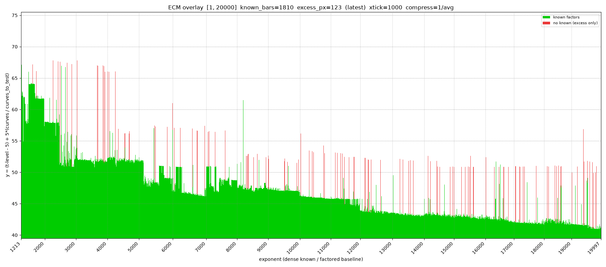
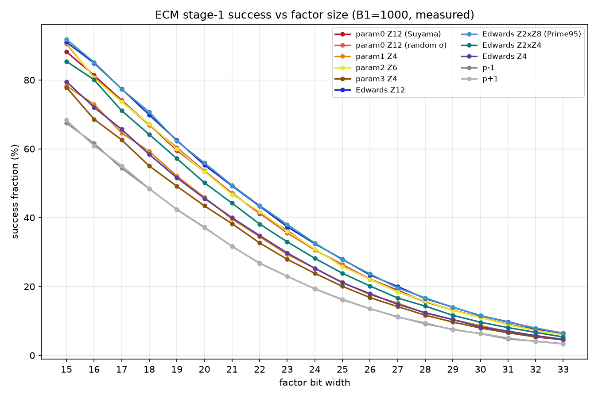
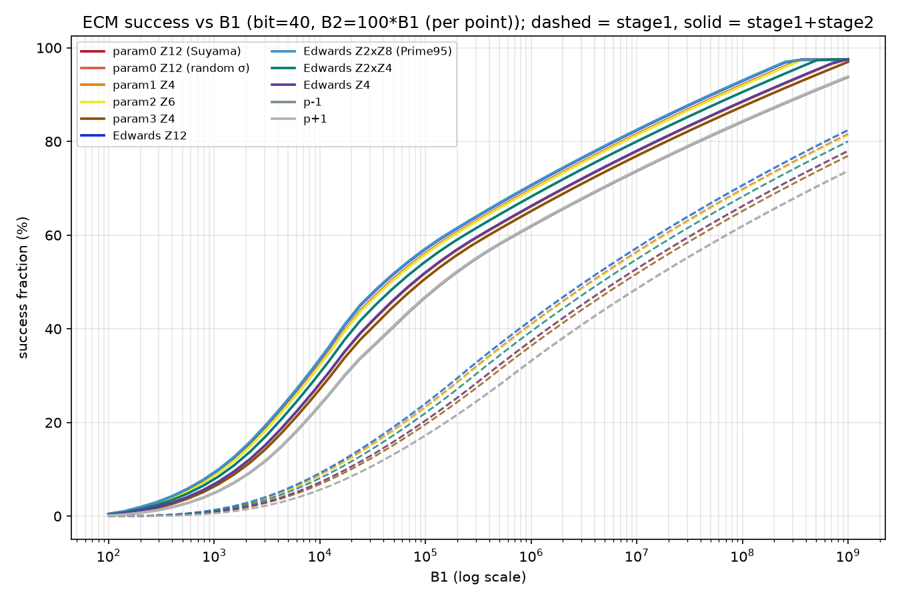
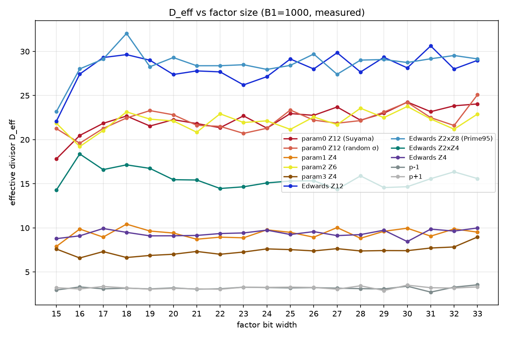

# ECM-ELF

[中文](README.md) | English

A **multi-backend stage-1 engine** for the Elliptic Curve Method (ECM): **OpenCL** (Windows / Linux / macOS / Android; param 3), **CUDA** (CGBN; param 0 Suyama and param 3 batch), and **GMP** & **AVX-512 IFMA** (Edwards / Montgomery, x86 CPU, 8 curves per thread). They share one driver / argument parser / checkpoint / save logic and swap the implementation at link time.

The programs are compatible with **GMP-ECM** & **Prime95** savefile formats, support checkpoints and custom operators (Montgomery mul/sqr and modular add/sub), and add a queue manager (worktodo / save sync / resume) plus the Prime95 stage-2 handoff tool `ecm_p95feeder`.

> **This repository was formerly named OpenCL-ECM.** The rename reflects that the main backends are now CUDA/CGBN (param 0 + param 3) and the AVX-512 batch path, with OpenCL as one of three. The **binary names (`ecm.exe` / `ecm_cuda.exe` / `ecm_p95feeder.exe`), the `.save` format and the `ecm.ini` keys are unchanged**, so existing scripts and saves keep working.


---

## How this repo improves on the existing tools

An **engineering-grade stage-1 implementation** for the GIMPS ecosystem (Prime95 / gmp-ecm / PrMers): multiple backends (OpenCL / CUDA-CGBN / AVX-512), **save-file interoperability** with the existing stage-2 tools, and ECM helper tools for Mersenne numbers.

### Shared by all backends (tooling)

| Capability | Notes |
|---|---|
| **Task queue** | One task per line in `worktodo.txt`, accepting `ECM=` / `ECM2=` (equivalent) / `ECMSTAGE2=`; completed tasks are appended to `worktodo.finished.txt` and removed from the queue, failing lines are rewritten in place as `# ERROR <original line>` |
| **Single ini** | `ecm.ini`: GPU / CPU / curve parametrization / backend / threads / affinity / save-name template / checkpoint interval / progress-bar colour…; a template is generated when the file is missing |
| **Mid-stage-1 checkpoints** | GPU `.ckpt`, Edwards `e{n}_c{k}.ckpt`, Montgomery `m{n}_{b1}_c{k}.ckpt`. Saved on a 600 s timer by default, and once more when interrupted with `Ctrl+C` |
| **Saves and sync** | Syncs `.save` files into the Prime95 folder and adds the `worktodo.add` entries |
| **Live progress** | Command-line progress bar with rate, completion and ETA |

### GPU · CUDA / CGBN (`ecm_cuda.exe`)

- **New versus gmp-ecm**
  - `gpu param 0`: **Suyama sigma (Z/12)**, the same curve as gmp-ecm `-param 0`; the save can be continued by gmp-ecm *and* by Prime95 for stage 2;
  - a **native Windows** CUDA build (Visual Studio or NMake; no Linux / WSL / msys2 toolchain), fully wired into the queue manager / checkpoints / save sync;
  - selectable parametrization `gpu_param = 0 | 3`.
- Supports **N ≤ 16384 bit**, **recommended for `< 12288 bit`**. It can go up to N ≤ 65536, but is then markedly slower than FFT/NTT implementations.

### GPU · OpenCL (`ecm.exe`)

- Cross-platform (Windows / Linux / macOS / Android) gmp-ecm (param 3) path with custom-operator support (`--mul/--sqr/--add/--sub/--special-mult`).
- Positioning: **small operands**. A curve takes longer, but its footprint is smaller, so more curves fit in flight at the same size (measured about **4×** CGBN) - throughput comes from curve count. Recommended for **≲1024 bit**; larger sizes go to CUDA/CGBN or the CPU.
- Normalized per-stream-processor / per-CUDA-core, same-clock throughput (CGBN = 100%, author's measurement):

  | operand size | CGBN baseline (Ada Lovelace) | AMD RDNA3.5 | Qualcomm Adreno 830 |
  |---|---|---|---|
  | 256 | 100% | 460% | — |
  | 384 | 100% | 200% | 57.1% |
  | 512 | 100% | 152% | — |
  | 1024 | 100% | 93.6% | — |

  In other words, an AMD iGPU is far more efficient *per stream processor* at small sizes (turning slightly negative at 1024 bit).

### CPU (Edwards / Montgomery curves × gmp / AVX-512 backends)

- **Edwards (Atkin–Morain, a=1, Z/2×Z/8)**:
  - generates Prime95-style stage-1 saves, e.g. `e0001213`;
  - with `ecm_p95feeder` it is delivered automatically, so Prime95 runs stage 2 directly.
- **Montgomery (Suyama sigma, Z/12)**:
  - the same curve as gmp-ecm `-param 0` (`A = (v−u)³(3u+v)/(4u³v) − 2`);
  - outputs a **gmp-ecm-style text save** (`METHOD=ECM; SIGMA=<64-bit>; … X=0x…`) that stage 2 can continue from: a Prime95 `ECMSTAGE2=` queue line, or gmp-ecm `-resume`.
- **Two backends**: `backend = gmp` and `backend = simd` (**AVX-512 IFMA + int52 radix, 8 curves per batch**). The SIMD path is a large performance win.
- **Benchmark (normalized single thread, seconds per curve, B1=1e6)**, measured plus fitted rows (source: `docs/ECM_Montgomery_STAGE1.md` §14.5):

  | N | FFT tier | this repo | GMP-ECM 7.0.6 | Prime95 v31 | this/GMP-ECM | this/Prime95 |
  |---|---|---|---|---|---|---|
  | M127 | 128 | **0.118 s** | — | 3.86 s | — | **32.7×** |
  | M521 | 128 | **0.371 s** | — | 3.86 s | — | **10.4×** |
  | M1277 | 128 | **0.979 s** | 2.484 s | 3.86 s | 2.54× | **3.94×** |
  | M2203 | 128 | **2.285 s** | 5.804 s | 3.86 s | 2.54× | 1.69× |
  | M3001 | 256 | **4.137 s** | 9.586 s | **5.65 s** (measured) | 2.32× | 1.37× |
  | M3500 | 256 | **5.164 s** | 11.656 s | 5.65 s | 2.26× | 1.09× |
  | M4001 | 256 | **6.290 s** | 14.624 s | 5.65 s | 2.32× | 0.90× |
  | M5755 (fitted) | 384 | 12.05 s | ~21 s | 8.06 s | ~1.7× | 0.67× |
  | M8527 (fitted) | 512 | 24.9 s | ~43 s | 10.06 s | ~1.7× | 0.40× |

- **Size recommendation**: **use it for Mersenne numbers below 4096 bit** (2.26–2.55× faster than GMP-ECM there); beyond roughly 6000 bit Prime95's GWNUM FFT is the better choice.
- **Mersenne numbers**: `N = 2^k−1` uses the fold reduction (half the madds per multiply), about **2×** faster than a generic integer of the same size.
- **Threading**: SMT usually buys only ~10%; run one thread per physical core.

### Bundled tools

**`ecm-report`** - PrimeNet ECM progress statistics and plots; data source: `www.mersenne.org/report_ecm/`



**`ecm-prob`** - heuristic-plus-measured ECM probability tool (pure Python, research use):

It covers **10 curve parametrizations** and implements the corresponding ECM algorithms (4 Edwards torsions Z/4, Z/2×Z/4, Z/12, Z/2×Z/8; Montgomery param 0/1/2/3; p−1 / p+1). The core is a faithful port of GMP-ECM's `rho.c` (Dickman rho + local rho + Brent-Suyama).

It can **calibrate the effective divisor D_eff from prime sets**, compute t-levels and invert `{bit, B1, curves, miss probability}`.

|  |  |
|---|---|
| Success rate vs bit width (measured) | Success rate vs B1 (measured + predicted) |



**Work distribution** - wiring GPU stage 1 into CPU stage 2 automatically:

- **`ecm_p95feeder` (this repo, ECM)**: sends Edwards stage-1 saves to Prime95 and counts the stage-2 tasks in the queue (`worktodo.txt` + `worktodo.add`, `[Worker #N]` sections supported) so they run in order.
- **AutoWorktodo (companion project, separate repository - not part of this repo)**: the same idea for **P-1** pipelines - GPU runs stage 1, Prime95 runs stage 2.
  1. **Transfer**: supports GpuOwl and PrMers; renames `resume_p<exp>_B1_<b1>.p95` via the `m{head36}{tail6}` template (matching Prime95's P-1 save names) into the target directory, and moves the staged stage-2 rows into the `worktodo.add` file Prime95 consumes;
  2. **Auto-assign**: pre-generates a stage-2 row with the rewritten `B2` for every exponent;
  3. **Dashboard** (ECharts): task counts, current job progress / IPS / ETA, projected works per hour/day/week/month, completion history bars filterable by stage (B1/B2) and exponent range, runtime environment and factor count, with light/dark themes and zh/en switching.

---

## Contents

| Section | Description |
|------|------|
| [How this repo improves on the existing tools](#how-this-repo-improves-on-the-existing-tools) | Multiple backends, save-file interoperability, Mersenne ECM helper tools |
| [Quick Start](#quick-start) | Shortest path: build → `ecm` → microbenchmarks |
| [Command-line options](#command-line-options) | CLI flags |
| [Building from source (Windows)](#building-from-source) | Desktop build, usage, and OpenCL capabilities |
| [Building the CUDA backend](#building-the-cuda-backend-cgbn) | NVIDIA CGBN stage-1 build and usage |
| [Android](#android) | ECM stage-1 factorization, device probe and microbenchmarks |
| [Development and docs](#development-and-docs) | Math background, params, operator analysis, tools, benches, AMD asm |
| [Other documentation index](#other-documentation-index) | Sub-docs not expanded in the main body |

---

## Quick Start

```powershell
# ECM stage-1
echo '(2^347-1)' | .\ecm.exe -v -d 0 -gpu -gpucurves 1 1e4 0
echo '(2^421-1)' | .\ecm_cuda.exe -v -gpu -sigma 3:268526266 -gpucurves 1 1e5 0
:: has factor 22000409

echo "(2^991-1)" | .\ecm.exe -v --go -gpu -gpucurves 384 1e5 0
echo '(2^347-1)' | .\ecm.exe -v -d 1 -gpu -sigma 3:561219477 -gpucurves 1 1e4 0
:: has factor 14143189112952632419639

# List OpenCL-capable devices
opencl_platform_test.bat
# Run ECM and validate against known factors
test_validate_factors.bat
# Show help
ecm.bat
.\ecm.exe -h

# Operator microbenchmarks
.\build_rel\Release\cpu_addsub_bench.exe -a 1,3,5,7,9,11,13,15 512 1e6 16 5 -t 8
.\build_rel\Release\opencl_ecm_addsub.exe --bits 512 10000 128 3 --fixed
.\build_rel\Release\opencl_ecm_montsqr.exe --bits 512 1000 128 1
```

List all switchable kernel paths: `build\Debug\ecm.exe --showkernel`

---

## Command-line options

### Running ECM stage-1 (`ecm.exe`)

```text
echo "N" | ecm.exe <-gpu> [-gpucurves <n>] [...] <B1> <B2>
```

Read composite **N** from stdin (decimal or expression) and run stage-1; `-gpu` enables batched GPU curves (`ecm.exe` = OpenCL, `ecm_cuda.exe` = CUDA/CGBN - the startup banner prints which).  
Angle brackets `< >`: required arguments.  
Square brackets `[ ]`: optional arguments.

```powershell
echo "(2^991-1)" | build\Debug\ecm.exe -gpu -gpucurves 384 1e6 0
echo "(2^4003-1)" | build\Debug\ecm.exe -gpu -gpucurves 384 -v --go --add asm_b32 1e6 0
build\Debug\ecm.exe --showkernel

:: Release build
echo "(2^991-1)" | build_rel\Release\ecm.exe -v --go -gpu -gpucurves 384 1e6 0
```

| Option | Description |
|------|------|
| `<B1>` `<B2>` | Required positional args at the end of the command |
| `-gpu` / `-gpucurves <n>` | GPU stage-1 and curves per batch |
| `-d <index>` | GPU device index (OpenCL device in `ecm`, CUDA device in `ecm_cuda`) |
| `-v` | Verbose output |
| `--mul` / `--sqr` / `--add` / `--sub` / `--special-mult <path>` | Override each operator kernel path (id / alias / auto) |
| `--showkernel` | Enumerate all operators from the registry (id, aliases, file, platforms) |

Optional: `--go` computes the group order and factors it.  
- Install [Pari/GP](https://pari.math.u-bordeaux.fr/); add `gp.exe` to `PATH` or pass `--gp <path>`.

Upstream semantics for `-param`, `-sigma`, and other ECM parameters: [docs/README](docs/README) §6.

### Advanced options (replaced environment variables)

All custom environment variables have been removed in favor of CLI flags (converged into `EcmRuntimeConfig`; see
`include/opencl_ecm_runtime_config.h`). For the main `ecm` program:

| Old environment variable | New flag (`ecm`) | Description |
|------------|----------------|------|
| `CGBN_OPENCL_DEVICE_INDEX` | `-d <index>` | OpenCL device index |
| `ECM_KERNEL_ROOT` / `CGBN_KERNEL_ROOT` | `--kernel-root <dir>` | Override `.cl` kernel tree directory |
| `CGBN_OPENCL_CACHE_DIR` | `--kernel-cache-dir <dir>` | Binary cache directory |
| `CGBN_OPENCL_CACHE_DISABLE` | `--no-kernel-cache` | Disable binary cache |
| `CGBN_OPENCL_CACHE_VERBOSE` | `--kernel-cache-verbose` | Cache hit/miss details |
| `CGBN_OPENCL_COMPILE_VERBOSE` | `--compile-verbose` | Print compile timings |
| `ECM_OPENCL_TPI` | `--tpi <1..32>` | Threads per instance (default 8) |
| `ECM_STAGE1_FORCE_NORMALIZE` | `--force-normalize <0\|1>` | Force normalize path |
| `ECM_MP_ADD_MOD_FUSED_UNROLL` | `--addsub-fused-unroll <1\|2>` | add/sub fused-unroll variant |
| `ECM_PROFILE_OPS` / `_FILE` | `--profile-ops` / `--profile-ops-file <f>` | Operator counts / CSV |
| `ECM_VERIFY_GPU_RESULTS` / `_STRICT` | `--verify-gpu` / `--verify-gpu-strict` | CPU cross-check |
| `ECM_SYNC_EACH_BATCH` | `--sync-each-batch` | Sync after each batch |
| `ECM_GPU_DUMP` / `_FILE` | `--gpu-dump` / `--gpu-dump-file <f>` | Dump GPU state |
| `ECM_LOG_TIMESTAMP=0` | `--no-log-timestamp` | Disable log timestamps (on by default) |
| `ECM_GP_BIN` / `PARI_GP_BIN` | `--gp <path>` | Path to `gp` used by `--go` |

Bench / diagnostic tools: `opencl_ecm_addsub` uses `--no-asm`, `--asm-b64`, `--addsub-fused-unroll`, `--csv`;
`opencl_ecm_montsqr` uses `--wg-impl`, `--wg-impl4-unroll`, `--csv`, `--kernel-root`, `-d`.

> Only standard system variables such as `LOGNAME` / `USERNAME` are still read as usual (not project-specific).  
> Android has no CLI: the JNI entry writes `EcmRuntimeConfig` directly and falls back to defaults when unset.

OpenCL backend skeleton: [kernels/opencl/README.md](kernels/opencl/README.md)

---

## CPU stage-1: Edwards vs Suyama-Montgomery (`ecm.ini`) — quick reference

There are **two independent CPU stage-1 paths**, both driven by the same `ecm.ini` (parsed by
`src/core/ecm_queue_config.cpp`, shared by `ecm.exe` and `ecm_cuda.exe`), and every CLI flag has a
matching ini key. **The full tutorial (recipes, thread/batch sizing, resume, pitfalls) is written in
Chinese**: see [CPU stage-1 教程](README.md#cpu-stage-1-教程edwardsatkin-morain与-suyama-montgomery--ecmini-配置).

| Method | CLI | ini | Notes |
|---|---|---|---|
| CPU Edwards (Atkin-Morain, a=1) | `--edwards` / `--method edwards` | `method = edwards` | shared `backend = auto\|simd\|gmp`, `stage1_threads`, `field`; `naf_w` (default 12) |
| CPU Suyama-Montgomery | `--mont` / `--method mont` | `method = mont` | shared `backend`, `stage1_threads`, `field`; `exponent = lcm\|choose12` (`lcm` = gmp-ecm `-param 0` alignment, `choose12` = Prime95) |

The two paths are mutually exclusive (`--mont` wins on the command line; `mont = 1` disables Edwards in the ini).

| ini key | Values | Default | Meaning |
|---|---|---|---|
| `field` | `auto` / `mersenne` / `montgomery` | `auto` | SIMD reduction domain, shared by both CPU methods. `auto` = Mersenne fold for `N = 2^k-1` (half the madds per multiply), Montgomery otherwise; `mersenne` = force the fold (error if N is not of that shape); `montgomery` = force CIOS (A/B baseline). The domain actually used is printed on the `field layer :` line |
| `stage1_threads` | `0` = auto, `1` = serial, `n` | `0` | CPU stage-1 worker threads (both methods), clamped by the number of *tasks*: one SIMD task is 8 curves, so filling 16 cores needs ≥ 128 curves (`-gpucurves`) |
| `save_name_pattern` | name template | `m{n}_{b1}.save` | Write-side template, shared by both CPU methods; one shared save file per `(N, B1)`. The reader ignores the template and takes B1 from the last `_` token before `.save` |
| `sigma` | `0` = random | `0` | Fixed sigma: curve *i* uses `sigma + i` (64-bit; keep it ≤ 2^63 because Prime95's ECMSTAGE2 reads SIGMA with `atoll()`) |
| `affinity` | `""` / `1,3,5,7` / `0-7` / `0-3,8,10-11` | `""` | Pin worker *t* to `list[t % len]`; the CLI equivalent is `--affinity <list>`. Measured on the HX 370 test box (4 Zen5 + 8 Zen5c cores, **SMT on both**): **leave it unset**. SMT siblings are numbered adjacently and are a *last resort* (big cores +10~11%; small cores +6~8% while the Zen5c cluster has headroom, **-19%** once all 8 small physical cores are loaded). Pinning all 24 logical CPUs drops throughput from 9.01x to 5.85x |
| `tmp_dir` / `worktodo` / `finished` / `log_file` | paths | `.` / `worktodo.txt` / `worktodo.finished.txt` / `screen.log` | Local saves (`.save` *and* mid-stage-1 `.ckpt`), queue input, completed tasks, timestamped append-only log |
| `ckpt_seconds` | seconds, `0` = off | `600` | Mid-stage-1 checkpoint interval (CLI `--ckpt`). Every method that has one uses it: the GPU path (OpenCL *and* CUDA - the v4 header records the parametrization) saves the curve buffer + exponent offset, Edwards writes `e{n}_c{k}.ckpt`, Montgomery writes `m{n}_{b1}_c{k}.ckpt`. `0` = no periodic autosave, but **Ctrl+C still saves once** |

**Interrupted runs resume themselves.** With a non-empty `tmp_dir` both CPU methods persist mid-ladder
state, so the resume is simply *the same command line again* - no extra flag. The checkpoints pin each
curve's sigma (and, when the run stops cleanly, the results already computed), so a resumed run works on
the same curve set and skips what is done. Verified end to end: killing the process mid-ladder and
rerunning reproduces, curve for curve, the same save content as one uninterrupted run
(`tools/test/test_mont_checkpoint.ps1`), and the ladder hooks cost **-0.6% +/- 1%** in an interleaved A/B
(`tools/bench/mont_ckpt_ab.cpp`). Montgomery's checkpoint format is internal (plain text, checksummed);
the interoperable artifact stays the `.save` file written at the end. See
[docs/ECM_Montgomery_STAGE1.md](docs/ECM_Montgomery_STAGE1.md) §17.

**Fixed startup cost** (per task, independent of N and of the curve count): building
`s = torsion*lcm(1..B1)` and expanding it to one byte per bit. All three methods now share one
product-tree builder (`src/core/ecm_stage1_exp.cpp`):

| B1 | build `s` | expand bits |
|---|---|---|
| 1e6 | 0.016 s | 0.002 s |
| 1e7 | 0.23 s | 0.02 s |
| 1.1e8 | 5.3 s (0.4 s sieve + FFT multiplies) | 0.2 s |

At B1 = 1e7 the Montgomery path used to spend **29 s** here (a prime-by-prime accumulator, quadratic in
the number of primes) while the GPU/Edwards paths already used a product tree - that is also where the
"CUDA needs 5 s for B1 = 1.1e8" figure comes from, since the GPU path pays the same construction.
Fixed in §18 of the Montgomery doc.

Single-thread stage-1 on **M4001 = 2^4001-1** (Suyama/Montgomery curves, stage 1 only), seconds/curve:

| B1 | this implementation (SIMD, 1 thread) | GMP-ECM 7.0.6 (1 thread) | Prime95 v31 (1 worker) |
|---|---|---|---|
| 1e5 | **0.60** | 1.79 | 0.67 |
| 1e6 | **6.26** | 15.0 | 6.72 |
| 2e6 | **13.46** | ~30 | 13.44 |
| 1e7 | ~63-67 (extrapolated) | ~150 (extrapolated) | **67.2 (measured)** |

On one core we are **on par with Prime95** (13.455 vs 13.44 s at B1=2e6) and **2.2-3.0x faster than
GMP-ECM**; Prime95's edge is GWNUM FFT + PRAC chains, ours is AVX512-IFMA 8-lane batching + the
Mersenne fold domain + an affine-difference ladder. Multi-threaded we add 8.46x (16 threads) /
9.01x (24 threads) on top.

**Crossover (B1=1e6, one thread, seconds/curve)**: M127 **0.118**, M521 **0.371**, M1277 **0.98**,
M2203 **2.29**, M3001 **4.14** (Prime95 measured 5.65), M3500 **5.16**, M4001 **6.29**. Prime95 picks
its FFT length in steps (128/256/384/512/..., thresholds 2/2905/5755/8527/...), so its cost is **flat
in the number size inside one bracket**, while ours grows like n^1.66. That yields **two crossings:
about 2880 and 3760 bits** - we win by a factor at 2880 bits and below (33x at M127, 3.9x at M1277),
and **above ~6000 bits Prime95 wins and widens its lead with every FFT step** (~6x at 19701 bits).
GMP-ECM never crosses: 2.3-2.6x slower throughout. Rule of thumb: **use this implementation below
~3700-bit N, hand ~6000-bit and larger N to Prime95**. Details: docs/ECM_Montgomery_STAGE1.md §14.

Cost of forcing `field = montgomery`: Montgomery CIOS costs about `n(4n+3)` madds per modular
multiplication against the fold domain's `2n^2` (with squarings at `n(n-1)+2n`), so prefer the fold
whenever `N = 2^k-1`.

---

## Building from source

### Dependencies

| Dependency | Notes | Path override |
| ---- | ---- | ---- |
| CMake 3.20+ | Visual Studio 2022 or vcpkg recommended | `-DCMAKE_TOOLCHAIN_FILE` |
| OpenCL ICD | NVIDIA / AMD / Intel runtime | / |
| OpenSSL | vcpkg recommended | `-DOPENSSL_ROOT_DIR` |
| GMP | vcpkg recommended | `-DECM_WINDOWS_GMP_ROOT` |

### Build

```powershell
cd ECM-ELF
# 1. Debug build (development)
cmake -S . -B build -DCMAKE_BUILD_TYPE=Debug
cmake --build build --config Debug

# 2. Release build (deployment, MSVC /O2)
cmake -S . -B build_rel -DCMAKE_BUILD_TYPE=Release
cmake --build build_rel --config Release

# Optionally pin vcpkg toolchain, OpenSSL, and GMP paths
cmake -S . -B build_rel -DCMAKE_BUILD_TYPE=Release `
  -DCMAKE_TOOLCHAIN_FILE=vcpkg/scripts/buildsystems/vcpkg.cmake `
  -DOPENSSL_ROOT_DIR=vcpkg/installed/x64-windows
cmake --build build_rel --config Release
```

Artifacts land in `build/Debug/` or `build_rel/Release/`. Main targets: `ecm.exe`, `opencl_ecm_addsub.exe`, `opencl_ecm_montsqr.exe`, `opencl_asm_selftest.exe`, `opencl_*_isa_export.exe`, etc.

> After a Release build, CMake automatically copies `libcrypto-3-x64.dll`, `libssl-3-x64.dll`, and `gmp.dll` from vcpkg into the output directory — no extra `PATH` setup required.

### Usage: operator microbenchmarks

Argument form (same for both tools):

```text
<exe> [--bits <bits>] <kernel_iterations> <instances> <launch_repeats>
```

```powershell
build\Debug\opencl_ecm_addsub.exe --bits 512 10000 128 3
build\Debug\opencl_ecm_montsqr.exe --bits 512 1000 128 1
```

- Append CSV: `--csv <file>`
- Cross-vendor 512/4096 comparison report: [bench/0530_report.md](bench/0530_report.md)

### Other: OpenCL and runtime

| Topic | Description | Details |
|------|------|----------|
| OpenCL implementation overview | stage-1 host/kernel split vs CUDA | [docs/OPENCL_IMPLEMENTATION.md](docs/OPENCL_IMPLEMENTATION.md) |
| Program binary cache | FNV-1a key, `/.opencl_cache/` | Implementation in `kernels/opencl/impl_opencl.cpp`; variables in the table above |
| Kernel tree and manifest | `.cl` registration, path enumeration | [kernels/opencl/bench/mp_addsub/README.md](kernels/opencl/bench/mp_addsub/README.md) |
| Debug parameters | `--profile-ops`, `--verify-gpu`, etc. | [docs/DEBUG_PARAMETERS_GUIDE.md](docs/DEBUG_PARAMETERS_GUIDE.md) |

---

<a id="building-the-cuda-backend-cgbn"></a>

## Building the CUDA backend (CGBN)

`ecm_cuda` is a native CUDA stage-1 based on upstream CGBN (`kernels/cuda/cgbn_stage1.cu`). It **shares the same driver / argument parsing / checkpoint / save / logging** as the OpenCL `ecm` binary, and only swaps the GPU implementation at link time via `include/ecm_backend.h` (OpenCL glue: `src/opencl_backend_glue.cpp`; CUDA glue: `src/cuda/ecm_cuda_backend.cu`).

### Curve parametrization: `gpu_param = 0 | 3` (`--gpu-param`)

| value | curve family | torsion / success rate | save form | backends |
|---|---|---|---|---|
| **0** | **Suyama param0** (Prime95 `sigma_type=1` / gmp-ecm `-param 0`) - the SAME curves, for the same sigma, as the CPU `--method mont` path | Z/12; effective divisor D ≈ 21-23 vs ≈ 6.4-7.6 for the batch family (a **~3x ratio in D**). ⚠ The *success-rate* ratio is much smaller: measured **1.30x-1.8x** at B1=256 over bits 15-40 (bit 20: 30.47% vs 21.64%) | param0 text (**no** `PARAM=`), carries the **original N** so gmp-ecm `-param 0` and Prime95 both accept it for stage 2 | CUDA/CGBN only (the OpenCL kernels refuse 0 loudly) |
| 3 | gmp-ecm batch parametrization (`P=(2:1)`, `d = sigma/2^32`) - the historical GPU path | Z/4 | carries `PARAM=3` | CUDA and OpenCL |

Default is 3, so an ini without the key behaves exactly as before (`ecm.ini` ships 0, documented as
recommended). param0 costs ~22% more time per curve but cuts the expected cost per factor to ~0.27x of the
batch family. Measured (M3001, B1=1e5, 4096 curves, RTX 4070 Ti): 11.7M curve-bits/s = 3.8x the whole
24-thread CPU box (~35x a single core), and the resulting stage-1 save was verified to run gmp-ecm
stage 2 successfully. See [docs/ECM_Montgomery_STAGE1.md](docs/ECM_Montgomery_STAGE1.md) §19/§20 and the
regression test `tools/test/test_cuda_param0.ps1`.

> The full CUDA build ships TPI=16 containers on a 512-bit grid (2560...8192). A 256-bit grid was tried and
> reverted: no throughput gain, nearly double the full-build time. The param0 kernels now cover the SAME
> grid as param3 (TPI=4 128-512, TPI=8 768-2048, TPI=16 2560-8192, TPI=32 9216-16384), which doubles the
> number of instantiations in a full build; a dev build still carries only the small tiers. Whether the two
> parametrizations can share instantiations is answered in
> [docs/ECM_Montgomery_STAGE1.md](docs/ECM_Montgomery_STAGE1.md) §21 (short: no, their per-bit arithmetic
> differs - but if the batch family is no longer needed, dropping param3 is the real way to halve the build).
>
> **How much is left in CGBN itself**: see [docs/ECM_CGBN_OPTIMIZATION.md](docs/ECM_CGBN_OPTIMIZATION.md) -
> ① the arch-default multiply variant (WMAD for sm_70+) is already optimal on Ada; forcing XMAD/IMAD is
> 1.5-2.3x slower; ② `mont_sqr` is just `mont_mul(a,a)`, so a dedicated square caps out at 12-14%;
> ③ removing 8 (param3) / 6 (param0) redundant `normalize_addition` calls per bit measured **+5.4% / +6.7%**
> (landed; the 18-check acceptance suite passes 18/18); ④ the add-chain (PRAC/NAF) ceiling is now measured
> down to its floor: one add every 3 bits **1.47x**, every 5 bits **1.62x**, adds fully off **1.91x**
> (realistic target 1.4-1.6x), with the timing-only probe `-DECM_PROBE_ADD_DENSITY=k`.
> Tools: `tools/bench/cgbn_op_probe.cu` (per-operator cost + variant A/B), `tools/bench/cuda_kernel_ab.ps1`
> (whole-kernel A/B).

### Dependencies

| Dependency | Notes |
|------|------|
| CUDA Toolkit | Includes `nvcc` (validated on 12.6–13.3); host compiler must be a matching MSVC |
| CGBN | CUDA high-precision integer library under `cgbn/` — `git clone https://github.com/NVlabs/CGBN.git` |
| GMP / OpenSSL | Same as the OpenCL build |

### Why a separate build

The Visual Studio generator (`build_rel`) needs CUDA’s MSBuild integration files; **Build Tools-only installs usually lack them**, so CMake does not find the CUDA compiler and **automatically disables** `ecm_cuda` (no impact on the existing OpenCL project). Use the **NMake (or Ninja) generator** instead, with `cl` and `nvcc` both visible under a `vcvars64` environment:

```bat
# Preferred: convenience scripts under `build_cuda/`

:: In "x64 Native Tools Command Prompt", or call vcvars64.bat first

# PowerShell
# Adjust the path to your local vcvars64.bat
cmd /c "call ""C:\Program Files (x86)\Microsoft Visual Studio\2022\BuildTools\VC\Auxiliary\Build\vcvars64.bat"" >nul && cmake -DECM_CUDA_ARCHITECTURES=80 -S . -B build_cuda_cmake && cmake --build build_cuda_cmake --target ecm_cuda"

# CMD
call "C:\Program Files (x86)\Microsoft Visual Studio\2022\BuildTools\VC\Auxiliary\Build\vcvars64.bat"

cmake -G "NMake Makefiles" -DCMAKE_BUILD_TYPE=Release ^
  -S . -B build_cuda_cmake

cmake --build build_cuda_cmake --target ecm_cuda
```

Artifact: `build_cuda_cmake\ecm_cuda.exe` (GMP DLL is copied next to it automatically).

### Convenience scripts (`build_cuda/`)

The `.bat` scripts under `build_cuda/` each `call vcvars64.bat` first, so you do not need to open Native Tools manually. **Paths for vcvars64 / cmake / `sm_89` are hardcoded — edit them for your machine; the authoritative architecture for a proper build is `ECM_CUDA_ARCHITECTURES`.**

| Script | Role |
|------|------|
| `cfg_cuda.bat` | **Configure**: NMake generator into `build_cuda_cmake` (same as `cmake -G "NMake Makefiles" ...` above) |
| `build_cuda_target.bat` | **Build**: `cmake --build build_cuda_cmake --target ecm_cuda`; errors redirected to `build_cuda\build_err.txt` |
| `compile_cu.bat` | **Diagnostics**: `nvcc -c` compiles only `kernels/cuda/cgbn_stage1.cu` (`--ptxas-options=-v` for register pressure); no link |
| `smoke_build.bat` | **Smoke test**: `nvcc` builds CGBN’s `samples/sample_01_add` to verify `nvcc + CGBN + cl + gmp` |

The first two are the formal two-step build; the last two are for troubleshooting / environment checks and do not produce `ecm_cuda.exe`.

### CMake options

| Option | Default | Description |
|------|------|------|
| `-DECM_ENABLE_CUDA` | `ON` when `nvcc` is found | Whether to build `ecm_cuda` |
| `-DCMAKE_CUDA_COMPILER` | From `Path` | Path to `nvcc.exe`, e.g. `"C:/Program Files/NVIDIA GPU Computing Toolkit/CUDA/v12.6/bin/nvcc.exe"` |
| `-DECM_CUDA_ARCHITECTURES` | `80` | CUDA compute capability (`89` = RTX 40-series; adjust for your GPU, e.g. `86` = RTX 30-series) |
| `-DECM_CUDA_FULL_BUILD` | `OFF` | `ON` compiles the full CGBN kernel set; default **dev build** supports **N ≤ 1024 bit** and compiles faster |
| `-DCMAKE_BUILD_TYPE` | `DEBUG` | Use `Release` for deployment |
| `-DCMAKE_CUDA_FLAGS` | / | Extra `nvcc` flags, e.g. `"--verbose --ptxas-options=-v"` |

### Usage

The CLI matches `ecm.exe` **exactly**. `-d` selects a CUDA device (under `-gpu`, NVIDIA devices are enumerated; `--mul` / `--sqr` / `--add` / `--sub` / `--special-mult` are OpenCL-only and ignored by the CUDA backend).

```powershell
echo "(2^421-1)" | build_cuda_cmake\ecm_cuda.exe -v -d 0 -gpu -sigma 3:268526266 -gpucurves 32 1e4 0
:: -> factor[0]=614002928307599
```

> The default dev build supports N ≤ 1024 bit; larger widths require reconfiguring with `-DECM_CUDA_FULL_BUILD=ON` (compile time increases substantially).

---

## Android

The Android app implements **full ECM stage-1 factorization** on device (OpenCL): its UI maps one-to-one onto the desktop `ecm.exe -gpu -gpucurves B1 B2` flags (N expression / presets, sigma, checkpoint, kernel path overrides, worktodo batch execution, `-save` output). It also ships an **OpenCL device probe** and **ECM-aligned operator microbenchmarks** (add/sub, mont mul/sqr). Running the native factorization requires linking GMP: `Android/ECM/README_ECM_FACTORIZATION.md`.

### Build

1. Open **`Android/ECM`** in Android Studio (not the repository root).
2. Ensure **`jniLibs/` does not contain** a phone-pulled `libOpenCL.so` (`adb pull`) — 16 KB page devices will crash on alignment.
3. Build and Run on a real **arm64-v8a** device.

Gradle syncs OpenCL kernels into APK assets before build (`syncAddsubKernels` / `syncEcmStage1Kernels`). Overview and 16 KB page constraints: [Android/README.md](Android/README.md).

### Usage: ECM factorization, probe and microbenchmarks

| Step | Description |
|------|------|
| ECM stage-1 factorization | Maps to desktop `ecm.exe -gpu -gpucurves B1 B2`; without GMP linked the run points to the build instructions |
| Device probe | On launch the app enumerates platforms/devices; success marker: `RESULT: PASS (OpenCL usable)` |
| ECM add/sub | UI’s four parameters map to desktop `opencl_ecm_addsub.exe` |
| ECM mont mul/sqr | Maps to desktop `opencl_ecm_montsqr.exe` (WG, tpi=4; no AMD asm) |

Desktop command mapping, defaults, and 512-bit path-list format: [Android/ECM/README.md](Android/ECM/README.md).

```bash
adb logcat ECM-OpenCL:I *:S
adb shell run-as com.example.ecm ls -la code_cache/opencl_cache/
```

### Other: Android-specific behavior

- **OpenCL loading**: `uses-native-library` + runtime `dlopen`; vendor `.so` is not bundled — [Android/README.md](Android/README.md)
- **Compile cache**: `codeCacheDir/opencl_cache/`; if the driver cannot export binaries, a **live program cache** is used — [Android/ECM/README.md](Android/ECM/README.md) “OpenCL compile cache”
- **vs desktop**: no AMD asm paths; first compile of large `mont_priv*.cl` kernels may take several minutes

---

## Development and docs

The sections below index subdirectory docs by topic. **This README is an entry point; details live in the linked documents.**

### Math background and GPU-ECM flow

| Document | Summary |
|------|------|
| [docs/ECM_GPU_FLOW.md](docs/ECM_GPU_FLOW.md) | stage-1 math flow: Montgomery ladder, `s` bit scan, checkpoints |
| [docs/README.gpu](docs/README.gpu) | Upstream CUDA/CGBN GPU-ECM enablement and usage |
| [docs/README](docs/README) | Upstream ECM/P-1/P+1 basics and `-param` options |

### GPU-ECM `param` and debugging

| Document | Summary |
|------|------|
| [docs/DEBUG_PARAMETERS_GUIDE.md](docs/DEBUG_PARAMETERS_GUIDE.md) | `cgbn_ecm_stage1` / batch params, `gpu_ecm()` debug output |
| [docs/README.lib](docs/README.lib) | `ecm_params` structure and `ecm_factor()` return values |

### Operator analysis

| Document | Summary |
|------|------|
| [docs/ECM_OPERATOR_ANALYSIS.md](docs/ECM_OPERATOR_ANALYSIS.md) | stage-1 operator mix, microbench data, optimization priorities (Montgomery is the primary hotspot) |

### Tools (`tools/`)

`tools/` is grouped by purpose: `gen/` (kernel/parameter code generators), `refactor/`
(one-off migration scripts), `bench/` (benchmarks and A/B scripts), `test/` (unit and
integration tests plus fixtures), `disasm/` (disassembly / ISA inspection), plus
`ecm_prob/`, `ecm_report/` and `log_parser/`. Index: [tools/README.md](tools/README.md).

| Document / entry | Summary |
|-------------|------|
| [tools/README.md](tools/README.md) | Index of the tools tree (subdirectory roles, common commands) |
| [tools/disasm/DISASM_SETUP.md](tools/disasm/DISASM_SETUP.md) | Install objdump / llvm-objdump on Windows for ISA export |
| [kernels/opencl/bench/mp_addsub/README.md](kernels/opencl/bench/mp_addsub/README.md) | add/sub kernel layout, `tools/gen/gen_all.py` regeneration, bench priorities |
| `tools/gen/gen_*.py`, `tools/disasm/disasm_*_isa.ps1` | Montgomery/addsub unroll and asm-block generators; disassembly scripts |

### Performance benches (`bench/`)

Cross-vendor overview: [bench/0530_report.md](bench/0530_report.md) (512 / 4096-bit, NVIDIA / AMD / Intel iGPU).

| Series | Document | Topic |
|------|------|------|
| Montgomery WG | [MONT_WG_SWITCHABLE_FRAMEWORK_CN.md](bench/MONT_WG_SWITCHABLE_FRAMEWORK_CN.md) | Switchable WG framework |
| | [MONT_WG_IMPL4_CROSS_VENDOR_TUNING_CN.md](bench/MONT_WG_IMPL4_CROSS_VENDOR_TUNING_CN.md) | impl4 cross-vendor unroll tuning |
| | [MONT_WG_MINIMAL_IMPL4_PLAN_CN.md](bench/MONT_WG_MINIMAL_IMPL4_PLAN_CN.md) | Minimal impl4 plan |
| | [MONT_ISA_4096_ANALYSIS.md](bench/MONT_ISA_4096_ANALYSIS.md) | 4096-bit Montgomery ISA |
| Add/Sub tuning | [ADDSUB_BASELINE_CN.md](bench/ADDSUB_BASELINE_CN.md) | 4096-bit pure-kernel baseline (AMD gfx1150) |
| | [ADDSUB_ADDMOD_SPECULATIVE_CN.md](bench/ADDSUB_ADDMOD_SPECULATIVE_CN.md) | Speculative reduction |
| | [ADDSUB_ADDMOD_FULL_UNROLL_CN.md](bench/ADDSUB_ADDMOD_FULL_UNROLL_CN.md) | Full unroll |
| | [ADDSUB_ADDMOD_ASM_4096_CN.md](bench/ADDSUB_ADDMOD_ASM_4096_CN.md) | 4096-bit asm |
| Profiling / TPI | [RadeonGPUProfiler_1.md](bench/RadeonGPUProfiler_1.md) | RGP analysis notes |
| | [TPI_1.md](bench/TPI_1.md) | TPI-related tests |
| Intel iGPU | [0530_Intel.md](bench/0530_Intel.md) | 2026-05-30 Intel iGPU raw notes |

### AMD assembly optimization

| Document | Summary |
|------|------|
| [docs/README.dev.asm](docs/README.dev.asm) | Upstream asm-redc directory conventions (historical reference) |
| [bench/ADDSUB_ADDMOD_ASM_4096_CN.md](bench/ADDSUB_ADDMOD_ASM_4096_CN.md) | add/sub-mod 4096-bit AMDGCN asm |
| [bench/MONT_ISA_4096_ANALYSIS.md](bench/MONT_ISA_4096_ANALYSIS.md) | Montgomery 4096 ISA and asm paths |
| `tools/disasm/disasm_mont_isa.ps1` | Disassembly with `opencl_mont_isa_export` |

### IM Compiler (integer-multiply codegen)

| Document | Summary |
|------|------|
| [docs/IM_Compiler/分段整数乘法.md](docs/IM_Compiler/分段整数乘法.md) | Segmented integer multiplication approach |
| [docs/IM_Compiler/IMCompiler论文.md](docs/IM_Compiler/IMCompiler论文.md) | Paper summary |
| [docs/IM_Compiler/IMCompiler：面向密码学整数乘法的高性能GPU内核自动生成框架.md](docs/IM_Compiler/IMCompiler：面向密码学整数乘法的高性能GPU内核自动生成框架.md) | Framework overview |

### NPU (Ryzen AI)

| Document | Summary |
|------|------|
| [RyzenAI/README_ADDSUB.md](RyzenAI/README_ADDSUB.md) | NPU add/sub microbench vs OpenCL `opencl_ecm_addsub` |
| [RyzenAI/quicktest/README.md](RyzenAI/quicktest/README.md) | Quick validation scripts |

### Repository layout (sketch)

```
ECM-OpenCl/
├── src/                    # host code (compiled per target)
│   ├── core/               #   shared driver: ecm_driver, params, checkpoint, save, gpu_common
│   ├── cuda/               #   CUDA backend glue (ecm_cuda_backend.cu)
│   ├── opencl_backend_glue.cpp   # OpenCL backend glue (ecm_backend_* hooks)
│   ├── opencl_ecm_stage1.cpp     # OpenCL stage-1 host
│   └── ...                 #   micro-benchmarks, cl_probe, logging, registry
├── include/                # public headers (ecm_backend.h, cgbn_stage1.h, ...)
├── kernels/opencl/         # OpenCL kernel sources
│   ├── common/             #   shared helpers, operator interface, mp primitives
│   ├── mont_mul/           #   Montgomery multiply kernels
│   ├── add_mod/            #   modular addition kernels
│   ├── sub_mod/            #   modular subtraction kernels
│   ├── bench/              #   micro-benchmark kernels (addsub, mont, asm selftest)
│   ├── impl_opencl.cpp     #   OpenCL backend runtime (context, build, binary cache)
│   └── ecm_stage1*.cl      #   stage-1 ladder entry points
├── kernels/cuda/           # CUDA/CGBN stage-1 (cgbn_stage1.cu) + port shims
├── cgbn/                   # CGBN header-only library (include/, samples/, ...)
├── docs/                   # principles, debug, upstream README copies
├── bench/                  # performance records and tuning notes
├── tools/                  # generators and disassembly
├── Android/ECM/            # Android App
├── RyzenAI/                # NPU micro-benchmarks
└── test/                   # CUDA/OpenCL correctness & bench suite (Makefile)
```

---

## References and acknowledgements

This repository builds on and thanks upstream **[ZIMMERMANN Paul / ecm · GitLab](https://gitlab.inria.fr/zimmerma/ecm)** (GMP-ECM) for algorithms, interfaces, and GPU design direction.

Upstream documentation is kept under [`docs/`](docs/) in this repo (synced for offline reading):

| File | Contents |
|------|------|
| [docs/README](docs/README) | GMP-ECM basics, B1/B2, expression syntax, `-param` / `-sigma`, etc. |
| [docs/README.gpu](docs/README.gpu) | Upstream CUDA/CGBN GPU notes |
| [docs/README.lib](docs/README.lib) | `libecm` API and `ecm_params` |
| [docs/README.dev](docs/README.dev) | Upstream autotools development build |
| [docs/README.dev.asm](docs/README.dev.asm) | Upstream architecture-specific assembly notes |


## Other documentation index

Markdown / notes in the repo that are **not expanded above** (excluding `.refactor/`, `.github/`, `build/`, `docs/ecm/`, etc. from `.gitignore`):

| Path | Description |
|------|------|
| [README.md](README.md) | Chinese project documentation |
| [docs/README.dev](docs/README.dev) | Upstream autotools development notes |

Makefile-driven CUDA/OpenCL test sources under `test/` (no separate `.md` index) are for kernel correctness; CUDA bench headers are in `test/bench_cgbn_*.h`.
