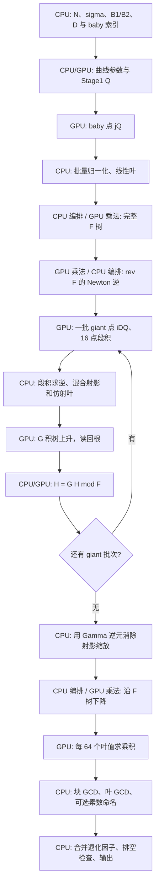

# 当前 CUDA ECM Stage2 实现：逐步骤说明

日期：2026-10-03。源码基线：`d1433be` 的真实 baby/段积修复，加本轮连续缓冲 fold 候选（§26）；当前代码行号已同步。

本文按一条曲线的实际执行顺序说明算法、输入输出、CPU/GPU 分工和数据生命周期。代码链接均指向当前原文件的一处入口，行号为本基线的一基行号；后续修改源码时行号可能变化。

## 1. 范围与入口

本文主线是 [stage2_tree_gpu.cu](D:/code/MPA-OpenCl/tools/bench/stage2_tree_gpu.cu:9701) 的 `--real` → `run_real()` → `run_batched()`。多项式乘法直接包含并调用 [ntt_poly_probe.cu](D:/code/MPA-OpenCl/tools/bench/stage2_tree_gpu.cu:87)，不是另写一份 NTT。

需要区分三个实现：

- **CUDA 多项式树实验引擎**：本文对象。F/G 积树、模 F fold、余式树下降、分块 GCD，构建为 `stage2_tree_gpu.exe`。
- **CPU GMP 树参考**：[stage2_tree_ref.cpp](D:/code/MPA-OpenCl/tools/bench/stage2_tree_ref.cpp:1)，提供小形状独立结果和 F dump。
- **CUDA pairing/BSGS 路径**：[cgbn_stage2.cu](D:/code/MPA-OpenCl/kernels/cuda/cgbn_stage2.cu:1)，使用逐候选点关系和模乘，执行步骤与本文树版不同。

树版仍位于 `tools/bench/`，不能当作已经接入生产驱动的默认 Stage2。生产驱动当前有 [Prime95 交付调用](D:/code/MPA-OpenCl/src/core/ecm_driver.cpp:3148)。树版 CLI 的 [参数解析](D:/code/MPA-OpenCl/tools/bench/stage2_tree_gpu.cu:11112) 提供 `--real` 和 `--check-F` 等入口，没有直接读取生产 `.save` 的 `--resume` 入口。

`--real` 会自己重算 Stage1 Q；`--check-F` 从 CPU dump 读取 Q、baby/F 参考信息并验证。[run_check_F](D:/code/MPA-OpenCl/tools/bench/stage2_tree_gpu.cu:10557) 是独立检查入口，不能用它通过来替代 `--real` 输入生成正确性检查。

### 1.1 本文采用的优化组合

“当前代码默认值”与“最近成功 A/B 使用的组合”不同。逐步骤主线以下列测量组合为例，回退分支另行说明：

- S4 设备系数归约开启，`NTT_S4_OLDTAIL=0`：直接长除法归约。
- `NTT_GROOT_DEVICE=1`：G 树中间层驻留设备，只读回根。
- `NTT_SCALED_DESCENT=1`：scaled 下降；`NTT_S5_ON=0`。
- `NTT_S4_OUTPUT_WINDOW=1`、`NTT_S4_CHUNK_OUTPUT=1`：只返回需要的系数窗口，并复用 chunk 输出空间。
- `NTT_S4_PACK_DIRECT=1`、`NTT_S4_FLAT_DIRECT=1`：直接打包到 NTT 工作区，尽量借用已有 flat 输入。
- `NTT_GROOT_LEAF_STAGING=1`、`NTT_GROOT_COMPACT_RAW=1`：复用 pinned staging，raw A/B 分别定容。
- `NTT_GFINV_BATCH=1`：64 段窗口批量求逆；`NTT_S4_CARRY_BATCH=0`。
- 最近生产 A/B 的 oracle async=0，sample=96、check every=8；异步 oracle 是另外的可选路径。

其中 G-root device、scaled descent、output window、GFINV batch 都是 **opt-in，代码默认关闭**；pack direct、flat direct、chunk output、G-root leaf staging/compact raw 默认开启，final whole readback 默认关闭，carry batch 默认关闭。
出处：[S4 与算法开关](D:/code/MPA-OpenCl/tools/bench/stage2_tree_gpu.cu:1415)、[G-root 内存开关](D:/code/MPA-OpenCl/tools/bench/stage2_tree_gpu.cu:1477)、[carry batch](D:/code/MPA-OpenCl/tools/bench/stage2_tree_gpu.cu:1499)、[GFINV batch](D:/code/MPA-OpenCl/tools/bench/stage2_tree_gpu.cu:388)。

## 2. 总流程与符号



符号约定：

- `N`：待分解的奇数模数；`S=bits(N)`，`W=ceil(S/64)`。
- `Q`：Stage1 后的 Montgomery 曲线点。本文用 `Y` 表示多项式变量，避免与点坐标 `X` 混淆。
- `D`：baby/giant 步长。`J={j:1≤j≤D/2, gcd(j,D)=1}`，`P=|J|=φ(D)/2`。
- `x_j=x([j]Q)`：baby 仿射横坐标；`u_i=x([iD]Q)`：giant 仿射横坐标。
- `I=floor(B2/D)+2`：当前引擎的 giant 数量，索引为 `i=1..I`。
- `F(Y)=∏_(j∈J)(Y−x_j)`；`G_b(Y)`：第 b 批 giant 对应的积多项式。
- `H`：逐批累积的 giant 多项式，通常保持为模 F 的余式。
- `n_ntt`：变换长度；NTT 模数记作 `p_ntt`，它与 ECM 模数 N 不同。

**为什么可用多项式寻找因子？** 对 N 的某个素因子 q，正常点关系中 `x([iD]Q)=x([j]Q) mod q` 对应 `[iD±j]Q=O mod q`。因此积多项式在 baby 点的值含有这些差值因子，最终通过 GCD 提取 N 的因子。无穷远点、不可逆 Z 和退化 chain 需按代码的专门分支处理。

giant/baby 组合是候选超集，不是“每个线性因子对应一个已经筛过的 Stage2 素数”；素数区间与素性过滤发生在小素数分支及命名分支。
出处：[giant 范围](D:/code/MPA-OpenCl/tools/bench/stage2_tree_gpu.cu:8716)、[命名方向说明](D:/code/MPA-OpenCl/tools/bench/stage2_tree_gpu.cu:9432)。

## 3. 数据表示：贯穿全部步骤的约定

### 3.1 多项式系数

系数是 **普通域中的 `[0,N)` 整数**，一个系数占 W 个 little-endian 64-bit limb。flat 布局为：

```text
poly[k*W+t] = 第 k 个系数的第 t 个 limb
系数顺序：常数项、一次项、二次项……
```

`CPoly` 是“一系数一个 vector”的主机表示；积树节点通常用 flat vector。`cp_from_flat/cp_to_flat` 在两种容器间复制。它们仍都存普通模 N 系数，不是 NTT 频谱。
出处：[布局约定](D:/code/MPA-OpenCl/tools/bench/stage2_tree_gpu.cu:20)、[转换函数](D:/code/MPA-OpenCl/tools/bench/stage2_tree_gpu.cu:4221)。

### 3.2 点坐标与三个算术域

- 点 kernel 采用 Montgomery 模乘，参数包含 `R=2^(64W) mod N`、`ninv=−N⁻¹ mod 2^64`、Montgomery image 的 `a24/Q`。
- 多项式接口输入输出是普通模 N 系数。
- NTT 内部是 Goldilocks 素域 `p_ntt=2^64−2^32+1`。

`ladder_points` 输出普通域坐标；chain 输出保留 Montgomery image 的射影坐标。**同一对坐标共同乘 R 仍代表同一仿射点**，但其射影叶的标量也包含 R。精确消除这一标量需要与实际返回 Z 的普通乘积相匹配；当前 chain 段积的尺度差异见第 13、17 节，不能只依赖源码注释判断。
出处：[LadderCtx](D:/code/MPA-OpenCl/tools/bench/stage2_tree_gpu.cu:3922)、[chain seeds 转域](D:/code/MPA-OpenCl/tools/bench/stage2_tree_gpu.cu:8270)、[实际 Z 段积合同](D:/code/MPA-OpenCl/tools/bench/stage2_tree_gpu.cu:8878)、[NTT 模数](D:/code/MPA-OpenCl/tools/bench/ntt_poly_probe.cu:88)。

## 4. 第 0 步：解析任务、规划 D、枚举 baby 集

**位置/分工：CPU；CUDA 查询设备与显存。**

1. 读取 N，要求 N 为奇数，计算 S/W，选择 `--device`。
2. 查询空闲显存，默认预留 768 MiB，用剩余容量形成 arena 预算；`NTT_ARENA_RESERVE_MB / NTT_ARENA_CAP_KB` 可覆盖。
3. 使用指定 `--d`，或 `--choose-d` 根据拟合的 loop/tree/giant/glue 成本及形状容量选择可容纳的 D。
4. 枚举 `j≤D/2 且 gcd(j,D)=1`，严格检查数量等于 φ(D)/2。
5. 计算 giant 数 I、G 批次数 `ceil(I/P)`、fold 次数 `ceil(I/P)−1`。

D 越大，giant 数往往越少，但 F 树、逆多项式和下降随 P 增大；当前选择策略并非“取能放下的最大 D”。源码仍有一些早期注释，实际应以决策逻辑为准。

**输出：** baby 索引、P、I、批次数、形状及显存预算。baby 索引留在主机，点生成时上传。
出处：[解析和显存预算](D:/code/MPA-OpenCl/tools/bench/stage2_tree_gpu.cu:9701)、[D 决策](D:/code/MPA-OpenCl/tools/bench/stage2_tree_gpu.cu:9881)、[baby 集](D:/code/MPA-OpenCl/tools/bench/stage2_tree_gpu.cu:9905)。

## 5. 第 1 步：曲线、Stage1 Q 与上下文准备

这一节是 Stage2 的输入准备；Stage1 运算本身不计入 `stage2_full_wall.total`。

**CPU：** Suyama sigma 参数化计算 `a24` 和起点 `(X:Z)`，准备 Montgomery 常数；参数化退化时当前 `--real` 报错退出。生成各素数最高幂组成的 lcm 指数因子列表。

**GPU：** `ladder_product` 在一个顺序 ladder chain 中计算 Q。各指数因子之间有数据依赖，不按这些因子并行。

```text
NTT_STAGE1_EXTRA=1  → Q = [lcm(1..B1)]P0
NTT_STAGE1_EXTRA=12 → Q = [12*lcm(1..B1)]P0
```

生产 ini 的相应设置是 `method=gpu`、`gpu_param=0`、`exponent=choose12`。探针不读取该 ini，必须显式设 `NTT_STAGE1_EXTRA=12`；对齐 Prime95 还需相同 N/sigma/B1，最好核对完整 Q。

Q 准备完毕后，建立 LadderCtx、NTT arena、S4 输入/输出区、归约常数及检查上下文。此后的 S4 等 mandatory 自测计入 Stage2 init；Q 之前的点 Montgomery 自测不在这个 init 边界内。

**传输：** 起点、指数列表和常数 H2D，最终 Q D2H；CPU 准备 Stage2 的 Q Montgomery image。上下文和 arena 存活到本次 `run_real` 结束。
出处：[Montgomery 参数](D:/code/MPA-OpenCl/tools/bench/stage2_tree_gpu.cu:9929)、[Stage1 EXTRA](D:/code/MPA-OpenCl/tools/bench/stage2_tree_gpu.cu:9965)、[Stage2 init 起点](D:/code/MPA-OpenCl/tools/bench/stage2_tree_gpu.cu:10001)、[ini 文档](D:/code/MPA-OpenCl/docs/DEV_ECM_INI.md:65)。

## 6. 第 2 步：GPU 生成 baby 点 `[j]Q`

**输入：** Q、a24、N 和全部 baby 索引。GPU 用 x-only Montgomery ladder，按点并行，返回 `bx/bz` 两个 flat 坐标数组。普通 ladder 与 chain 的线程模型不同，不能把它视为一个 CGBN 生产 Stage1 kernel。

**输出：** 每个 baby 点的普通域 `(X_j,Z_j)`，回到 CPU。

baby 点数组大小各为 `P*W*8` bytes。后续构造完线性叶和 F 树后，局部 bx/bz 被释放；F 树保留。
出处：[baby 调用](D:/code/MPA-OpenCl/tools/bench/stage2_tree_gpu.cu:10109)、[ladder kernel](D:/code/MPA-OpenCl/tools/bench/stage2_tree_gpu.cu:781)、[ladder_points](D:/code/MPA-OpenCl/tools/bench/stage2_tree_gpu.cu:3929)。

## 7. 第 3 步：CPU 批量归一化 baby，并构造 monic 叶

按 **256 点一个 segment**，由 CPU/GMP 构造 Z 的 prefix 积：

```text
pv[0] = 1
pv[j+1] = pv[j]*Z_j mod N
iprod = inverse(pv[segment_length]) mod N

从末尾到开头：
    Z_j_inverse = iprod*pv[j] mod N
    x_j = X_j*Z_j_inverse mod N
    iprod = iprod*Z_j mod N
```

通常一个 segment 只做一次 `mpz_invert`，其余是模乘。若某个 Z=0 或组合积不可逆，整个 segment 走逐点 affine helper。该 helper 的实际规则为：Z=0 返回 x=0 且标记成功；非零 Z 不可逆则返回 X、标记失败，调用处另计算 `gcd(Z,N)` 收集退化信息。

最终叶系数为 `[-x_j,1]`，即 `Y−x_j`，因此 F 及其所有真实节点 monic，后续反转多项式的常数项可逆。

**重要修复：** 旧代码漏乘 `pv[j]`，把 `X_j/(Z_0…Z_j)` 当成 x_j。本基线已修复；此前 `--real` 性能记录不能证明正确 ECM 的性能。新真实入口门禁核对独立全部 baby/F，冻结因子已恢复。

**资源：** 固定 256 点 GMP 临时窗口、P 个 2W-word 叶 vector；不在 GPU 求 baby 的逆元。
出处：[256 点窗口及回退](D:/code/MPA-OpenCl/tools/bench/stage2_tree_gpu.cu:10129)、[正确逆扫描](D:/code/MPA-OpenCl/tools/bench/stage2_tree_gpu.cu:10176)、[affine helper](D:/code/MPA-OpenCl/tools/bench/stage2_tree_gpu.cu:352)、[独立门禁](D:/code/MPA-OpenCl/tools/test/test_stage2_real_baby.py:1)。

## 8. 第 4 步：上升构建完整 F 积树

把叶数补到 `Fpad=next_power_of_two(P)`，使用二叉 heap 编号：根为 1，孩子为 2v/2v+1，叶从 Fpad 开始。

- 真实叶为 `Y−x_j`，padding 叶为常数 1，**不是多加一个零根**。
- 每层按孩子多项式长度分组；同形状的多个 pair 一起调用 batched 乘法。
- 常数 1 子树使用 passthrough，无需 NTT 乘法。
- F 树保留全部需要的节点和次数信息，供最后下降读取；不能套用 G 树的“只保留根”策略。

**分工/传输：** CPU 建 heap、组装每层 flat 输入；GPU 做多项式乘法及 mod N 归约；当前 F 树节点结果仍读回主机。F 全树尚未按 G-root 的方式全程驻留 GPU。

**输出：** `Ft/Fdeg/Fpad`，根 `Ft[1]` 是完整 F。
出处：[build_tree_flat](D:/code/MPA-OpenCl/tools/bench/stage2_tree_gpu.cu:3671)、[真实 F 构建](D:/code/MPA-OpenCl/tools/bench/stage2_tree_gpu.cu:10210)。

## 9. 公共算术步骤：一次 GPU 多项式乘法如何执行

F 树、G 树、Newton 逆、fold、下降共用这一链路。单次 batch 内每个 slice 是独立多项式乘法，变换长度按最大输入长度规划。

### 9.1 主机分组、形状与 chunk

`poly_mul_batch_modN` 接受 ma/mb、nbatch 和输出窗口 first/count。检查长度、stride、输入/输出 alias 与驻留 offset；按 batch 预算拆成多个 chunk。

普通路径上传 flat 模 N 原始系数；驻留 G 树路径使用已经在 raw frontier 的系数，额外上传 offset metadata，不再上传整层系数。
出处：[乘法入口合同](D:/code/MPA-OpenCl/tools/bench/stage2_tree_gpu.cu:3131)、[flat 输入借用/补零](D:/code/MPA-OpenCl/tools/bench/stage2_tree_gpu.cu:6945)。

### 9.2 Kronecker 打包

把多项式系数看成彼此留有足够空隙的大整数槽，槽位宽至少：

```text
slot_bits = 2*S + max(1, ceil(log2(max_input_coeff_count)))
slot_words = ceil(slot_bits/bpw)
slot_stride = slot_words*bpw
```

第 k 个系数从 `k*slot_stride` bit 开始，每个 NTT digit 有 bpw 个有效 bit。不能把系数 k 写到第 k 个 digit；一个系数占很多 digits。

`pack_direct=1` 时 GPU pack kernel 直接写 NTT 引擎的 A/B scratch，省去单独 packed input 的临时显存与后续 D2D。resident 路径按 metadata gather；普通路径从上传后的 raw 输入打包。NTT 仍需要 A/B 工作区，优化没有让输入频谱消失。
出处：[NTT 形状规划](D:/code/MPA-OpenCl/tools/bench/ntt_poly_probe.cu:2848)、[普通 pack](D:/code/MPA-OpenCl/tools/bench/stage2_tree_gpu.cu:2997)、[直接 scratch pack](D:/code/MPA-OpenCl/tools/bench/stage2_tree_gpu.cu:3095)、[resident gather](D:/code/MPA-OpenCl/tools/bench/stage2_tree_gpu.cu:3060)。

### 9.3 精确性预算

卷积在 `p_ntt=2^64−2^32+1` 上执行。单个 digit 卷积的累加项数 L_terms 满足：

```text
L_terms = max_input_coeff_count*slot_words
L_terms*(2^bpw−1)^2 < p_ntt
```

结合零填充和槽位容量，该不等式保证 NTT 结果能恢复为普通整数卷积，而不是只得到模 p_ntt 的模糊结果。它是整数精确性约束，不是浮点误差估计；每种形状规划/使用时检查，不能直接套用其他位宽的 bpw。
出处：[精确界计算](D:/code/MPA-OpenCl/tools/bench/ntt_poly_probe.cu:2262)、[调用前检查](D:/code/MPA-OpenCl/tools/bench/ntt_poly_probe.cu:2957)。

### 9.4 Forward、逐点乘法和 inverse

GPU fused forward 对 A/B 做 DIF：自然顺序输入、bit-reversed 频谱输出；inverse 使用 DIT，消费相同频谱顺序并恢复自然顺序。逐点相乘及 inverse 长度缩放融合进 inverse tile pass，避免单独扫数组；不需要独立 bit-reversal kernel。

多个 stage 在 tile 内融合，临时寄存器/共享内存和全局存储属于底层 NTT 实现。arena 复用 FuseCtx、工作区和表；当前仍是普通完整卷积，不是 Prime95 的 NO_UNFFT 或共享父谱算法。
出处：[实际 NTT passes](D:/code/MPA-OpenCl/tools/bench/ntt_poly_probe.cu:3139)、[融合 inverse](D:/code/MPA-OpenCl/tools/bench/ntt_poly_probe.cu:3191)、[NttArena](D:/code/MPA-OpenCl/tools/bench/ntt_poly_probe.cu:1552)。

### 9.5 Carry 恢复整数 digits

inverse 得到 digit 卷积系数后，GPU 把超出 bpw 的部分向高 digit 传递。常见形状用 carry cone 把有限依赖链展开到寄存器，并在 kernel 内完成 binary propagation；超出 cone 支持范围时执行旧 height-reduction 路径再收尾。

必须保留 carry convergence/residual verdict。defer carry 及 carry batch 只调整检查完成时机，不允许跳过中间 chunk 的检查；当前测量组合 carry batch=0。
出处：[carry 执行](D:/code/MPA-OpenCl/tools/bench/ntt_poly_probe.cu:3204)、[chunk verdict 生命周期](D:/code/MPA-OpenCl/tools/bench/stage2_tree_gpu.cu:3335)。

### 9.6 系数 mod N 归约

GPU 每线程处理一个输出系数：

1. 检查对应源槽的高位界，即使该系数不在请求输出窗口内也检查。
2. 对请求窗口，将 bpw digits 重组为 little-endian 64-bit limbs。
3. 当前默认直接长除法：把 N 左移规范化，借助高两字/一字除法及预计算 reciprocal 估计商，逐字乘减，过估时加回修复，最后去除规范化 shift，得到普通 `C mod N`。
4. `NTT_S4_OLDTAIL=1` 或 forensic dump 保留旧 REDC 消元再 Montgomery restoration 路径，供同二进制对照/诊断。

因此当前主线已经接入长除法；“还需要把原语接进 reduce”的历史计划已完成。它同时替代旧消元和域恢复两部分，不是只换最后一行乘法。
出处：[归约 kernel](D:/code/MPA-OpenCl/tools/bench/stage2_tree_gpu.cu:1868)、[直接长除法分支](D:/code/MPA-OpenCl/tools/bench/stage2_tree_gpu.cu:1915)、[长除法 helper](D:/code/MPA-OpenCl/tools/bench/stage2_tree_gpu.cu:1810)、[常数预计算](D:/code/MPA-OpenCl/tools/bench/stage2_tree_gpu.cu:2176)。

### 9.7 输出窗口、检查和结果交付

- output window 开启时，仅归约/返回 `[first,first+count)` 的系数；**仍执行完整 NTT 和 carry**，不是截断 NTT。
- 普通调用用 chunk 输出区，D2H 到交替 pinned staging；event 保证前一 chunk 被消费后才能覆写，调用结束排空待处理结果。
- resident G 树调用把结果 scatter 回下一个 raw frontier，常规模式不把中间节点读回 CPU。
- GMP oracle 根据抽样/全检查策略核对独立重构的系数；可选异步 worker 使用快照和 fence，必须排空后才报告成功。抽样并非全部系数逐个做 GMP。
- 关闭 pinning/异步的回退保留 blocking D2H；final whole readback 开关用于恢复原完整布局对照。

出处：[归约窗口检查](D:/code/MPA-OpenCl/tools/bench/stage2_tree_gpu.cu:1885)、[scatter/D2H/event](D:/code/MPA-OpenCl/tools/bench/stage2_tree_gpu.cu:3489)、[oracle 检查](D:/code/MPA-OpenCl/tools/bench/stage2_tree_gpu.cu:2904)、[oracle drain](D:/code/MPA-OpenCl/tools/bench/stage2_tree_gpu.cu:2859)。

## 10. 第 5 步：小素数补充检查与曲线 workspace

进入 `run_batched()` 后建立 S3Workspace，上传 N、Q、a24、Montgomery one；点数组和累积数组按需增长并复用。

先枚举 `(B1,B2]` 内且 `p≤D/2` 的素数，GPU 批量计算 `[p]Q`，CPU 对其 Z 做 GCD。这部分不能完全依赖 `i≥1` 的 giant/baby 覆盖，包含 D 的相关小素数。

得到非平凡因子时通过 `s3_record` 记录因子及该 p；当前流程仍继续后面的树运算。
出处：[workspace](D:/code/MPA-OpenCl/tools/bench/stage2_tree_gpu.cu:8162)、[小素数分支](D:/code/MPA-OpenCl/tools/bench/stage2_tree_gpu.cu:8737)。

## 11. 第 6 步：预计算反转 F 的 Newton 逆

当 G 批次不止一个时，准备：

```text
rev_P(F)[k] = F[P−k]
finv = 1/rev_P(F) mod Y^(P+1)
Newton: g_new = g*(2−rev_P(F)*g) mod Y^next_length
```

F monic，因此 rev(F) 的常数项是 1；不需要假设模 N 是素域。每轮精度最多翻倍，两次多项式乘法经 GPU；2−ag 等系数构造由 CPU 完成。inverse 长度不能随零尾项 trim，否则 Newton 精度增长可能失效。

**生命周期：** finv 在全部 fold 期间保留，scaled 下降根转换可复用；不是每一个 giant 批次重算。仅一批 G 时可能不预先建立，后续下降按需处理。
出处：[一次性 finv](D:/code/MPA-OpenCl/tools/bench/stage2_tree_gpu.cu:8792)、[Newton 实现](D:/code/MPA-OpenCl/tools/bench/stage2_tree_gpu.cu:4327)。

## 12. 第 7 步：按 point chunk 生成 giant 点

G 树每批最多 P 点；外层 point chunk 可含整倍数的 G 批次。当前点预算以 256 MiB 两坐标 payload 为目标，并向上取整到整批，至少一批；**不是严格保证 256 MiB 峰值上限**，也不含 seeds、段积及其他区。

**大 chunk：chain。** CPU 枚举每段的前两个倍数和 DQ，GPU ladder 计算 seeds，CPU 把 seeds 转成 Montgomery image，再上传。每个 GPU 线程顺序生成一个 chain block，使用差分加法生成后续 `[iD]Q`；默认每线程 64 点。

**小 chunk/对照：ladder。** 默认点数小于 32768 时逐点 ladder；`NTT_GIANT_LADDER=1` 或调整 chain_min 可强制。chain 固定 seed/传输成本使它在很小形状上未必划算。

chain 遇到因子模上的退化点后可能影响本 block 后续坐标；64 点块限制传播范围，但不是“自动重算所有退化点为独立 ladder”。可选 chain check 运行两种方法，按仿射点比较。

**输出/访存：** giant X/Z 当前都 D2H 到主机 `gx/gz`，并非从 chain 输出直接构造 device 叶。chain seeds、ox/oz、段积设备 buffer 还有按 chunk 的 malloc/free；S3Workspace 存在不代表这些临时区已经全部池化。
出处：[点预算](D:/code/MPA-OpenCl/tools/bench/stage2_tree_gpu.cu:8816)、[选择阈值](D:/code/MPA-OpenCl/tools/bench/stage2_tree_gpu.cu:8850)、[chain 组织](D:/code/MPA-OpenCl/tools/bench/stage2_tree_gpu.cu:8259)、[顺序 chain kernel](D:/code/MPA-OpenCl/tools/bench/stage2_tree_gpu.cu:911)、[D2H 与释放](D:/code/MPA-OpenCl/tools/bench/stage2_tree_gpu.cu:8330)。

## 13. 第 8 步：16 点段积、可逆性分类与批量求逆

每个 point chunk 按 **16 点 segment** 建立 Z 积网格：chain 在 GPU 算，ladder 回退在 CPU 算。**两条路径的可逆性分类等价，但当前源码的精确数值尺度不同。**

设一个段实际有 m 点，返回坐标为 `Ztilde_j`：

```text
ladder host 段积 = product(Z_j) mod N
chain GPU 段积 = product(Ztilde_j)*R^(-(m−1)) mod N
```

第二式直接来自 kernel：以第一个 Z 为初值，再执行 m−1 次 `s2g_mont_mul(a,b)=a*b*R^−1`。kernel 后的 host 代码仅 D2H，没有把额外 R 幂补回。由于 R 与奇数 N 互素，两者对相应坐标的 unit/nonunit 判断不受该幂影响；但 chain 段积不能直接称为“实际返回 Z 的普通乘积”。

这是本报告静态阅读发现的**注释合同与实现尺度差异**，不是本次新增的动态复现。此前同一路径的新旧求逆互比也不能证明它等于独立 monic 参考；后续需对一般奇数模数、完整段及末段建立独立段积/完整叶门禁。

默认对每个查询段积调用 `mpz_invert`。`NTT_GFINV_BATCH=1` 时：

1. 对现有段积网格取最多 64 段的对齐窗口，不改变 16 点分段。
2. 生成 prefix，求一次组合积逆元，逆扫描恢复各段逆元。
3. 同窗口重复查询从缓存复制结果。
4. 组合积不可逆时逐段 invert，准确区分组内好段和坏段；不能把整组全部判坏。

缓存在 point chunk 的 G 批次循环外，跨 G 批次片段共享，只有一个窗口；离开 point chunk 清除 GMP 对象。这里的“64 段求逆窗口”和“16 点 segment”“64 点 chain”“64 叶 GCD 块”是四个不同概念。
出处：[段积 kernel](D:/code/MPA-OpenCl/tools/bench/stage2_tree_gpu.cu:982)、[Montgomery 模乘定义](D:/code/MPA-OpenCl/tools/bench/stage2_tree_gpu.cu:659)、[host 普通段积](D:/code/MPA-OpenCl/tools/bench/stage2_tree_gpu.cu:536)、[chain 段积读回](D:/code/MPA-OpenCl/tools/bench/stage2_tree_gpu.cu:8334)、[GfinvBatch](D:/code/MPA-OpenCl/tools/bench/stage2_tree_gpu.cu:397)、[缓存生命周期](D:/code/MPA-OpenCl/tools/bench/stage2_tree_gpu.cu:8897)。

## 14. 第 9 步：CPU 构造 mixed giant 叶，累计 Gamma 逆元

**好段：** 段积可逆，说明段内每个 Z 都可逆。直接构造 `[-X_i,Z_i]`，即：

```text
Z_i*Y−X_i = Z_i*(Y−u_i)
```

不逐点求仿射逆元：取负和复制 limb 即可。把实际 gseg 的逆元只累计一次到名为 Ginv 的变量；ladder 段积与普通叶尺度一致，chain 段积还有第 13 节所述 R 幂。

**坏段：** 对当前片段尝试原有 affine 批量路径，必要时逐点处理；非零不可逆 Z 的 GCD 通过 `s3_record(..., count_hit=false)` 保留。这些叶采用 `[-affine_helper_result,1]`，不计入 Gamma。

`first_touch` 防止跨 G 批次的同一 segment 被多计；段网格索引是 point chunk 的局部索引，不是全部 giant 的全局索引。末段使用实际 seglen。

**输出：** 主机 `bleaf`（每点 2W words）和累积 Ginv。即使 G 树中间层驻留 GPU，当前这一步仍在 CPU。
出处：[射影叶合同](D:/code/MPA-OpenCl/tools/bench/stage2_tree_gpu.cu:8912)、[first_touch/Gamma](D:/code/MPA-OpenCl/tools/bench/stage2_tree_gpu.cu:8957)、[好段写叶](D:/code/MPA-OpenCl/tools/bench/stage2_tree_gpu.cu:8985)、[坏段回退](D:/code/MPA-OpenCl/tools/bench/stage2_tree_gpu.cu:9018)。

## 15. 第 10 步：构造本批 G，保留根

G 树只服务 fold，后面不沿它下降，因此允许释放孩子。

**resident 路径：**

1. CPU 根据 leaf degree 构造树次数和 offset metadata。
2. 借用既有 pinned output staging 将 leaf H2D 到 raw A；event 保护复用，不能覆盖尚未完成的 D2H/H2D。
3. raw A 容纳最大 leaf frontier，raw B 按首 parent frontier 定容。每层仅保留当前/下一 frontier。
4. CPU 按孩子长度分组，上传 offsets；GPU gather → 公共 NTT/归约 → scatter。
5. 常数 1 子树 passthrough 用 D2D；空 padding 不生成伪根。
6. 最终仅 D2H 根 `(actual_batch_points+1)*W` words；返回的 heap 只含可用根 payload。中间节点不读回，临时 metadata 释放。

**回退：** `build_groot_select` 检查 S4、root-only、direct pack、关闭 final whole readback/host pack 等条件；不满足时用主机编排的 `build_tree_flat`，并统计 fallback。该主机路径仍可 root-only，在消费后释放子节点。

G-root 使用的 raw pair 被独占借用，不能同时被普通 raw upload 覆写。leaf staging 只复用已有 pinned 容量，不表示整个 bleaf 已从主机消失；不可用时额外 flatten 到 pageable vector 再上传。
出处：[选择条件](D:/code/MPA-OpenCl/tools/bench/stage2_tree_gpu.cu:4166)、[resident 树](D:/code/MPA-OpenCl/tools/bench/stage2_tree_gpu.cu:4015)、[pinned 叶 staging](D:/code/MPA-OpenCl/tools/bench/stage2_tree_gpu.cu:4050)、[按层 gather/scatter](D:/code/MPA-OpenCl/tools/bench/stage2_tree_gpu.cu:4111)、[仅根读回](D:/code/MPA-OpenCl/tools/bench/stage2_tree_gpu.cu:4159)。

## 16. 第 11 步：fold，逐批 `H←G·H mod F`

第一批直接 `H=G_0`；后续批次执行：

```text
T = G_b*H
若 deg(T)<P：H=T
否则：
    k = deg(T)−P+1
    qrev = low_k(rev_deg(T)(T) * low_k(finv))
    q = reverse(qrev)
    qb_low = low_P(q*F)
    H = low_P(T)−qb_low mod N
```

常见完整形状有三次多项式乘法：G*H、逆序商、q*F。finv 跨所有批次复用；请求低系数窗口减少归约/读回，但底层仍完整卷积。

**分工/访存：** G 根、Fpoly、H 在 CPU；`cp_mul` flatten/补零并经 GPU 运算，结果回 CPU；逆序、q 构造、`cp_coeff_sub` 和 trim 由 CPU/GMP 处理。此阶段没有完整 H/F/G 驻留的 device fold，仍有反复 H2D/D2H 与临时 CPoly/vector 构造。

首次 H 可能仍为 P 次；只有一批 G 时没有 fold，下降入口需自行处理 H mod F。
出处：[初始化 H 与 fold](D:/code/MPA-OpenCl/tools/bench/stage2_tree_gpu.cu:9086)、[cp_mul 主机准备](D:/code/MPA-OpenCl/tools/bench/stage2_tree_gpu.cu:4295)、[系数减法](D:/code/MPA-OpenCl/tools/bench/stage2_tree_gpu.cu:4256)。

## 17. 第 12 步：CPU 消除射影缩放

所有好段的射影叶使 giant 积带上 `Gamma=∏(实际返回 Z_i)`。fold 在模 F 环中保持这个常数因子，循环完成后 CPU 逐系数做：

```text
H[k] = H[k]*Ginv mod N
```

没有额外 GPU kernel；每系数 words↔GMP、乘法、取模、导出。代码检查 `projective leaves == Gamma 覆盖 points`，并检查 Ginv 可逆。这两个断言证明覆盖数量和 unit 属性，**不能证明 Ginv 数值恰好等于实际 Gamma 的逆元**。

根据第 13 节的静态尺度推导，若 chain 好段长度为 m_s，当前实际累计值为
`Ginv=Gamma^−1 * R^(sum_s(m_s−1)) mod N`；处理后的 H 仍可能带这个可逆 R 幂。全部走普通 ladder 时没有这一 chain 差异。
可逆常数不改变 GCD，但会改变精确 H/叶系数；应补独立 chain 段积与 monic 叶值对拍，并确认相应 modulus 下 R 幂是否碰巧为 1。这里不能写成已证明所有路径精确 unscale。
出处：[unscale 与覆盖断言](D:/code/MPA-OpenCl/tools/bench/stage2_tree_gpu.cu:9150)。

## 18. 第 13 步：只沿 F 树下降一次，得到 `H(x_j)`

最终叶按 baby 索引排列，而不是 giant 索引。主循环已经把所有 giant 批次折叠进 H，所以无需逐批做一次完整下降。

### 18.1 当前优化组合：ordinary-coefficient scaled descent

对 monic 节点多项式 M、次数 d，状态可解释为：

```text
r = H mod M
S_M = rev_(d−1)(r) / rev_d(M) mod Y^d
```

根状态由逆序 H 与 finv 相乘取低 P 项得到；如果 H 次数还达到 P，先做根余式。对目标孩子次数 a、兄弟次数 b：

```text
child_state = coefficients [b, b+a) of
              parent_state * rev_b(sibling_polynomial)
```

同一层按 `(a,b)` 分组，一组 batch 乘法。兄弟次数为 0 时直接拷贝父状态，目标次数为 0 时跳过；每层次数守恒和长度都检查。

到 monic 线性叶 `Y−x_j` 时 d=1，状态只剩一个系数，就是 `H(x_j)`。无需为每个孩子重算 Newton inverse/完整 divmod。

**内存/分工：** F 树和 cur/next 状态仍在主机；CPU pack 组输入、反转兄弟、组装下一层，GPU 乘法并返回窗口。只保留两个状态 frontier，但保留 F 全树。当前尚未共享同一父状态的 NTT 频谱。
出处：[scaled state 独立解释](D:/code/MPA-OpenCl/tools/bench/stage2_tree_gpu.cu:7148)、[根转换](D:/code/MPA-OpenCl/tools/bench/stage2_tree_gpu.cu:7188)、[child 窗口递推](D:/code/MPA-OpenCl/tools/bench/stage2_tree_gpu.cu:7237)、[叶输出](D:/code/MPA-OpenCl/tools/bench/stage2_tree_gpu.cu:7275)。

### 18.2 默认及可选分支

- S4 开启、scaled 关闭：`descent_batched`，逐层按形状批量余式除法；线性叶有单独 Horner 路径。
- S4 关闭：`descent_slow`；单次多项式乘法仍可使用共享 NTT，精确系数的模 N 归约由主机执行，不能简单叫“整个算法纯 CPU”。
- `NTT_S5_ON=1`：`descent_batched_dev`，另一套设备下降/叶驻留实验；与 scaled 不可同时启用，**不属于本次 96.848 秒结果**。
- descent check 可跑 slow 参考逐叶比较；检查开关增加额外工作，clean 性能测量应与其区分。

出处：[下降分支选择](D:/code/MPA-OpenCl/tools/bench/stage2_tree_gpu.cu:9271)、[batched 下降](D:/code/MPA-OpenCl/tools/bench/stage2_tree_gpu.cu:4473)、[线性叶 Horner](D:/code/MPA-OpenCl/tools/bench/stage2_tree_gpu.cu:6828)、[S5 设备下降](D:/code/MPA-OpenCl/tools/bench/stage2_tree_gpu.cu:6345)。

## 19. 第 14 步：GPU 分块乘积，CPU GCD 和可选命名

scaled/default S4 下降的全部叶在 CPU `values`。先 flatten 为 `P*W` words，再 H2D 到 ws.dvals。GPU 每 **64 个叶值** 求分块乘积，D2H 返回每块一个 W-word 值；它不是把全体叶只归约成一个最终累加器。

该 kernel 对普通叶值连续使用 Montgomery 模乘。m 个叶的实际输出是 `product(values)*R^(-(m−1)) mod N`，没有再恢复普通乘积尺度。这里输出只用于 GCD，R 是 unit，所以 GCD 与普通块乘积相同；不要把返回的 limb 数值当成普通乘积做逐字参考比较。

CPU 对每个块乘积做 `gcd(block_product,N)`；当得到 `1<g<N` 时进入该块，检查单叶 GCD：

- 不命名或超出命名预算：记录单叶的非平凡 GCD，因子保留。
- 允许命名：对该 baby 索引 j 扫 `i=1..I`，生成 `iD−j` 和 `iD+j`，只保留 `(B1,B2]` 的素数；GPU ladder 计算这些候选倍数，CPU 对 Z 做 GCD确认并记录 `hit_primes`。
- 没有确认的素数名也保留叶 GCD，记为 unnamed。

`NTT_NAME_MAX` 与 block budget限制诊断成本；`hits/hit_primes` 是归因计数，不能直接当作完整因子集合大小。`s3_record` 去重因子、排除 1/N，核对是否整除 N。

**当前代码的具体边界：** 块 GCD 为 N 时，不进入上述单叶检查分支；当前 batched 尾部也没有“最后再求一次全部块乘积 GCD”的代码。不能把早期流程文档的“每块+末尾 GCD”当作现状。饱和块递归定位是否需要补充，需另建独立用例；本报告仅记录静态行为，没有做新复现。

出处：[block product kernel](D:/code/MPA-OpenCl/tools/bench/stage2_tree_gpu.cu:8132)、[当前叶上传](D:/code/MPA-OpenCl/tools/bench/stage2_tree_gpu.cu:9396)、[块 GCD 条件](D:/code/MPA-OpenCl/tools/bench/stage2_tree_gpu.cu:9475)、[候选扫描/确认](D:/code/MPA-OpenCl/tools/bench/stage2_tree_gpu.cu:9536)、[unnamed 保留](D:/code/MPA-OpenCl/tools/bench/stage2_tree_gpu.cu:9573)、[record 合同](D:/code/MPA-OpenCl/tools/bench/stage2_tree_gpu.cu:8433)。

## 20. 第 15 步：合并、排空检查、计时和释放

`run_batched` 返回后先排空 GMP oracle，合并 baby 转换收集的退化因子字符串，再输出 factors/hit_primes、精确 full/main、NTT/归约/拷贝/内存统计。当前 CLI 输出实验结果，没有在这里完成生产队列回写或 Prime95 交付替换。

计时边界：

- `shape`：baby 索引枚举；其值已加入 init，不要再加到 total。
- `init`：Q 准备完成后的上下文/归约准备、自测、baby/F 树，加 shape。
- `main` / `stage2.elapsed`：`run_batched`、GCD/命名、最终 oracle drain 等。
- `total=init+main`：Stage2 完整时间，不含 Stage1。
- 进程 wall：还有程序启动、Stage1 等开销，不能和 total 混用。
- `--curves K` 复用同一 Q/F/init 重复运行，本入口不是 K 条不同 sigma 曲线的正式调度；clean 要求单次且没有额外诊断 fixture/real dump/额外 S2 对照。

所有权结束时释放 S3Workspace、segment GMP cache、S4/arena、点与树的主机容器。arena 能跨调用复用，但缓存高水位直到 owner 生命周期结束才归还；局部 vector 的 capacity 与整个进程峰值不是一个指标。
出处：[init 计时](D:/code/MPA-OpenCl/tools/bench/stage2_tree_gpu.cu:10246)、[返回后的 drain/merge](D:/code/MPA-OpenCl/tools/bench/stage2_tree_gpu.cu:10283)、[full 输出合同](D:/code/MPA-OpenCl/tools/bench/stage2_tree_gpu.cu:10301)、[workspace 析构](D:/code/MPA-OpenCl/tools/bench/stage2_tree_gpu.cu:8173)。

## 21. 当前数据流和性能状态

### 21.1 哪些部分还会往返主机

1. baby ladder：坐标回 CPU → GMP 归一化 → F 叶。
2. F 树：各层系数结果回 CPU，完整树留在主机。
3. giant chain：seeds GPU→CPU→GPU；全部 giant X/Z、段积回 CPU。
4. giant 叶：CPU 构造 → 叶 H2D；G 树中间层驻留，根仍 D2H。
5. fold：主机 CPoly 构造/逆序/减法，三次 GPU 乘法的输入输出仍往返。
6. scaled 下降：每层主机 pack/组装 frontier，GPU 窗口乘法后读回。
7. 末尾：主机叶再次上传做 block product，再返回块乘积求 GCD。

所以 G-root residency、direct pack 与窗口优化已经减少了特定传输和临时区，但当前 Stage2 还没有形成从点输出一直驻留到因子累积的完整 device pipeline。

### 21.2 最新已完成的测量，不是本报告新跑的结果

最近 GPU1/RTX4060 Laptop 的同二进制 ABBA 使用 M4423、sigma26、B1=1000、Stage1 extra12、actual B2=2011326186870、D1231230、P115200。I=1633592，15 批 G、14 次 fold。

- 段积 individual 对照完整均值 **99.0950825 秒**；batch 候选 **96.8483615 秒**，少 2.246721 秒/2.267%。
- main **84.4200835→82.224508 秒**；init **14.6749995→14.623853 秒**。
- 段逆元阶段 **3.8715→1.532 秒**；102100 次逐段 invert 降为 1598 次组合 invert。
- 候选主要阶段：giant **14.5115 秒**、G trees **27.9555 秒**、fold **18.4775 秒**、descent **8.854 秒**、finv **2.158 秒**。具体项以原 summary 为准；阶段间存在其他 host 工作与 drain，不能把这些数当成互不重叠的完整成本账。
- `t_reduce=9.808 秒` 是上述多项式阶段内部的归约 kernel 时间，不能再加到总时间。
- 模 N 归约系数 **40218760**，H2D/D2H 主账 rounded **11.37/5.46 GiB**，两边相同；该账不包括全部 metadata 等传输。
- 新 GMP limb 缓存峰值 **143944 bytes**；整卡 NVML峰值均 **5027 MiB**；观察到的进程 private 峰值均值 **7938→8041.5 MB**，未证明 RAM 减少。
- 约 1Hz full GPU busy 均值约 **77.94%**，不是 SM occupancy；当前仍存在主机准备和等待空档。
- 候选仍比既有 Prime95 CPU 单核 full90.460秒慢约 **7.062%**；CPU本轮未重跑，D/degree/检查不同，不能当成严格同实现比较。

原始证据：[ABBA summary](D:/code/MPA-OpenCl/build_cuda_cmake/_gfinv_ab_20261003/summary.json)、[GPU1 采样](D:/code/MPA-OpenCl/build_cuda_cmake/_gfinv_ab_20261003/gpu1_summary.json)、[开发日志 §50](D:/code/MPA-OpenCl/docs/DEV_GPUOWL_NTT_NOTES.md:3760)。build 证据目录被 Git 忽略，其他 checkout 未必含这些本机结果；算法说明与源文件链接不依赖该目录。

### 21.3 正确性覆盖和未完成部分

最新同一二进制已有真实 baby/F 独立门禁12/0、段积 batch门禁16/0、原完整188/0、scaled41/0、G-root87/0；冻结已知因子 **59649589127497217**、hit prime **114713** 与独立完整叶指纹恢复。

当前尚未完成的工作包括生产 save/队列接入、完整 device leaf/fold、父状态共享 NTT、chain 段积/Gamma 的独立精确尺度验证、饱和 GCD 块的独立行为验证、坏段密集场景性能及整体 RAM 高水位收敛。门禁通过不等于这些集成和边界都已实现。
出处：[真实入口门禁](D:/code/MPA-OpenCl/tools/test/test_stage2_real_baby.py:1)、[段积门禁](D:/code/MPA-OpenCl/tools/test/test_stage2_gfinv_batch.py:1)、[scaled 门禁](D:/code/MPA-OpenCl/tools/test/test_stage2_scaled_gpu.py:1)、[G-root 门禁](D:/code/MPA-OpenCl/tools/test/test_stage2_groot_device.py:1)。

## 22. 阅读及运行定位

- 总入口：[run_real](D:/code/MPA-OpenCl/tools/bench/stage2_tree_gpu.cu:9701)。
- 主算法：[run_batched](D:/code/MPA-OpenCl/tools/bench/stage2_tree_gpu.cu:8710)。
- 公共 GPU 多项式乘法：[poly_mul_batch_modN](D:/code/MPA-OpenCl/tools/bench/stage2_tree_gpu.cu:3131) → [ntt_poly_mul_batch_dev](D:/code/MPA-OpenCl/tools/bench/ntt_poly_probe.cu:3581)。
- 构建：[build_stage2_tree_gpu.ps1](D:/code/MPA-OpenCl/tools/build/build_stage2_tree_gpu.ps1:1)，默认 sm89、单 TU、链接 GMP；`-Rebuild` 强制重新编译。
- 同二进制 A/B：[bench_stage2_reduce_ab.ps1](D:/code/MPA-OpenCl/tools/bench/bench_stage2_reduce_ab.ps1:1)，最新求逆优化目标 `-Target gfinv_batch`。脚本默认 N/Stage1Extra 与最近 M4423/extra12 测量不同，复现时需显式传参及预期 Q。
- 演进记录：[DEV_GPUOWL_NTT_NOTES.md](D:/code/MPA-OpenCl/docs/DEV_GPUOWL_NTT_NOTES.md:3760)。本文说明当前步骤；旧阶段测量和旧注释应结合修正记录阅读。

本报告仅新增文档并静态核对源码，未修改算法，也未启动新的 GPU benchmark 或门禁运行。

## 23. 可量化成本模型：约定、计算量与周期

### 23.1 参数与统计口径

以下公式针对当前 `run_real → run_batched` 路径的一条曲线，假定没有提前发现因子而退出。Stage1 的计算不计入 Stage2。N 表示待分解整数；NTT 长度另记为 n，避免把两者混淆。

| 符号 | 含义及本例值 |
| --- | --- |
| S、W | `S=bit_length(N)`，`W=ceil(S/64)`；M4423 为 S=4423、W=70，每个定宽模 N 系数为 8W=560 bytes |
| B1、B2、D | Stage1 上界、实际 Stage2 上界、轮转间隔；本例 1000、2011326186870、1231230 |
| P、K、h | `P=φ(D)/2` 个 baby；`K=2^ceil(log2 P)` 为树补齐叶数，`h=log2 K`；本例 115200、131072、17 |
| I、G | 当前程序生成 `I=floor(B2/D)+2` 个 giant；`G=ceil(I/P)` 个 G 树；本例 1633592、15 |
| n_b | 第 b 个 G 树的实际叶数，`n_b=min(P,I-bP)`，b 从 0 开始；末批 20792 |
| C、J | giant chunk 点数及 chunk 数。预算 A=256 MiB 时，`C=P·ceil(max(P,floor(A/(16W)))/P)`，`J=ceil(I/C)`；本例 C=345600、J=5 |
| L、s、g、q | chain 每线程最多 L=64 点；段积 s=16 点；CPU 段积批量求逆 g=64 段；GCD 块 q=64 叶 |
| c_j、E、U | chunk j 的点数；`E=Σ_j ceil(c_j/s)` 个段；`U=Σ_j ceil(ceil(c_j/s)/g)` 个求逆组；本例 E=102100、U=1598 |
| M、r、n、m | 一组多项式乘法中，输入较长一侧的**系数数** M、每系数 NTT digit 数 r、NTT 长度 n，以及本次 GPU chunk 的独立乘法数 m；不是多项式 degree |

`I` 包含覆盖边界的额外 giant，并非 `π(B2)-π(B1)`；当前不会为每个待测素数逐一生成点。D 自动选择还取决于可用显存、成本搜索和内存预算，所以性能不能只写成 B2 的函数。GiB/MiB 均为二进制单位；后文 bytes 均可直接复算。

出处：[baby/D/I 的确定](D:/code/MPA-OpenCl/tools/bench/stage2_tree_gpu.cu:9881)、[chunk 预算与取整](D:/code/MPA-OpenCl/tools/bench/stage2_tree_gpu.cu:8823)、[实际实验参数与统计](D:/code/MPA-OpenCl/build_cuda_cmake/_gfinv_ab_20261003/summary.json)。

### 23.2 点生成、归一化与段积

**GPU 点运算。** 当前 `xDBL` 是 5 次 Montgomery 乘法，`xADD` 是 8 次，包括以乘法实现的平方；这里不是常见的 6 次乘法差分加法版本。对于正整数 k，令 `ℓ(k)=floor(log2 k)+1`：

```text
ladder 内核内部 Montgomery 乘法数 = 5 + 13(ℓ(k)-1) = 13ℓ(k)-8
普通 ladder 点输出再将 X、Z 转成普通域：+2
baby 点生成总数 = Σ_{j∈baby_j} [13ℓ(j)-6]
                   ≤ P [13ℓ(floor(D/2))-6]
```

k=0 走单位元特殊分支，不套用上式。对本例 D，baby 上界为每点 254 次，共 **≤29260800 次 Montgomery 乘法**。它是按最大标量位长的上界，实际小标量更少。

chain 的每个短链先准备两个 seed，随后每新增一个点执行一次 `xADD`。设各短链长度为 a_t，则 chain 主循环为 `8Σ_t max(a_t-2,0)` 次 Montgomery 乘法；seed ladder 另按其标量位长累加，还包括每 chunk 的 DQ 准备与域转换。因此 chain 主循环为 O(IW²)，逐 giant ladder 则为 O(I·log(B2)·W²)。不能把 seed 或短链尾巴忽略后称为精确总数。

当前单线程 Montgomery 乘法采用 limb 乘法和 REDC，主要包含约 `2W²` 次 64 位乘加，另有进位、循环、模加减等操作。于是点生成主项可写为 `2W² × Montgomery 乘法总数`。每个“乘加”内部还拆为低/高位乘法和带进位加法，**它不是单条 GPU 指令，也不是一个时钟周期**。

**CPU baby 归一化。** 所有 Z 可逆时，256 点一组的实现执行 `4P` 次 GMP 模乘和 `ceil(P/256)` 次 GMP 求逆；本例为 **460800 次模乘 +450 次求逆**。记一次 S 位 GMP 模乘成本为 `M_CPU(S)`，求逆为 `Inv_CPU(S)`，则主项为：

```text
T_baby_affine ≈ 4P·M_CPU(S) + ceil(P/256)·Inv_CPU(S) + 导入/导出/构造叶开销
```

**段积及其求逆。** GPU 段积从第一点 Z 开始，实际执行 `I-E` 次 Montgomery 乘法，本例 **1531492 次**。CPU 成功组执行 `3E` 次模乘和 U 次求逆，替代旧路径 E 次求逆；本例 **306300 次模乘 +1598 次求逆**。本例求逆调用数减少 98.435%，不是整个 Stage2 加速 98.435%。组失败时该组退回逐段求逆，可能额外执行该组每段一次求逆；含非单位元时不能沿用全成功成本。全局 Gfinv 累积和 H 的缩放另有 O(E+P) 次 CPU 模乘。

段积涉及的 Montgomery 尺度仍以 §13、§17 的静态分析为准；以上计数不构成 chain 精确 monic 尺度的新验证。

出处：[xDBL](D:/code/MPA-OpenCl/tools/bench/stage2_tree_gpu.cu:706)、[xADD](D:/code/MPA-OpenCl/tools/bench/stage2_tree_gpu.cu:727)、[ladder](D:/code/MPA-OpenCl/tools/bench/stage2_tree_gpu.cu:751)、[chain 输出与段积](D:/code/MPA-OpenCl/tools/bench/stage2_tree_gpu.cu:8318)、[段积 kernel](D:/code/MPA-OpenCl/tools/bench/stage2_tree_gpu.cu:982)、[baby batch inverse](D:/code/MPA-OpenCl/tools/bench/stage2_tree_gpu.cu:10129)、[Gfinv batch inverse](D:/code/MPA-OpenCl/tools/bench/stage2_tree_gpu.cu:421)。

### 23.3 一次 GPU 多项式乘法的成本

先用每组的实际 ma、mb、输出窗口长度 w 建立模型，不能一律假定完整 2P 次卷积结果都归约。

```text
M = max(ma,mb)
b = 2S + max(1,ceil(log2 M))          # slot_bits，位
r = ceil(b/bpw)                      # slot_words，Goldilocks digit 数
n ≥ 2Mr，n 为 planner 选择的 2 的幂
k = log2 n
```

bpw 由精确性界和 planner 决定，满足 digit 卷积不溢出 Goldilocks 素数 `p=2^64-2^32+1` 的条件。r 与 n 不是只由 W 线性推出；跨 planner 阈值时会跳变。用未融合 radix-2 网络计数，一组 m 个独立乘法的“两次正变换+一次逆变换”为 **`(3/2)m n k` 个 butterfly**，另有约 `2mn` 个 pointwise/逆变换缩放模乘。当前融合、radix-4 和特殊 twiddle 会改变实际指令数，前者是统一比较算法工作量的参考计数。

输出 w 个系数时，对 `mw` 个系数执行 S4 归约。令 `d=ceil(r·bpw/64)`，实际归一化后的非零 limb 数为 d'，`d'≤d+1`；长除法每个系数最多尝试 `Q=max(0,d'-W+1)` 个商位，每商位做 W 个 64 位乘法减去整段除数，另含 2-by-1 商估计及至多两次 add-back 修复。因此：

```text
长除法主要 64 位乘法数 ≤ mw·W·max(0,d-W+2)
常见 d≈2W+O(log(M)/64)：主项约 mw·W²
输出装配/搬运与归一化：O(mw·(d+W)) limb 操作
```

窗口省掉的尾系数可以省归约和输出；当前仍要执行既定 n 的完整 NTT，不能按窗口比例宣称 NTT butterfly 同比例减少。线程局部数组的静态载荷为 `8[(2NW+4)+NW]=24NW+32 bytes/线程`，其中 NW 是模板容量而非实际 W；寄存器/本地内存分配及 spill 取决于编译器，不能直接乘线程数当成 `cudaMalloc` 显存峰值。

**周期表示。** 若需要硬件周期，使用待校准的 `c_butterfly`、`c_point`、`c_qdigit(W)`：

```text
C_poly_work ≈ m[(3/2)n k·c_butterfly + 2n·c_point
                + w·Q·c_qdigit(W)] + pack/carry/内存指令成本
C_point_chain ≈ 链上 Montgomery 次数 · C_Mont(W)
```

这里的 C 是工作量或单依赖链周期模型；并行 kernel 墙钟需要再考虑并发、占用、带宽和启动开销。尚无当前二进制对应的周期级测量，不能给各 primitive 编造固定周期。CPU GMP 同样用 M_CPU/Inv_CPU 保留可校准系数；用墙钟秒数乘 GPU 频率会混入 CPU 工作与空闲，不能代替算法周期数。

出处：[shape/slot/NTT 长度](D:/code/MPA-OpenCl/tools/bench/ntt_poly_probe.cu:2848)、[乘法 chunk 预算](D:/code/MPA-OpenCl/tools/bench/stage2_tree_gpu.cu:3240)、[长除法](D:/code/MPA-OpenCl/tools/bench/stage2_tree_gpu.cu:1810)、[S4 kernel](D:/code/MPA-OpenCl/tools/bench/stage2_tree_gpu.cu:1868)。

### 23.4 将乘法模型应用到整条 Stage2

对每个实际乘法对 i 的 `(ma_i,mb_i,w_i)` 求出 n_i、k_i，整条 NTT 参考工作量为 `Σ_i (3/2)n_i k_i` butterfly；归约主项为 `Σ_i w_i W Q_i` 次 64 位乘法。这比一个统一“大 NTT 次数”更能解释底层小乘法与顶层大乘法的差异。

| 步骤 | 数量/主项，忽略特殊提前退出 |
| --- | --- |
| D/baby 索引准备 | 遍历约 D/2 个 j，检查 gcd(j,D)，Euclid 操作数上界 O(D log D)；D 成本搜索另计 |
| F 树 | 实际两子树都有正 degree 的乘法 P-1 次，本例 **115199**；degree=0 的补齐分支复制，不做等价大乘法 |
| rev(F) 的 Newton 逆 | 目标 k=P+1，最多 `2ceil(log2(P+1))` 次截断乘法，本例 **34**；每轮长度翻倍，另有 O(P) 系数加减/复制 |
| G 树 | `Σ_b(n_b-1)=I-G` 次实际乘法，本例 **1633577**；当前中间层驻留，不代表这些乘法被消除 |
| fold | G-1 次，每次通常 3 次多项式乘法，本例 **42**；另外 O((G-1)PW) 主机逆序/截取/减法/复制 |
| scaled 下降 | root transform 1 对加每个实分叉两对，`2P-1` 个乘法对，本例 **230399**；一轮可批量包含很多对，不能把 pairs 当作 kernel launches |
| block product/GCD | `P-ceil(P/q)` 次 Montgomery 乘法；本例 **113400**；CPU 检查 `ceil(P/q)=1800` 个块 GCD，命中块才检查叶 |
| 因子命名 | 每命中叶最多检查 2I 个 `iD±j` 候选；还受命名预算限制，本例没有命中，命名时长为 0 |

对于 P 为 2 的幂的平衡树，F 第 l 层有 `P/2^l` 个 degree `2^l` 的节点；构建该层的输入系数数为 `2^(l-1)+1`。于是可以逐层累加上一节成本。非 2 的幂时应按真实子树 degree 计算，补齐分支不会贡献同样的 NTT。

固定 D、S 和 planner 选项，I≈B2/D，G≈B2/(DP)：giant、G 树、fold 的累计量大体随 B2 线性增长，F/init、finv、下降和无命中的末尾 GCD 基本不随 B2 增长。改变 D 会同时改变 P、I、NTT shape 和峰值空间，应重新计算，而非只按 B2 比例外推。

出处：[F 树](D:/code/MPA-OpenCl/tools/bench/stage2_tree_gpu.cu:3671)、[Newton](D:/code/MPA-OpenCl/tools/bench/stage2_tree_gpu.cu:4327)、[主循环](D:/code/MPA-OpenCl/tools/bench/stage2_tree_gpu.cu:8710)、[scaled 下降](D:/code/MPA-OpenCl/tools/bench/stage2_tree_gpu.cu:7188)、[末尾 GCD/命名](D:/code/MPA-OpenCl/tools/bench/stage2_tree_gpu.cu:9447)。

## 24. 主机内存、显存、数据生成与传输

### 24.1 长期对象与阶段临时区

以下首先列**系数载荷**，不含 vector 容器、allocator 碎片、GMP capacity、CUDA context、缓存及 oracle。不同阶段的峰值不能直接相加。

| 对象 | 逻辑载荷或分配模型 | 本例 |
| --- | --- | --- |
| baby 索引 | 8P bytes | 0.879 MiB |
| baby X/Z、两系数叶 | 每一份分别 16PW bytes；构造期间可能同时存在多份 | 每份 123.047 MiB |
| CPU 完整 F 树 | `8W[(h+1)P+2K]` bytes；各层 degree 总和 P，全部 2K 个槽含一个常数系数 | **1247.422 MiB** |
| F 树 metadata | degree 数组 `2K·sizeof(size_t)`；容器 `2K·sizeof(vector)`，另有每节点分配开销 | 64 位 size_t 数组 2 MiB；容器大小取决于 C++ ABI |
| H、finv、单个 G 根 | 分别约 8PW、8(P+1)W、8(n_b+1)W bytes | 每份约 61.52 MiB |
| giant chunk 的 CPU X/Z | 16c_jW bytes；所有 chunks 累计 16IW，不同时全留 | 最大 369.141 MiB，累计 1744.865 MiB |
| giant GPU X/Z 与段积 | `16c_jW +8Wceil(c_j/s)`，另加 seeds/上下文 | 最大约 380.676 MiB，阶段结束释放 |
| giant CPU 叶 | 16n_bW bytes，加容器；还与当前 chunk X/Z 等共存 | 最大 123.047 MiB |
| G 树 device 两层 frontier/raw | 叶到第一层峰值 `8W[2n_b+n_b+ceil(n_b/2)]`，约 28n_bW | **225792000 bytes /215.332 MiB**，实际计数相符 |
| G 树 metadata | 最大三组 K/2 个 64 位字，`12K` bytes；主机 staging 另计 | device 最大 1.5 MiB |
| scaled 两层 state | `16PW` bytes 的逻辑系数载荷 | **123.047 MiB**，容器与 pack 另计 |
| scaled pack/product | 依各组 ma/mb/窗口、vector capacity 决定，不能仅按 state 载荷估算 | 实测统计峰值 **395461376 bytes /377.141 MiB** |
| GMP 段逆元 cache | 2g+1 个 prefix/inverse 加少量 GMP 临时数，limb 数与 capacity 随 S 增长，O(gW) | 实测 limb 分配峰值 **143944 bytes /140.570 KiB**，不含 GMP 对象头 |
| block product 输出 | `8Wceil(P/q)` bytes | **1008000 bytes /0.961 MiB** |

CPU F 树公式是 `size()` 载荷；实际 `capacity()` 可以更大。fold 的 T 通常最多 2P+1 个系数，另有 reverse、quotient、qF、输入 pack 和结果副本；应按同时存活的各 vector capacity 求和。不会把所有临时名义大小相加后称为已测 RAM 峰值。

**NTT 显存模型。** 一次 m 组、长度 n 的 A/B/Q scratch 基本项为 `24mn bytes`。另有 retained output/residual、twiddle tables、S4 原始输入和归约输出：

```text
V_live ≈ 24mn + T_twiddle(n,配置) + V_retained_small
         + 16mMW + 8mwW + V_resident_frontier + 其他上下文
```

同一对象被多个 wrapper 借用时只计一次。非 direct pack 还可能增加 `16mn` 的 packed A/B 临时区；direct pack 省掉该区及对应 D2D。当前 workspace pool 复用大 A/B/Q；不同 shape 的 small buffers/table 仍会保留，峰值不等于单次公式的最小载荷。每组 chunk 选择检查 `(3nm + (2M-1)m)·8 ≤ batch_budget`，至少保留一组；**64 MiB batch budget 不是全程序显存上限**。

修复后 ABBA 候选：workspace owned 峰值 **3519583952 bytes /3356.537 MiB**；计入其 full 口径为 **3656064320 bytes /3486.695 MiB**。整卡 NVML 峰值 **5027 MiB**，还含其他分配/context 等，不能再把 workspace 加到 NVML。主机 observed private 峰值均值 **8041.5 MB（沿原记录单位）**，并非以上系数载荷之和或系统物理 RAM 占用。raw pinned **129025120 bytes**，window 双 staging pinned **258049120 bytes**；G 叶借用 existing pinned staging 最大 **129024000 bytes**，新增独立 host staging 计数为 0，不应重复算一份新增内存。

出处：[F 树容量跟踪](D:/code/MPA-OpenCl/tools/bench/stage2_tree_gpu.cu:3671)、[giant 点分配](D:/code/MPA-OpenCl/tools/bench/stage2_tree_gpu.cu:8318)、[arena 所有权与缓存](D:/code/MPA-OpenCl/tools/bench/ntt_poly_probe.cu:1552)、[原始上传/pack 分配](D:/code/MPA-OpenCl/tools/bench/stage2_tree_gpu.cu:3379)、[本例内存高水位](D:/code/MPA-OpenCl/build_cuda_cmake/_gfinv_ab_20261003/summary.json)。

### 24.2 点/树边界的累计数据生成与 PCIe 传输

| 边界 | 累计字节公式 | 本例 |
| --- | --- | --- |
| baby 标量 H2D | 8P | 0.879 MiB |
| baby X/Z D2H | 16PW；CPU 再生成等大叶数据 | 123.047 MiB |
| giant seed 往返 | 每 chunk 约 `2ceil(c_j/L)+1` 个 seed 点；每点 X/Z 为 16W；ladder 标量另加 8 bytes/seed，转换及 chain 上传按实际路径计 | 约 O(IW/L)，相比全部 giant 坐标小一个 L 量级 |
| giant X/Z D2H | 16IW | **1829623040 bytes /1.7040 GiB** |
| giant 段积 D2H | 8WE | **57176000 bytes /54.527 MiB** |
| CPU giant 叶生成及叶 H2D | 分别 16IW；是不同方向/位置的数据事件 | 每项 **1.7040 GiB** |
| device G 树 metadata H2D | 24(I-G)，每实际乘法三字 metadata | **39205848 bytes /37.390 MiB** |
| G 根 D2H | `8WΣ_b(n_b+1)=8W(I+G)` | **914819920 bytes /0.8520 GiB** |
| block 叶 H2D | 8PW；当前 host leaf 路径 | 61.523 MiB |
| block product D2H | 8Wceil(P/q) | 0.961 MiB |

以上不包括 F 树、Newton、fold、下降的通用多项式上传/读回，也不包括检查样本、carry 状态、twiddle 构建和常量。G intermediate resident 的统计为 **2052522710 words**，对应约 **15.293 GiB** 的所统计内部 word 事件；这是 GPU 内部处理/写入账，既不是额外显存峰值，也不是 PCIe 传输量，更不是所有 DRAM 读写的完整总账。

### 24.3 通用乘法、窗口与 CPU pack 的累计量

对 host-input 的一组 m 对乘法，当前上传两边都按较长输入 M 补齐，因此原始 **H2D=16mMW bytes**，而非 `8mW(ma+mb)`。CPU staging memcpy 通常还搬相同字节一次。返回 host 的窗口为 **D2H=8mwW bytes**；device-output 的 G 树中间层这一项为 0。令集合 A 为所有 host-input 调用，集合 H 为所有 host-output 调用：

```text
raw_H2D = Σ_{i∈A} 16m_i M_i W
coeff_D2H = Σ_{i∈H} 8m_i w_i W
device 归约输出载荷 = Σ_all 8m_i w_i W
```

本例 output-window ledger 记录 source **50419417**、reduced/returned **40218760**、skipped **10200657** 个系数，省去 **20.23%** 的原完整输出归约；按 W=70，省去约 **5.3201 GiB 的输出载荷生成**。这不是全部省去的 PCIe 字节：有些原本就留在 device。全部归约输出载荷为 **20.9757 GiB**；实际 host-output window 计数 **762790490 words=5.6832 GiB**，其余包括 device resident 输出。主运行主账 rounded H2D/D2H 为 **11.37/5.46 GiB**，与 window 总账的阶段范围不同，不应强行相等或相加；独立根、点、metadata 等边界也不能无条件并入主账。

scaled 的 state 统计为 `(h+1)PW=145152000 words`，即各层累计逻辑 state 载荷 **1.0815 GiB**，并非同时占用；zero-degree/pass-through 不一定触发乘法传输。当前 flat prepare 累计 memcpy **1095269280 bytes /1.0200 GiB**、memset **2061516800 bytes /1.9199 GiB**；相对 control 分别避免 copy 与 zero **2448588800 bytes /2.2804 GiB**。这是 CPU 内存写入账，不能当作减少的 PCIe 量，也不能按节约 bytes 直接推导墙钟加速。

NTT 内部 DRAM 可用 pass 模型比较：一次全数组 read+write 为 `16mn bytes`。三次变换共 `16mn(F_A+F_B+F_I)`，另加 pointwise 读取 B、pack、carry 和归约；F 表示实际融合 pass 数，不是 k 个未融合 stage。未融合 radix-2 时 F=k；当前融合显著减少 global passes。twiddle、局部 spill、cache 命中和每系数 digit 重读必须另计，因此这里只给算法流量模型，不宣称为 profiler 测得的 DRAM 总量。

出处：[固定 M 的双边上传](D:/code/MPA-OpenCl/tools/bench/stage2_tree_gpu.cu:3379)、[window 计数/host-output 边界](D:/code/MPA-OpenCl/tools/bench/stage2_tree_gpu.cu:3622)、[详细运行统计](D:/code/MPA-OpenCl/build_cuda_cmake/_gfinv_ab_20261003/summary.json)。

## 25. 阶段时长占比与外推边界

采用 §21 的**已修复真实 baby 归一化**的 batch 候选 ABBA 均值，总 Stage2 **96.8483615 秒=100%**。下表作为近似阶段分摊：计时器间仍有未归属 host 工作与 drain，残差不是一个单独 kernel。各百分数直接除以 total，四舍五入后可能相差 0.01%。

| 步骤/计时项 | 秒 | Stage2 占比 | 随参数增长的主要关系 |
| --- | ---: | ---: | --- |
| init：shape、context、自测、baby/F 树 | 14.6239 | 15.10% | 点生成约 P log D·W²，F 树逐层 NTT；不随固定 D 下的 B2 增长 |
| giant 点/chain、seed、坐标与段积生成读回 | 14.5115 | 14.98% | 约 I·W² 加 seed 与 16IW 读回 |
| giant CPU 叶处理：in/invert/out 合计 | 2.2025 | 2.27% | 3E 模乘 + U 求逆 + O(IW) 叶构造 |
| G 树 | 27.9555 | 28.87% | G 棵至多 P 叶的树，累计 I-G 对乘法 |
| rev(F) finv | 2.1580 | 2.23% | O(log P) 轮长度倍增乘法，当前单曲线一次 |
| fold | 18.4775 | 19.08% | G-1 轮、通常三次乘法/轮，加 O(GPW) 主机操作 |
| Gfinv 对 H 缩放 | 0.5200 | 0.54% | 约 P 次模乘及导入/导出 |
| scaled 下降 | 8.8540 | 9.14% | 2P-1 对窗口乘法与逐层 pack，不随固定 D 下的 B2 增长 |
| block product/GCD/累积 | 0.1490 | 0.15% | 约 P 次 Montgomery 乘法与 P/q 次 GCD；命中时增加叶检查 |
| 未归属残差 | 7.3965 | 7.64% | 包括 small-prime 处理、其他准备/同步/drain 等；不能全部归为数据传输 |

init 的单次原日志另报 baby ladder **8.958 秒**、baby affine **2.060 秒**；不能把这个单次分解当成 ABBA 均值的精确拆分。`t_reduce=9.808 秒` 约占 total **10.13%**，包含在 G 树/fold/finv/下降等项中；它是内部 kernel 成本，**不能作为上表额外一行求和**。段逆元 invert **1.532 秒**、cache prepare **1.436888 秒**也为嵌套计时，包含于 giant 叶处理。

当前主账 H2D+D2H 约 16.83 GiB。若假设有效单向 PCIe 带宽 B_PCIe=8 或 12 GiB/s 且全部串行，则仅此账的数据搬运时间分别为约 **2.10/1.40 秒**；这只是带宽模型，未覆盖全部传输、双向竞争、小拷贝延迟及 CPU staging，也没有计入重叠。约 22% GPU 非 busy 样本时间不能直接解释成 22% PCIe 时间。大量小乘法/同步、串行 point seed、GMP 与主机对象准备同样会形成空档。

固定 S、D、planner 和 batch 配置，可作局部估算：

```text
T(B2') ≈ T_fixed + (B2'/B2)·T_giant_related + T_other(B2')
T_fixed 包括 baby/F、finv、下降、无命中的末尾 GCD
T_giant_related 包括 giant、G 叶、G 树、fold，以及相关 host 工作
T_other 是未归属残差，当前 B2 下约 7.397 秒，外推关系尚未校准
```

按表内可识别项目，T_giant_related≈63.147 秒，T_fixed≈26.305 秒；7.397 秒残差尚不能可靠归入两类。这个拟合仅用于相邻参数规划：跨 NTT 长度阈值、显存预算、D 选择、非单位元密度、CPU/GPU 时钟或 oracle 配置变化时必须重新测量。

优化上限也可定量约束：若只把当前归约 kernel 加快一倍且完全暴露在关键路径上，理想 total 约减至 **91.944 秒（耗时下降 5.06%）**；彻底消掉该项的理想上限为 **87.040 秒（耗时下降 10.13%）**。真实收益可能更低。进一步降低 28.87% 的 G 树与 19.08% 的 fold、减少 host/device 边界及串行准备，才有机会继续扩大整体收益；不能用旧的未修复 `--real` 数据证明当前 ECM 加速。

证据：[ABBA 均值与所有计数](D:/code/MPA-OpenCl/build_cuda_cmake/_gfinv_ab_20261003/summary.json)、[单次候选日志](D:/code/MPA-OpenCl/build_cuda_cmake/_gfinv_ab_20261003/2_segment_batch.log)、[运行计时输出合同](D:/code/MPA-OpenCl/tools/bench/stage2_tree_gpu.cu:10301)。本次补充只复算已有数据和静态公式，未运行新 benchmark 或实现门禁。
