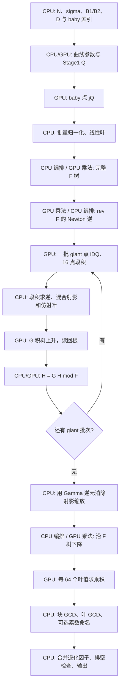

# 当前 CUDA ECM Stage2 实现：逐步骤说明

日期：2026-10-03；量化及优化补充：2026-10-04。历史测量基线：`0cfa589`；代码行号对应本轮已验证的 device leaf 候选，最新生产证据见§31.5–§31.6。§26–§30 保留各自测量基线，最新逐步骤量化汇总及 device leaf 生产验证见§31。

本文按一条曲线的实际执行顺序说明算法、输入输出、CPU/GPU 分工和数据生命周期。代码链接均指向当前原文件的一处入口，行号为本基线的一基行号；后续修改源码时行号可能变化。

**量化阅读入口：** §23 给出计算量及可校准的周期公式，§24 区分 RAM/显存峰值、累计数据生成和传输量，§25 保留上一轮段积实验的阶段分摊，§26 记录 fold 实验。**§27 按 fold-flat 历史基线逐步骤列账**，细化 seed、积树及参数外推；**§28 用 device seed 实测修正操作数、资源和阶段占比**；**§29 给出 Mersenne 归约实测**；**§30 给出本轮小素数复用的同二进制 A/B、资源和 GPU 时间线**。**§31 汇总最新基线每一步的计算/周期公式、容量、生成/传输量和时长占比，并量化当前 device leaf 候选。**公式推导、日志实测和规划预估分别标明。

## 1. 范围与入口

本文主线是 [stage2_tree_gpu.cu](D:/code/MPA-OpenCl/tools/bench/stage2_tree_gpu.cu:10214) 的 `--real` → `run_real()` → `run_batched()`。多项式乘法直接包含并调用 [ntt_poly_probe.cu](D:/code/MPA-OpenCl/tools/bench/stage2_tree_gpu.cu:87)，不是另写一份 NTT。

需要区分三个实现：

- **CUDA 多项式树实验引擎**：本文对象。F/G 积树、模 F fold、余式树下降、分块 GCD，构建为 `stage2_tree_gpu.exe`。
- **CPU GMP 树参考**：[stage2_tree_ref.cpp](D:/code/MPA-OpenCl/tools/bench/stage2_tree_ref.cpp:1)，提供小形状独立结果和 F dump。
- **CUDA pairing/BSGS 路径**：[cgbn_stage2.cu](D:/code/MPA-OpenCl/kernels/cuda/cgbn_stage2.cu:1)，使用逐候选点关系和模乘，执行步骤与本文树版不同。

树版仍位于 `tools/bench/`，不能当作已经接入生产驱动的默认 Stage2。生产驱动当前有 [Prime95 交付调用](D:/code/MPA-OpenCl/src/core/ecm_driver.cpp:3148)。树版 CLI 的 [参数解析](D:/code/MPA-OpenCl/tools/bench/stage2_tree_gpu.cu:11644) 提供 `--real` 和 `--check-F` 等入口，没有直接读取生产 `.save` 的 `--resume` 入口。

`--real` 会自己重算 Stage1 Q；`--check-F` 从 CPU dump 读取 Q、baby/F 参考信息并验证。[run_check_F](D:/code/MPA-OpenCl/tools/bench/stage2_tree_gpu.cu:11089) 是独立检查入口，不能用它通过来替代 `--real` 输入生成正确性检查。

### 1.1 本文采用的优化组合

“当前代码默认值”与“最近成功 A/B 使用的组合”不同。逐步骤主线以下列测量组合为例，回退分支另行说明：

- S4 设备系数归约开启，`NTT_S4_OLDTAIL=0`：直接长除法归约。
- `NTT_S4_MERSENNE=1` 可选择精确 `N=2^S−1` 的专用fold归约；默认0、通用N回退长除法，详见§29。
- 本轮 `NTT_SMALL_PRIME_REUSE=1` 复用 baby 归一化的 unit/GCD 结果；默认0，缺失点、无缓存或输入不匹配仍走原ladder/GCD。§23–§29的小素数工作量为未复用对照值，候选折减与适用范围见§30。
- `NTT_GROOT_DEVICE=1`：G 树中间层驻留设备，只读回根。
- `NTT_SCALED_DESCENT=1`：scaled 下降；`NTT_S5_ON=0`。
- `NTT_S4_OUTPUT_WINDOW=1`、`NTT_S4_CHUNK_OUTPUT=1`：只返回需要的系数窗口，并复用 chunk 输出空间。
- `NTT_S4_PACK_DIRECT=1`、`NTT_S4_FLAT_DIRECT=1`：直接打包到 NTT 工作区，尽量借用已有 flat 输入。
- `NTT_GROOT_LEAF_STAGING=1`、`NTT_GROOT_COMPACT_RAW=1`：复用 pinned staging，raw A/B 分别定容。
- `NTT_GFINV_BATCH=1`：64 段窗口批量求逆；`NTT_S4_CARRY_BATCH=0`。
- `NTT_FOLD_FLAT=1`：本轮A/B两边均用连续host fold；`NTT_GFINV_SEG_EXACT=1`为精确段积默认，`NTT_GIANT_SEED_DEVICE=0/1`是§28的唯一性能对照变量。
- 最近生产 A/B 的 oracle async=0，sample=96、check every=8；异步 oracle 是另外的可选路径。

其中 G-root device、scaled descent、output window、GFINV batch 都是 **opt-in，代码默认关闭**；pack direct、flat direct、chunk output、G-root leaf staging/compact raw 默认开启，final whole readback 默认关闭，carry batch 默认关闭。
device seed及fold-flat仍默认关闭；精确段积默认开启，旧尺度仅由显式诊断开关恢复。
出处：[S4 与算法开关](D:/code/MPA-OpenCl/tools/bench/stage2_tree_gpu.cu:1460)、[G-root 内存开关](D:/code/MPA-OpenCl/tools/bench/stage2_tree_gpu.cu:1522)、[carry batch](D:/code/MPA-OpenCl/tools/bench/stage2_tree_gpu.cu:1544)、[GFINV batch](D:/code/MPA-OpenCl/tools/bench/stage2_tree_gpu.cu:407)。

## 2. 总流程与符号



符号约定：

- `N`：待分解的奇数模数；`S=bits(N)`，`W=ceil(S/64)`。
- `Q`：Stage1 后的 Montgomery 曲线点。本文用 `Y` 表示多项式变量，避免与点坐标 `X` 混淆。
- `D`：baby/giant 步长。`J={j:1≤j≤D/2, gcd(j,D)=1}`，`P=|J|=φ(D)/2`。
- `x_j=x([j]Q)`：baby 仿射横坐标；`u_i=x([iD]Q)`：giant 仿射横坐标。
- `I=floor(B2/D)+2`：当前引擎的 giant 数量，索引为 `i=1..I`。
- `F(Y)=∏_(j∈J)(Y−x_j)`；`G_b(Y)`：第 b 批 giant 对应的积多项式。
- `H`：逐批累积的 giant 多项式，通常保持为模 F 的余式。
- `n_ntt`：变换长度；NTT 模数记作 `p_ntt`，它与 ECM 模数 N 不同。

**为什么可用多项式寻找因子？** 对 N 的某个素因子 q，正常点关系中 `x([iD]Q)=x([j]Q) mod q` 对应 `[iD±j]Q=O mod q`。因此积多项式在 baby 点的值含有这些差值因子，最终通过 GCD 提取 N 的因子。无穷远点、不可逆 Z 和退化 chain 需按代码的专门分支处理。

giant/baby 组合是候选超集，不是“每个线性因子对应一个已经筛过的 Stage2 素数”；素数区间与素性过滤发生在小素数分支及命名分支。
出处：[giant 范围](D:/code/MPA-OpenCl/tools/bench/stage2_tree_gpu.cu:9122)、[命名方向说明](D:/code/MPA-OpenCl/tools/bench/stage2_tree_gpu.cu:9939)。

## 3. 数据表示：贯穿全部步骤的约定

### 3.1 多项式系数

系数是 **普通域中的 `[0,N)` 整数**，一个系数占 W 个 little-endian 64-bit limb。flat 布局为：

```text
poly[k*W+t] = 第 k 个系数的第 t 个 limb
系数顺序：常数项、一次项、二次项……
```

`CPoly` 是“一系数一个 vector”的主机表示；积树节点通常用 flat vector。`cp_from_flat/cp_to_flat` 在两种容器间复制。它们仍都存普通模 N 系数，不是 NTT 频谱。
出处：[布局约定](D:/code/MPA-OpenCl/tools/bench/stage2_tree_gpu.cu:20)、[转换函数](D:/code/MPA-OpenCl/tools/bench/stage2_tree_gpu.cu:4391)。

### 3.2 点坐标与三个算术域

- 点 kernel 采用 Montgomery 模乘，参数包含 `R=2^(64W) mod N`、`ninv=−N⁻¹ mod 2^64`、Montgomery image 的 `a24/Q`。
- 多项式接口输入输出是普通模 N 系数。
- NTT 内部是 Goldilocks 素域 `p_ntt=2^64−2^32+1`。

`ladder_points` 默认输出普通域坐标；device seed 可直接借用其 Montgomery image，chain 输出也保留 image 射影坐标。**同一对坐标共同乘 R 仍代表同一仿射点**，但其射影叶的标量也包含 R。当前默认段积已恢复为实际返回 Z 的普通乘积；旧尺度、修正公式及独立验证见第 13、17、28 节。
出处：[LadderCtx](D:/code/MPA-OpenCl/tools/bench/stage2_tree_gpu.cu:4085)、[chain seeds 转域](D:/code/MPA-OpenCl/tools/bench/stage2_tree_gpu.cu:8583)、[实际 Z 段积合同](D:/code/MPA-OpenCl/tools/bench/stage2_tree_gpu.cu:9311)、[NTT 模数](D:/code/MPA-OpenCl/tools/bench/ntt_poly_probe.cu:88)。

## 4. 第 0 步：解析任务、规划 D、枚举 baby 集

**位置/分工：CPU；CUDA 查询设备与显存。**

1. 读取 N，要求 N 为奇数，计算 S/W，选择 `--device`。
2. 查询空闲显存，默认预留 768 MiB，用剩余容量形成 arena 预算；`NTT_ARENA_RESERVE_MB / NTT_ARENA_CAP_KB` 可覆盖。
3. 使用指定 `--d`，或 `--choose-d` 根据拟合的 loop/tree/giant/glue 成本及形状容量选择可容纳的 D。
4. 枚举 `j≤D/2 且 gcd(j,D)=1`，严格检查数量等于 φ(D)/2。
5. 计算 giant 数 I、G 批次数 `ceil(I/P)`、fold 次数 `ceil(I/P)−1`。

D 越大，giant 数往往越少，但 F 树、逆多项式和下降随 P 增大；当前选择策略并非“取能放下的最大 D”。源码仍有一些早期注释，实际应以决策逻辑为准。

**输出：** baby 索引、P、I、批次数、形状及显存预算。baby 索引留在主机，点生成时上传。
出处：[解析和显存预算](D:/code/MPA-OpenCl/tools/bench/stage2_tree_gpu.cu:10214)、[D 决策](D:/code/MPA-OpenCl/tools/bench/stage2_tree_gpu.cu:10394)、[baby 集](D:/code/MPA-OpenCl/tools/bench/stage2_tree_gpu.cu:10418)。

## 5. 第 1 步：曲线、Stage1 Q 与上下文准备

这一节是 Stage2 的输入准备；Stage1 运算本身不计入 `stage2_full_wall.total`。

**CPU：** Suyama sigma 参数化计算 `a24` 和起点 `(X:Z)`，准备 Montgomery 常数；参数化退化时当前 `--real` 报错退出。生成各素数最高幂组成的 lcm 指数因子列表。

**GPU：** `ladder_product` 在一个顺序 ladder chain 中计算 Q。各指数因子之间有数据依赖，不按这些因子并行。

```text
NTT_STAGE1_EXTRA=1  → Q = [lcm(1..B1)]P0
NTT_STAGE1_EXTRA=12 → Q = [12*lcm(1..B1)]P0
```

生产 ini 的相应设置是 `method=gpu`、`gpu_param=0`、`exponent=choose12`。探针不读取该 ini，必须显式设 `NTT_STAGE1_EXTRA=12`；对齐 Prime95 还需相同 N/sigma/B1，最好核对完整 Q。

Q 准备完毕后，建立 LadderCtx、NTT arena、S4 输入/输出区、归约常数及检查上下文。此后的 S4 等 mandatory 自测计入 Stage2 init；Q 之前的点 Montgomery 自测不在这个 init 边界内。

**传输：** 起点、指数列表和常数 H2D，最终 Q D2H；CPU 准备 Stage2 的 Q Montgomery image。上下文和 arena 存活到本次 `run_real` 结束。
出处：[Montgomery 参数](D:/code/MPA-OpenCl/tools/bench/stage2_tree_gpu.cu:10442)、[Stage1 EXTRA](D:/code/MPA-OpenCl/tools/bench/stage2_tree_gpu.cu:10478)、[Stage2 init 起点](D:/code/MPA-OpenCl/tools/bench/stage2_tree_gpu.cu:10514)、[ini 文档](D:/code/MPA-OpenCl/docs/DEV_ECM_INI.md:65)。

## 6. 第 2 步：GPU 生成 baby 点 `[j]Q`

**输入：** Q、a24、N 和全部 baby 索引。GPU 用 x-only Montgomery ladder，按点并行，返回 `bx/bz` 两个 flat 坐标数组。普通 ladder 与 chain 的线程模型不同，不能把它视为一个 CGBN 生产 Stage1 kernel。

**输出：** 每个 baby 点的普通域 `(X_j,Z_j)`，回到 CPU。

baby 点数组大小各为 `P*W*8` bytes。后续构造完线性叶和 F 树后，局部 bx/bz 被释放；F 树保留。
出处：[baby 调用](D:/code/MPA-OpenCl/tools/bench/stage2_tree_gpu.cu:10627)、[ladder kernel](D:/code/MPA-OpenCl/tools/bench/stage2_tree_gpu.cu:800)、[ladder_points](D:/code/MPA-OpenCl/tools/bench/stage2_tree_gpu.cu:4092)。

## 7. 第 3 步：CPU 批量归一化 baby，并构造 monic 叶

按 **256 点一个 segment**，由 CPU/GMP 构造 Z 的 prefix 积：

```text
pv[0] = 1
pv[j+1] = pv[j]*Z_j mod N
iprod = inverse(pv[segment_length]) mod N

从末尾到开头：
    Z_j_inverse = iprod*pv[j] mod N
    x_j = X_j*Z_j_inverse mod N
    iprod = iprod*Z_j mod N
```

通常一个 segment 只做一次 `mpz_invert`，其余是模乘。若某个 Z=0 或组合积不可逆，整个 segment 走逐点 affine helper。该 helper 的实际规则为：Z=0 返回 x=0 且标记成功；非零 Z 不可逆则返回 X、标记失败，调用处另计算 `gcd(Z,N)` 收集退化信息。

最终叶系数为 `[-x_j,1]`，即 `Y−x_j`，因此 F 及其所有真实节点 monic，后续反转多项式的常数项可逆。

**重要修复：** 旧代码漏乘 `pv[j]`，把 `X_j/(Z_0…Z_j)` 当成 x_j。本基线已修复；此前 `--real` 性能记录不能证明正确 ECM 的性能。新真实入口门禁核对独立全部 baby/F，冻结因子已恢复。

**资源：** 固定 256 点 GMP 临时窗口、P 个 2W-word 叶 vector；不在 GPU 求 baby 的逆元。
出处：[256 点窗口及回退](D:/code/MPA-OpenCl/tools/bench/stage2_tree_gpu.cu:10647)、[正确逆扫描](D:/code/MPA-OpenCl/tools/bench/stage2_tree_gpu.cu:10698)、[affine helper](D:/code/MPA-OpenCl/tools/bench/stage2_tree_gpu.cu:353)、[独立门禁](D:/code/MPA-OpenCl/tools/test/test_stage2_real_baby.py:1)。

## 8. 第 4 步：上升构建完整 F 积树

把叶数补到 `Fpad=next_power_of_two(P)`，使用二叉 heap 编号：根为 1，孩子为 2v/2v+1，叶从 Fpad 开始。

- 真实叶为 `Y−x_j`，padding 叶为常数 1，**不是多加一个零根**。
- 每层按孩子多项式长度分组；同形状的多个 pair 一起调用 batched 乘法。
- 常数 1 子树使用 passthrough，无需 NTT 乘法。
- F 树保留全部需要的节点和次数信息，供最后下降读取；不能套用 G 树的“只保留根”策略。

**分工/传输：** CPU 建 heap、组装每层 flat 输入；GPU 做多项式乘法及 mod N 归约；当前 F 树节点结果仍读回主机。F 全树尚未按 G-root 的方式全程驻留 GPU。

**输出：** `Ft/Fdeg/Fpad`，根 `Ft[1]` 是完整 F。
出处：[build_tree_flat](D:/code/MPA-OpenCl/tools/bench/stage2_tree_gpu.cu:3834)、[真实 F 构建](D:/code/MPA-OpenCl/tools/bench/stage2_tree_gpu.cu:10732)。

## 9. 公共算术步骤：一次 GPU 多项式乘法如何执行

F 树、G 树、Newton 逆、fold、下降共用这一链路。单次 batch 内每个 slice 是独立多项式乘法，变换长度按最大输入长度规划。

### 9.1 主机分组、形状与 chunk

`poly_mul_batch_modN` 接受 ma/mb、nbatch 和输出窗口 first/count。检查长度、stride、输入/输出 alias 与驻留 offset；按 batch 预算拆成多个 chunk。

普通路径上传 flat 模 N 原始系数；驻留 G 树路径使用已经在 raw frontier 的系数，额外上传 offset metadata，不再上传整层系数。
出处：[乘法入口合同](D:/code/MPA-OpenCl/tools/bench/stage2_tree_gpu.cu:3294)、[flat 输入借用/补零](D:/code/MPA-OpenCl/tools/bench/stage2_tree_gpu.cu:7115)。

### 9.2 Kronecker 打包

把多项式系数看成彼此留有足够空隙的大整数槽，槽位宽至少：

```text
slot_bits = 2*S + max(1, ceil(log2(max_input_coeff_count)))
slot_words = ceil(slot_bits/bpw)
slot_stride = slot_words*bpw
```

第 k 个系数从 `k*slot_stride` bit 开始，每个 NTT digit 有 bpw 个有效 bit。不能把系数 k 写到第 k 个 digit；一个系数占很多 digits。

`pack_direct=1` 时 GPU pack kernel 直接写 NTT 引擎的 A/B scratch，省去单独 packed input 的临时显存与后续 D2D。resident 路径按 metadata gather；普通路径从上传后的 raw 输入打包。NTT 仍需要 A/B 工作区，优化没有让输入频谱消失。
出处：[NTT 形状规划](D:/code/MPA-OpenCl/tools/bench/ntt_poly_probe.cu:2848)、[普通 pack](D:/code/MPA-OpenCl/tools/bench/stage2_tree_gpu.cu:3160)、[直接 scratch pack](D:/code/MPA-OpenCl/tools/bench/stage2_tree_gpu.cu:3258)、[resident gather](D:/code/MPA-OpenCl/tools/bench/stage2_tree_gpu.cu:3223)。

### 9.3 精确性预算

卷积在 `p_ntt=2^64−2^32+1` 上执行。单个 digit 卷积的累加项数 L_terms 满足：

```text
L_terms = max_input_coeff_count*slot_words
L_terms*(2^bpw−1)^2 < p_ntt
```

结合零填充和槽位容量，该不等式保证 NTT 结果能恢复为普通整数卷积，而不是只得到模 p_ntt 的模糊结果。它是整数精确性约束，不是浮点误差估计；每种形状规划/使用时检查，不能直接套用其他位宽的 bpw。
出处：[精确界计算](D:/code/MPA-OpenCl/tools/bench/ntt_poly_probe.cu:2262)、[调用前检查](D:/code/MPA-OpenCl/tools/bench/ntt_poly_probe.cu:2957)。

### 9.4 Forward、逐点乘法和 inverse

GPU fused forward 对 A/B 做 DIF：自然顺序输入、bit-reversed 频谱输出；inverse 使用 DIT，消费相同频谱顺序并恢复自然顺序。逐点相乘及 inverse 长度缩放融合进 inverse tile pass，避免单独扫数组；不需要独立 bit-reversal kernel。

多个 stage 在 tile 内融合，临时寄存器/共享内存和全局存储属于底层 NTT 实现。arena 复用 FuseCtx、工作区和表；当前仍是普通完整卷积，不是 Prime95 的 NO_UNFFT 或共享父谱算法。
出处：[实际 NTT passes](D:/code/MPA-OpenCl/tools/bench/ntt_poly_probe.cu:3139)、[融合 inverse](D:/code/MPA-OpenCl/tools/bench/ntt_poly_probe.cu:3191)、[NttArena](D:/code/MPA-OpenCl/tools/bench/ntt_poly_probe.cu:1552)。

### 9.5 Carry 恢复整数 digits

inverse 得到 digit 卷积系数后，GPU 把超出 bpw 的部分向高 digit 传递。常见形状用 carry cone 把有限依赖链展开到寄存器，并在 kernel 内完成 binary propagation；超出 cone 支持范围时执行旧 height-reduction 路径再收尾。

必须保留 carry convergence/residual verdict。defer carry 及 carry batch 只调整检查完成时机，不允许跳过中间 chunk 的检查；当前测量组合 carry batch=0。
出处：[carry 执行](D:/code/MPA-OpenCl/tools/bench/ntt_poly_probe.cu:3204)、[chunk verdict 生命周期](D:/code/MPA-OpenCl/tools/bench/stage2_tree_gpu.cu:3498)。

### 9.6 系数 mod N 归约

GPU 每线程处理一个输出系数：

1. 检查对应源槽的高位界，即使该系数不在请求输出窗口内也检查。
2. 对请求窗口，将 bpw digits 重组为 little-endian 64-bit limbs。
3. 当前默认直接长除法：把 N 左移规范化，借助高两字/一字除法及预计算 reciprocal 估计商，逐字乘减，过估时加回修复，最后去除规范化 shift，得到普通 `C mod N`。
4. `NTT_S4_OLDTAIL=1` 或 forensic dump 保留旧 REDC 消元再 Montgomery restoration 路径，供同二进制对照/诊断。

因此当前主线已经接入长除法；“还需要把原语接进 reduce”的历史计划已完成。它同时替代旧消元和域恢复两部分，不是只换最后一行乘法。
出处：[归约 kernel](D:/code/MPA-OpenCl/tools/bench/stage2_tree_gpu.cu:2013)、[直接长除法分支](D:/code/MPA-OpenCl/tools/bench/stage2_tree_gpu.cu:2066)、[长除法 helper](D:/code/MPA-OpenCl/tools/bench/stage2_tree_gpu.cu:1856)、[常数预计算](D:/code/MPA-OpenCl/tools/bench/stage2_tree_gpu.cu:2331)。

### 9.7 输出窗口、检查和结果交付

- output window 开启时，仅归约/返回 `[first,first+count)` 的系数；**仍执行完整 NTT 和 carry**，不是截断 NTT。
- 普通调用用 chunk 输出区，D2H 到交替 pinned staging；event 保证前一 chunk 被消费后才能覆写，调用结束排空待处理结果。
- resident G 树调用把结果 scatter 回下一个 raw frontier，常规模式不把中间节点读回 CPU。
- GMP oracle 根据抽样/全检查策略核对独立重构的系数；可选异步 worker 使用快照和 fence，必须排空后才报告成功。抽样并非全部系数逐个做 GMP。
- 关闭 pinning/异步的回退保留 blocking D2H；final whole readback 开关用于恢复原完整布局对照。

出处：[归约窗口检查](D:/code/MPA-OpenCl/tools/bench/stage2_tree_gpu.cu:2030)、[scatter/D2H/event](D:/code/MPA-OpenCl/tools/bench/stage2_tree_gpu.cu:3652)、[oracle 检查](D:/code/MPA-OpenCl/tools/bench/stage2_tree_gpu.cu:3067)、[oracle drain](D:/code/MPA-OpenCl/tools/bench/stage2_tree_gpu.cu:3022)。

## 10. 第 5 步：小素数补充检查与曲线 workspace

进入 `run_batched()` 后建立 S3Workspace，上传 N、Q、a24、Montgomery one；点数组和累积数组按需增长并复用。

先枚举 `(B1,B2]` 内且 `p≤D/2` 的素数。这部分不能完全依赖 `i≥1` 的 giant/baby 覆盖，包含 D 的相关小素数。未启用复用时，GPU批量计算 `[p]Q`，CPU对其Z做GCD；启用 `NTT_SMALL_PRIME_REUSE=1` 且输入键匹配时，直接使用实际baby索引j=p的归一化证明和非单位元GCD。p|D等缺失点继续GPU ladder/CPU GCD。

baby批量逆元成功证明整批Z为unit；失败批保留逐点GCD，特别记录Z=0对应GCD=N，因为原仿射helper将它转为叶值0并返回成功。缓存不保存坐标，仅保存索引、输入键和非单位元GCD；原叶值、因子去重及prime hint处理保持一致。`NTT_SMALL_PRIME_CHECK=1` 重算整组小素数点并逐项核对复用证明，用于门禁，不用于性能对照。

得到非平凡因子时通过 `s3_record` 记录因子及该 p；当前流程仍继续后面的树运算。
出处：[workspace](D:/code/MPA-OpenCl/tools/bench/stage2_tree_gpu.cu:8333)、[小素数分支](D:/code/MPA-OpenCl/tools/bench/stage2_tree_gpu.cu:9145)。

## 11. 第 6 步：预计算反转 F 的 Newton 逆

当 G 批次不止一个时，准备：

```text
rev_P(F)[k] = F[P−k]
finv = 1/rev_P(F) mod Y^(P+1)
Newton: g_new = g*(2−rev_P(F)*g) mod Y^next_length
```

F monic，因此 rev(F) 的常数项是 1；不需要假设模 N 是素域。每轮精度最多翻倍，两次多项式乘法经 GPU；2−ag 等系数构造由 CPU 完成。inverse 长度不能随零尾项 trim，否则 Newton 精度增长可能失效。

**生命周期：** finv 在全部 fold 期间保留，scaled 下降根转换可复用；不是每一个 giant 批次重算。仅一批 G 时可能不预先建立，后续下降按需处理。
出处：[一次性 finv](D:/code/MPA-OpenCl/tools/bench/stage2_tree_gpu.cu:9225)、[Newton 实现](D:/code/MPA-OpenCl/tools/bench/stage2_tree_gpu.cu:4497)。

## 12. 第 7 步：按 point chunk 生成 giant 点

G 树每批最多 P 点；外层 point chunk 可含整倍数的 G 批次。当前点预算以 256 MiB 两坐标 payload 为目标，并向上取整到整批，至少一批；**不是严格保证 256 MiB 峰值上限**，也不含 seeds、段积及其他区。

**大 chunk：chain。** CPU 枚举每段的前两个倍数和 DQ，GPU ladder 计算 seeds。默认仍读回普通域seed，在CPU转成Montgomery image再上传；`NTT_GIANT_SEED_DEVICE=1` 让ladder直接输出Montgomery image并留在S3Workspace的设备X/Z缓冲，chain以stride=2读取两个连续seed和末尾DQ，不经CPU转域。每个 GPU 线程顺序生成一个 chain block，使用差分加法生成后续 `[iD]Q`；默认每线程 64 点。

**小 chunk/对照：ladder。** 默认点数小于 32768 时逐点 ladder；`NTT_GIANT_LADDER=1` 或调整 chain_min 可强制。chain 固定 seed/传输成本使它在很小形状上未必划算。

chain 遇到因子模上的退化点后可能影响本 block 后续坐标；64 点块限制传播范围，但不是“自动重算所有退化点为独立 ladder”。可选 chain check 运行两种方法，按仿射点比较。

**输出/访存：** giant X/Z 当前都 D2H 到主机 `gx/gz`，并非从 chain 输出直接构造 device 叶。device seed候选去掉六个seed设备临时数组及其上传，直接借用workspace；ox/oz、段积设备buffer仍按chunk malloc/free。S3Workspace 存在不代表这些临时区已经全部池化。
出处：[点预算](D:/code/MPA-OpenCl/tools/bench/stage2_tree_gpu.cu:9249)、[选择阈值](D:/code/MPA-OpenCl/tools/bench/stage2_tree_gpu.cu:9283)、[chain 组织](D:/code/MPA-OpenCl/tools/bench/stage2_tree_gpu.cu:8572)、[顺序 chain kernel](D:/code/MPA-OpenCl/tools/bench/stage2_tree_gpu.cu:932)、[D2H 与释放](D:/code/MPA-OpenCl/tools/bench/stage2_tree_gpu.cu:8676)。

## 13. 第 8 步：16 点段积、可逆性分类与批量求逆

每个 point chunk 按 **16 点 segment** 建立 Z 积网格：chain 在 GPU 算，ladder 回退在 CPU 算。当前默认 `NTT_GFINV_SEG_EXACT=1`，两条路径都返回各自**实际坐标字的普通模N乘积**。

设一个段实际有 m 点，返回坐标为 `Ztilde_j`：

```text
Gamma_seg = product(实际返回 Ztilde_j) mod N
旧 chain GPU 初始累积 p = Gamma_seg*R^(-(m−1)) mod N
当前默认 m>1 时：Mont(p,R^m) = Gamma_seg
m=1：原始 Z 字已经等于 Gamma_seg，直接返回
```

旧式来自以第一个Z为初值、再执行m−1次Mont乘法。当前每个非单点段额外一次Mont乘法恢复普通乘积；R^m表按modulus/workspace缓存，末段使用实际m，16点段W70的表为9520bytes。`NTT_GFINV_SEG_EXACT=0` 保留旧尺度作为诊断对照；ladder host段积原本就是普通乘积，不受此开关影响。

本轮已动态复现旧尺度，并对64/129/4423/5261位输入、完整段/尾段/单点建立独立GMP逐段比较。`NTT_GFINV_SEG_CHECK=1`还比较真实chain的每个段与实际返回gz的普通乘积；独立Python验证单位元形状的monic叶指纹。结果及局限见§28，不能将旧路径互比当作这次尺度证明。

默认对每个查询段积调用 `mpz_invert`。`NTT_GFINV_BATCH=1` 时：

1. 对现有段积网格取最多 64 段的对齐窗口，不改变 16 点分段。
2. 生成 prefix，求一次组合积逆元，逆扫描恢复各段逆元。
3. 同窗口重复查询从缓存复制结果。
4. 组合积不可逆时逐段 invert，准确区分组内好段和坏段；不能把整组全部判坏。

缓存在 point chunk 的 G 批次循环外，跨 G 批次片段共享，只有一个窗口；离开 point chunk 清除 GMP 对象。这里的“64 段求逆窗口”和“16 点 segment”“64 点 chain”“64 叶 GCD 块”是四个不同概念。
出处：[段积 kernel](D:/code/MPA-OpenCl/tools/bench/stage2_tree_gpu.cu:1005)、[Montgomery 模乘定义](D:/code/MPA-OpenCl/tools/bench/stage2_tree_gpu.cu:678)、[host 普通段积](D:/code/MPA-OpenCl/tools/bench/stage2_tree_gpu.cu:555)、[chain 段积读回](D:/code/MPA-OpenCl/tools/bench/stage2_tree_gpu.cu:8681)、[GfinvBatch](D:/code/MPA-OpenCl/tools/bench/stage2_tree_gpu.cu:416)、[缓存生命周期](D:/code/MPA-OpenCl/tools/bench/stage2_tree_gpu.cu:9360)。

## 14. 第 9 步：CPU 构造 mixed giant 叶，累计 Gamma 逆元

**好段：** 段积可逆，说明段内每个 Z 都可逆。直接构造 `[-X_i,Z_i]`，即：

```text
Z_i*Y−X_i = Z_i*(Y−u_i)
```

不逐点求仿射逆元：取负和复制 limb 即可。把实际gseg的逆元只累计一次到名为Ginv的变量；默认精确段积让chain和ladder都与各自普通叶尺度一致。诊断旧模式仍带第13节的R幂。

**坏段：** 对当前片段尝试原有 affine 批量路径，必要时逐点处理；非零不可逆 Z 的 GCD 通过 `s3_record(..., count_hit=false)` 保留。这些叶采用 `[-affine_helper_result,1]`，不计入 Gamma。

`first_touch` 防止跨 G 批次的同一 segment 被多计；段网格索引是 point chunk 的局部索引，不是全部 giant 的全局索引。末段使用实际 seglen。

**输出：** 主机 `bleaf`（每点 2W words）和累积 Ginv。即使 G 树中间层驻留 GPU，当前这一步仍在 CPU。
出处：[射影叶合同](D:/code/MPA-OpenCl/tools/bench/stage2_tree_gpu.cu:9383)、[first_touch/Gamma](D:/code/MPA-OpenCl/tools/bench/stage2_tree_gpu.cu:9428)、[好段写叶](D:/code/MPA-OpenCl/tools/bench/stage2_tree_gpu.cu:9459)、[坏段回退](D:/code/MPA-OpenCl/tools/bench/stage2_tree_gpu.cu:9493)。

## 15. 第 10 步：构造本批 G，保留根

G 树只服务 fold，后面不沿它下降，因此允许释放孩子。

**resident 路径：**

1. CPU 根据 leaf degree 构造树次数和 offset metadata。
2. 借用既有 pinned output staging 将 leaf H2D 到 raw A；event 保护复用，不能覆盖尚未完成的 D2H/H2D。
3. raw A 容纳最大 leaf frontier，raw B 按首 parent frontier 定容。每层仅保留当前/下一 frontier。
4. CPU 按孩子长度分组，上传 offsets；GPU gather → 公共 NTT/归约 → scatter。
5. 常数 1 子树 passthrough 用 D2D；空 padding 不生成伪根。
6. 最终仅 D2H 根 `(actual_batch_points+1)*W` words；返回的 heap 只含可用根 payload。中间节点不读回，临时 metadata 释放。

**回退：** `build_groot_select` 检查 S4、root-only、direct pack、关闭 final whole readback/host pack 等条件；不满足时用主机编排的 `build_tree_flat`，并统计 fallback。该主机路径仍可 root-only，在消费后释放子节点。

G-root 使用的 raw pair 被独占借用，不能同时被普通 raw upload 覆写。leaf staging 只复用已有 pinned 容量，不表示整个 bleaf 已从主机消失；不可用时额外 flatten 到 pageable vector 再上传。
出处：[选择条件](D:/code/MPA-OpenCl/tools/bench/stage2_tree_gpu.cu:4336)、[resident 树](D:/code/MPA-OpenCl/tools/bench/stage2_tree_gpu.cu:4178)、[pinned 叶 staging](D:/code/MPA-OpenCl/tools/bench/stage2_tree_gpu.cu:4206)、[按层 gather/scatter](D:/code/MPA-OpenCl/tools/bench/stage2_tree_gpu.cu:4281)、[仅根读回](D:/code/MPA-OpenCl/tools/bench/stage2_tree_gpu.cu:4329)。

## 16. 第 11 步：fold，逐批 `H←G·H mod F`

第一批直接 `H=G_0`；后续批次执行：

```text
T = G_b*H
若 deg(T)<P：H=T
否则：
    k = deg(T)−P+1
    qrev = low_k(rev_deg(T)(T) * low_k(finv))
    q = reverse(qrev)
    qb_low = low_P(q*F)
    H = low_P(T)−qb_low mod N
```

常见完整形状有三次多项式乘法：G*H、逆序商、q*F。finv 跨所有批次复用；请求低系数窗口减少归约/读回，但底层仍完整卷积。

**分工/访存：** G 根、Fpoly、H 在 CPU；`cp_mul` flatten/补零并经 GPU 运算，结果回 CPU；逆序、q 构造、`cp_coeff_sub` 和 trim 由 CPU/GMP 处理。此阶段没有完整 H/F/G 驻留的 device fold，仍有反复 H2D/D2H 与临时 CPoly/vector 构造。

首次 H 可能仍为 P 次；只有一批 G 时没有 fold，下降入口需自行处理 H mod F。
出处：[初始化 H 与 fold](D:/code/MPA-OpenCl/tools/bench/stage2_tree_gpu.cu:9593)、[cp_mul 主机准备](D:/code/MPA-OpenCl/tools/bench/stage2_tree_gpu.cu:4465)、[系数减法](D:/code/MPA-OpenCl/tools/bench/stage2_tree_gpu.cu:4426)。

## 17. 第 12 步：CPU 消除射影缩放

所有好段的射影叶使 giant 积带上 `Gamma=∏(实际返回 Z_i)`。fold 在模 F 环中保持这个常数因子，循环完成后 CPU 逐系数做：

```text
H[k] = H[k]*Ginv mod N
```

没有额外 GPU kernel；每系数 words↔GMP、乘法、取模、导出。代码检查 `projective leaves == Gamma 覆盖 points`，并检查 Ginv 可逆。这两个断言证明覆盖数量和 unit 属性，**不能证明 Ginv 数值恰好等于实际 Gamma 的逆元**。

默认精确段积下，按first_touch累计一次得到 `Ginv=Gamma^−1 mod N`。独立段积GMP比较验证实际gz的乘积，单位元端到端Python叶指纹另行验证unscale结果。两个覆盖/unit断言本身仍不构成数值证明。
诊断旧模式下，chain好段长度为m_s时，仍为 `Ginv=Gamma^−1·R^(Σ_s(m_s−1))`；本轮在65点单位元形状复现了最终叶多出的这个R幂。可逆常数不改变GCD，但精确系数不同；旧生产指纹不能继续用作当前默认精确unscale的固定叶参考。坏段仍按原回退代表处理，本轮没有消除chain退化传播或g=N饱和块问题。
出处：[unscale 与覆盖断言](D:/code/MPA-OpenCl/tools/bench/stage2_tree_gpu.cu:9657)。

## 18. 第 13 步：只沿 F 树下降一次，得到 `H(x_j)`

最终叶按 baby 索引排列，而不是 giant 索引。主循环已经把所有 giant 批次折叠进 H，所以无需逐批做一次完整下降。

### 18.1 当前优化组合：ordinary-coefficient scaled descent

对 monic 节点多项式 M、次数 d，状态可解释为：

```text
r = H mod M
S_M = rev_(d−1)(r) / rev_d(M) mod Y^d
```

根状态由逆序 H 与 finv 相乘取低 P 项得到；如果 H 次数还达到 P，先做根余式。对目标孩子次数 a、兄弟次数 b：

```text
child_state = coefficients [b, b+a) of
              parent_state * rev_b(sibling_polynomial)
```

同一层按 `(a,b)` 分组，一组 batch 乘法。兄弟次数为 0 时直接拷贝父状态，目标次数为 0 时跳过；每层次数守恒和长度都检查。

到 monic 线性叶 `Y−x_j` 时 d=1，状态只剩一个系数，就是 `H(x_j)`。无需为每个孩子重算 Newton inverse/完整 divmod。

**内存/分工：** F 树和 cur/next 状态仍在主机；CPU pack 组输入、反转兄弟、组装下一层，GPU 乘法并返回窗口。只保留两个状态 frontier，但保留 F 全树。当前尚未共享同一父状态的 NTT 频谱。
出处：[scaled state 独立解释](D:/code/MPA-OpenCl/tools/bench/stage2_tree_gpu.cu:7319)、[根转换](D:/code/MPA-OpenCl/tools/bench/stage2_tree_gpu.cu:7359)、[child 窗口递推](D:/code/MPA-OpenCl/tools/bench/stage2_tree_gpu.cu:7408)、[叶输出](D:/code/MPA-OpenCl/tools/bench/stage2_tree_gpu.cu:7446)。

### 18.2 默认及可选分支

- S4 开启、scaled 关闭：`descent_batched`，逐层按形状批量余式除法；线性叶有单独 Horner 路径。
- S4 关闭：`descent_slow`；单次多项式乘法仍可使用共享 NTT，精确系数的模 N 归约由主机执行，不能简单叫“整个算法纯 CPU”。
- `NTT_S5_ON=1`：`descent_batched_dev`，另一套设备下降/叶驻留实验；与 scaled 不可同时启用，**不属于本次 96.848 秒结果**。
- descent check 可跑 slow 参考逐叶比较；检查开关增加额外工作，clean 性能测量应与其区分。

出处：[下降分支选择](D:/code/MPA-OpenCl/tools/bench/stage2_tree_gpu.cu:9778)、[batched 下降](D:/code/MPA-OpenCl/tools/bench/stage2_tree_gpu.cu:4643)、[线性叶 Horner](D:/code/MPA-OpenCl/tools/bench/stage2_tree_gpu.cu:6998)、[S5 设备下降](D:/code/MPA-OpenCl/tools/bench/stage2_tree_gpu.cu:6515)。

## 19. 第 14 步：GPU 分块乘积，CPU GCD 和可选命名

scaled/default S4 下降的全部叶在 CPU `values`。先 flatten 为 `P*W` words，再 H2D 到 ws.dvals。GPU 每 **64 个叶值** 求分块乘积，D2H 返回每块一个 W-word 值；它不是把全体叶只归约成一个最终累加器。

该 kernel 对普通叶值连续使用 Montgomery 模乘。m 个叶的实际输出是 `product(values)*R^(-(m−1)) mod N`，没有再恢复普通乘积尺度。这里输出只用于 GCD，R 是 unit，所以 GCD 与普通块乘积相同；不要把返回的 limb 数值当成普通乘积做逐字参考比较。

CPU 对每个块乘积做 `gcd(block_product,N)`；当得到 `1<g<N` 时进入该块，检查单叶 GCD：

- 不命名或超出命名预算：记录单叶的非平凡 GCD，因子保留。
- 允许命名：对该 baby 索引 j 扫 `i=1..I`，生成 `iD−j` 和 `iD+j`，只保留 `(B1,B2]` 的素数；GPU ladder 计算这些候选倍数，CPU 对 Z 做 GCD确认并记录 `hit_primes`。
- 没有确认的素数名也保留叶 GCD，记为 unnamed。

`NTT_NAME_MAX` 与 block budget限制诊断成本；`hits/hit_primes` 是归因计数，不能直接当作完整因子集合大小。`s3_record` 去重因子、排除 1/N，核对是否整除 N。

**当前代码的具体边界：** 块 GCD 为 N 时，不进入上述单叶检查分支；当前 batched 尾部也没有“最后再求一次全部块乘积 GCD”的代码。不能把早期流程文档的“每块+末尾 GCD”当作现状。饱和块递归定位是否需要补充，需另建独立用例；本报告仅记录静态行为，没有做新复现。

出处：[block product kernel](D:/code/MPA-OpenCl/tools/bench/stage2_tree_gpu.cu:8303)、[当前叶上传](D:/code/MPA-OpenCl/tools/bench/stage2_tree_gpu.cu:9903)、[块 GCD 条件](D:/code/MPA-OpenCl/tools/bench/stage2_tree_gpu.cu:9982)、[候选扫描/确认](D:/code/MPA-OpenCl/tools/bench/stage2_tree_gpu.cu:10043)、[unnamed 保留](D:/code/MPA-OpenCl/tools/bench/stage2_tree_gpu.cu:10080)、[record 合同](D:/code/MPA-OpenCl/tools/bench/stage2_tree_gpu.cu:8797)。

## 20. 第 15 步：合并、排空检查、计时和释放

`run_batched` 返回后先排空 GMP oracle，合并 baby 转换收集的退化因子字符串，再输出 factors/hit_primes、精确 full/main、NTT/归约/拷贝/内存统计。当前 CLI 输出实验结果，没有在这里完成生产队列回写或 Prime95 交付替换。

计时边界：

- `shape`：baby 索引枚举；其值已加入 init，不要再加到 total。
- `init`：Q 准备完成后的上下文/归约准备、自测、baby/F 树，加 shape。
- `main` / `stage2.elapsed`：`run_batched`、GCD/命名、最终 oracle drain 等。
- `total=init+main`：Stage2 完整时间，不含 Stage1。
- 进程 wall：还有程序启动、Stage1 等开销，不能和 total 混用。
- `--curves K` 复用同一 Q/F/init 重复运行，本入口不是 K 条不同 sigma 曲线的正式调度；clean 要求单次且没有额外诊断 fixture/real dump/额外 S2 对照。

所有权结束时释放 S3Workspace、segment GMP cache、S4/arena、点与树的主机容器。arena 能跨调用复用，但缓存高水位直到 owner 生命周期结束才归还；局部 vector 的 capacity 与整个进程峰值不是一个指标。
出处：[init 计时](D:/code/MPA-OpenCl/tools/bench/stage2_tree_gpu.cu:10773)、[返回后的 drain/merge](D:/code/MPA-OpenCl/tools/bench/stage2_tree_gpu.cu:10810)、[full 输出合同](D:/code/MPA-OpenCl/tools/bench/stage2_tree_gpu.cu:10828)、[workspace 析构](D:/code/MPA-OpenCl/tools/bench/stage2_tree_gpu.cu:8346)。

## 21. 当前数据流和性能状态

### 21.1 哪些部分还会往返主机

1. baby ladder：坐标回 CPU → GMP 归一化 → F 叶。
2. F 树：各层系数结果回 CPU，完整树留在主机。
3. giant chain：seeds GPU→CPU→GPU；全部 giant X/Z、段积回 CPU。
4. giant 叶：CPU 构造 → 叶 H2D；G 树中间层驻留，根仍 D2H。
5. fold：主机 CPoly 构造/逆序/减法，三次 GPU 乘法的输入输出仍往返。
6. scaled 下降：每层主机 pack/组装 frontier，GPU 窗口乘法后读回。
7. 末尾：主机叶再次上传做 block product，再返回块乘积求 GCD。

所以 G-root residency、direct pack 与窗口优化已经减少了特定传输和临时区，但当前 Stage2 还没有形成从点输出一直驻留到因子累积的完整 device pipeline。

### 21.2 段积求逆阶段的已有测量

最近 GPU1/RTX4060 Laptop 的同二进制 ABBA 使用 M4423、sigma26、B1=1000、Stage1 extra12、actual B2=2011326186870、D1231230、P115200。I=1633592，15 批 G、14 次 fold。

- 段积 individual 对照完整均值 **99.0950825 秒**；batch 候选 **96.8483615 秒**，少 2.246721 秒/2.267%。
- main **84.4200835→82.224508 秒**；init **14.6749995→14.623853 秒**。
- 段逆元阶段 **3.8715→1.532 秒**；102100 次逐段 invert 降为 1598 次组合 invert。
- 候选主要阶段：giant **14.5115 秒**、G trees **27.9555 秒**、fold **18.4775 秒**、descent **8.854 秒**、finv **2.158 秒**。具体项以原 summary 为准；阶段间存在其他 host 工作与 drain，不能把这些数当成互不重叠的完整成本账。
- `t_reduce=9.808 秒` 是上述多项式阶段内部的归约 kernel 时间，不能再加到总时间。
- 模 N 归约系数 **40218760**，H2D/D2H 主账 rounded **11.37/5.46 GiB**，两边相同；该账不包括全部 metadata 等传输。
- 新 GMP limb 缓存峰值 **143944 bytes**；整卡 NVML峰值均 **5027 MiB**；观察到的进程 private 峰值均值 **7938→8041.5 MB**，未证明 RAM 减少。
- 约 1Hz full GPU busy 均值约 **77.94%**，不是 SM occupancy；当前仍存在主机准备和等待空档。
- 候选仍比既有 Prime95 CPU 单核 full90.460秒慢约 **7.062%**；CPU本轮未重跑，D/degree/检查不同，不能当成严格同实现比较。

原始证据：[ABBA summary](D:/code/MPA-OpenCl/build_cuda_cmake/_gfinv_ab_20261003/summary.json)、[GPU1 采样](D:/code/MPA-OpenCl/build_cuda_cmake/_gfinv_ab_20261003/gpu1_summary.json)、[开发日志 §50](D:/code/MPA-OpenCl/docs/DEV_GPUOWL_NTT_NOTES.md:3760)。build 证据目录被 Git 忽略，其他 checkout 未必含这些本机结果；算法说明与源文件链接不依赖该目录。

### 21.3 正确性覆盖和未完成部分

最新同一二进制已有真实 baby/F 独立门禁12/0、段积 batch门禁16/0、原完整188/0、scaled41/0、G-root87/0；冻结已知因子 **59649589127497217**、hit prime **114713** 与独立完整叶指纹恢复。

当前尚未完成的工作包括生产 save/队列接入、完整 device leaf/fold、父状态共享 NTT、饱和 GCD 块的独立行为验证、坏段密集场景性能及整体 RAM 高水位收敛。chain 段积/Gamma 的独立尺度验证已在§28补充；门禁通过不等于其余集成和边界都已实现。
出处：[真实入口门禁](D:/code/MPA-OpenCl/tools/test/test_stage2_real_baby.py:1)、[段积门禁](D:/code/MPA-OpenCl/tools/test/test_stage2_gfinv_batch.py:1)、[scaled 门禁](D:/code/MPA-OpenCl/tools/test/test_stage2_scaled_gpu.py:1)、[G-root 门禁](D:/code/MPA-OpenCl/tools/test/test_stage2_groot_device.py:1)。

## 22. 阅读及运行定位

- 总入口：[run_real](D:/code/MPA-OpenCl/tools/bench/stage2_tree_gpu.cu:10214)。
- 主算法：[run_batched](D:/code/MPA-OpenCl/tools/bench/stage2_tree_gpu.cu:9115)。
- 公共 GPU 多项式乘法：[poly_mul_batch_modN](D:/code/MPA-OpenCl/tools/bench/stage2_tree_gpu.cu:3294) → [ntt_poly_mul_batch_dev](D:/code/MPA-OpenCl/tools/bench/ntt_poly_probe.cu:3581)。
- 构建：[build_stage2_tree_gpu.ps1](D:/code/MPA-OpenCl/tools/build/build_stage2_tree_gpu.ps1:1)，默认 sm89、单 TU、链接 GMP；`-Rebuild` 强制重新编译。
- 同二进制 A/B：[bench_stage2_reduce_ab.ps1](D:/code/MPA-OpenCl/tools/bench/bench_stage2_reduce_ab.ps1:1)，最新求逆优化目标 `-Target gfinv_batch`。脚本默认 N/Stage1Extra 与最近 M4423/extra12 测量不同，复现时需显式传参及预期 Q。
- 演进记录：[DEV_GPUOWL_NTT_NOTES.md](D:/code/MPA-OpenCl/docs/DEV_GPUOWL_NTT_NOTES.md:3760)。本文说明当前步骤；旧阶段测量和旧注释应结合修正记录阅读。

§1–25 初稿仅整理源码和已有证据；本轮连续缓冲 fold 的实现及新测量见 §26。

## 23. 可量化成本模型：约定、计算量与周期

### 23.1 参数与统计口径

以下公式针对当前 `run_real → run_batched` 路径的一条曲线，假定没有提前发现因子而退出。Stage1 的计算不计入 Stage2。N 表示待分解整数；NTT 长度另记为 n，避免把两者混淆。

| 符号 | 含义及本例值 |
| --- | --- |
| S、W | `S=bit_length(N)`，`W=ceil(S/64)`；M4423 为 S=4423、W=70，每个定宽模 N 系数为 8W=560 bytes |
| B1、B2、D | Stage1 上界、实际 Stage2 上界、轮转间隔；本例 1000、2011326186870、1231230 |
| P、K、h | `P=φ(D)/2` 个 baby；`K=2^ceil(log2 P)` 为树补齐叶数，`h=log2 K`；本例 115200、131072、17 |
| I、G | 当前程序生成 `I=floor(B2/D)+2` 个 giant；`G=ceil(I/P)` 个 G 树；本例 1633592、15 |
| n_b | 第 b 个 G 树的实际叶数，`n_b=min(P,I-bP)`，b 从 0 开始；末批 20792 |
| C、J | giant chunk 点数及 chunk 数。预算 A=256 MiB 时，`C=P·ceil(max(P,floor(A/(16W)))/P)`，`J=ceil(I/C)`；本例 C=345600、J=5 |
| L、s、g、q | chain 每线程最多 L=64 点；段积 s=16 点；CPU 段积批量求逆 g=64 段；GCD 块 q=64 叶 |
| c_j、E、U | chunk j 的点数；`E=Σ_j ceil(c_j/s)` 个段；`U=Σ_j ceil(ceil(c_j/s)/g)` 个求逆组；本例 E=102100、U=1598 |
| M、r、n、m | 一组多项式乘法中，输入较长一侧的**系数数** M、每系数 NTT digit 数 r、NTT 长度 n，以及本次 GPU chunk 的独立乘法数 m；不是多项式 degree |

`I` 包含覆盖边界的额外 giant，并非 `π(B2)-π(B1)`；当前不会为每个待测素数逐一生成点。D 自动选择还取决于可用显存、成本搜索和内存预算，所以性能不能只写成 B2 的函数。GiB/MiB 均为二进制单位；后文 bytes 均可直接复算。

出处：[baby/D/I 的确定](D:/code/MPA-OpenCl/tools/bench/stage2_tree_gpu.cu:10394)、[chunk 预算与取整](D:/code/MPA-OpenCl/tools/bench/stage2_tree_gpu.cu:9256)、[实际实验参数与统计](D:/code/MPA-OpenCl/build_cuda_cmake/_gfinv_ab_20261003/summary.json)。

### 23.2 点生成、归一化与段积

**GPU 点运算。** 当前 `xDBL` 是 5 次 Montgomery 乘法，`xADD` 是 8 次，包括以乘法实现的平方；这里不是常见的 6 次乘法差分加法版本。对于正整数 k，令 `ℓ(k)=floor(log2 k)+1`：

```text
ladder 内核内部 Montgomery 乘法数 = 5 + 13(ℓ(k)-1) = 13ℓ(k)-8
普通 ladder 点输出再将 X、Z 转成普通域：+2
baby 点生成总数 = Σ_{j∈baby_j} [13ℓ(j)-6]
                   ≤ P [13ℓ(floor(D/2))-6]
```

k=0 走单位元特殊分支，不套用上式。对本例 D，baby 上界为每点 254 次，共 **≤29260800 次 Montgomery 乘法**。它是按最大标量位长的上界，实际小标量更少。

chain 的每个短链先准备两个 seed，随后每新增一个点执行一次 `xADD`。设各短链长度为 a_t，则 chain 主循环为 `8Σ_t max(a_t-2,0)` 次 Montgomery 乘法；seed ladder 另按其标量位长累加，还包括每 chunk 的 DQ 准备与域转换。因此 chain 主循环为 O(IW²)，逐 giant ladder 则为 O(I·log(B2)·W²)。不能把 seed 或短链尾巴忽略后称为精确总数。

当前单线程 Montgomery 乘法采用 limb 乘法和 REDC，主要包含约 `2W²` 次 64 位乘加，另有进位、循环、模加减等操作。于是点生成主项可写为 `2W² × Montgomery 乘法总数`。每个“乘加”内部还拆为低/高位乘法和带进位加法，**它不是单条 GPU 指令，也不是一个时钟周期**。

**CPU baby 归一化。** 所有 Z 可逆时，256 点一组的实现执行 `4P` 次 GMP 模乘和 `ceil(P/256)` 次 GMP 求逆；本例为 **460800 次模乘 +450 次求逆**。记一次 S 位 GMP 模乘成本为 `M_CPU(S)`，求逆为 `Inv_CPU(S)`，则主项为：

```text
T_baby_affine ≈ 4P·M_CPU(S) + ceil(P/256)·Inv_CPU(S) + 导入/导出/构造叶开销
```

**段积及其求逆。** 旧GPU段积从第一点Z开始，执行 `I-E` 次Montgomery乘法，本例1531492次；当前默认精确模式另加 `E_>1` 次，E_>1为实际长度大于1的段数。本例没有单点段，合计 **1633592 次**。CPU成功组执行 `3E` 次模乘和U次求逆，替代旧路径E次求逆；本例 **306300 次模乘 +1598 次求逆**。本例求逆调用数减少98.435%，不是整个Stage2加速98.435%。组失败时退回逐段求逆，可能额外执行该组每段一次求逆；含非单位元时不能沿用全成功成本。全局Gfinv累积和H缩放另有O(E+P)次CPU模乘。

段积精确尺度的当前公式见§13/§17，本轮独立动态证据见§28；§25–§27保留此前测量，不将新增补偿成本混入旧二进制统计。

出处：[xDBL](D:/code/MPA-OpenCl/tools/bench/stage2_tree_gpu.cu:725)、[xADD](D:/code/MPA-OpenCl/tools/bench/stage2_tree_gpu.cu:746)、[ladder](D:/code/MPA-OpenCl/tools/bench/stage2_tree_gpu.cu:770)、[chain 输出与段积](D:/code/MPA-OpenCl/tools/bench/stage2_tree_gpu.cu:8662)、[段积 kernel](D:/code/MPA-OpenCl/tools/bench/stage2_tree_gpu.cu:1005)、[baby batch inverse](D:/code/MPA-OpenCl/tools/bench/stage2_tree_gpu.cu:10647)、[Gfinv batch inverse](D:/code/MPA-OpenCl/tools/bench/stage2_tree_gpu.cu:440)。

### 23.3 一次 GPU 多项式乘法的成本

先用每组的实际 ma、mb、输出窗口长度 w 建立模型，不能一律假定完整 2P 次卷积结果都归约。

```text
M = max(ma,mb)
b = 2S + max(1,ceil(log2 M))          # slot_bits，位
r = ceil(b/bpw)                      # slot_words，Goldilocks digit 数
n ≥ 2Mr，n 为 planner 选择的 2 的幂
k = log2 n
```

bpw 由精确性界和 planner 决定，满足 digit 卷积不溢出 Goldilocks 素数 `p=2^64-2^32+1` 的条件。r 与 n 不是只由 W 线性推出；跨 planner 阈值时会跳变。用未融合 radix-2 网络计数，一组 m 个独立乘法的“两次正变换+一次逆变换”为 **`(3/2)m n k` 个 butterfly**，另有约 `2mn` 个 pointwise/逆变换缩放模乘。当前融合、radix-4 和特殊 twiddle 会改变实际指令数，前者是统一比较算法工作量的参考计数。

输出 w 个系数时，对 `mw` 个系数执行 S4 归约。令 `d=ceil(r·bpw/64)`，实际归一化后的非零 limb 数为 d'，`d'≤d+1`；长除法每个系数最多尝试 `Q=max(0,d'-W+1)` 个商位，每商位做 W 个 64 位乘法减去整段除数，另含 2-by-1 商估计及至多两次 add-back 修复。因此：

```text
长除法主要 64 位乘法数 ≤ mw·W·max(0,d-W+2)
常见 d≈2W+O(log(M)/64)：主项约 mw·W²
输出装配/搬运与归一化：O(mw·(d+W)) limb 操作
```

窗口省掉的尾系数可以省归约和输出；当前仍要执行既定 n 的完整 NTT，不能按窗口比例宣称 NTT butterfly 同比例减少。线程局部数组的静态载荷为 `8[(2NW+4)+NW]=24NW+32 bytes/线程`，其中 NW 是模板容量而非实际 W；寄存器/本地内存分配及 spill 取决于编译器，不能直接乘线程数当成 `cudaMalloc` 显存峰值。

**周期表示。** 若需要硬件周期，使用待校准的 `c_butterfly`、`c_point`、`c_qdigit(W)`：

```text
C_poly_work ≈ m[(3/2)n k·c_butterfly + 2n·c_point
                + w·Q·c_qdigit(W)] + pack/carry/内存指令成本
C_point_chain ≈ 链上 Montgomery 次数 · C_Mont(W)
```

这里的 C 是工作量或单依赖链周期模型；并行 kernel 墙钟需要再考虑并发、占用、带宽和启动开销。尚无当前二进制对应的周期级测量，不能给各 primitive 编造固定周期。CPU GMP 同样用 M_CPU/Inv_CPU 保留可校准系数；用墙钟秒数乘 GPU 频率会混入 CPU 工作与空闲，不能代替算法周期数。

出处：[shape/slot/NTT 长度](D:/code/MPA-OpenCl/tools/bench/ntt_poly_probe.cu:2848)、[乘法 chunk 预算](D:/code/MPA-OpenCl/tools/bench/stage2_tree_gpu.cu:3403)、[长除法](D:/code/MPA-OpenCl/tools/bench/stage2_tree_gpu.cu:1856)、[S4 kernel](D:/code/MPA-OpenCl/tools/bench/stage2_tree_gpu.cu:2013)。

### 23.4 将乘法模型应用到整条 Stage2

对每个实际乘法对 i 的 `(ma_i,mb_i,w_i)` 求出 n_i、k_i，整条 NTT 参考工作量为 `Σ_i (3/2)n_i k_i` butterfly；归约主项为 `Σ_i w_i W Q_i` 次 64 位乘法。这比一个统一“大 NTT 次数”更能解释底层小乘法与顶层大乘法的差异。

| 步骤 | 数量/主项，忽略特殊提前退出 |
| --- | --- |
| D/baby 索引准备 | 遍历约 D/2 个 j，检查 gcd(j,D)，Euclid 操作数上界 O(D log D)；D 成本搜索另计 |
| 小素数补充分支 | `K_s=max(0,π(min(B2,floor(D/2)))−π(B1))`；GPU `Σ_p(13ℓ(p)−6)` 次Mont，CPU K_s次GCD及约D/2次整数素性判断；本例50108点/11544588次Mont，归于pre而非giant |
| F 树 | 实际两子树都有正 degree 的乘法 P-1 次，本例 **115199**；degree=0 的补齐分支复制，不做等价大乘法 |
| rev(F) 的 Newton 逆 | 目标 k=P+1，最多 `2ceil(log2(P+1))` 次截断乘法，本例 **34**；每轮长度翻倍，另有 O(P) 系数加减/复制 |
| G 树 | `Σ_b(n_b-1)=I-G` 次实际乘法，本例 **1633577**；当前中间层驻留，不代表这些乘法被消除 |
| fold | G-1 次，每次通常 3 次多项式乘法，本例 **42**；另外 O((G-1)PW) 主机逆序/截取/减法/复制 |
| scaled 下降 | root transform 1 对加每个实分叉两对，`2P-1` 个乘法对，本例 **230399**；一轮可批量包含很多对，不能把 pairs 当作 kernel launches |
| block product/GCD | `P-ceil(P/q)` 次 Montgomery 乘法；本例 **113400**；CPU 检查 `ceil(P/q)=1800` 个块 GCD，命中块才检查叶 |
| 因子命名 | 每命中叶最多检查 2I 个 `iD±j` 候选；还受命名预算限制，本例没有命中，命名时长为 0 |

对于 P 为 2 的幂的平衡树，F 第 l 层有 `P/2^l` 个 degree `2^l` 的节点；构建该层的输入系数数为 `2^(l-1)+1`。于是可以逐层累加上一节成本。非 2 的幂时应按真实子树 degree 计算，补齐分支不会贡献同样的 NTT。

固定 D、S 和 planner 选项，I≈B2/D，G≈B2/(DP)：giant、G 树、fold 的累计量大体随 B2 线性增长，F/init、finv、下降和无命中的末尾 GCD 基本不随 B2 增长。改变 D 会同时改变 P、I、NTT shape 和峰值空间，应重新计算，而非只按 B2 比例外推。

出处：[F 树](D:/code/MPA-OpenCl/tools/bench/stage2_tree_gpu.cu:3834)、[Newton](D:/code/MPA-OpenCl/tools/bench/stage2_tree_gpu.cu:4497)、[主循环](D:/code/MPA-OpenCl/tools/bench/stage2_tree_gpu.cu:9115)、[scaled 下降](D:/code/MPA-OpenCl/tools/bench/stage2_tree_gpu.cu:7359)、[末尾 GCD/命名](D:/code/MPA-OpenCl/tools/bench/stage2_tree_gpu.cu:9954)。

## 24. 主机内存、显存、数据生成与传输

### 24.1 长期对象与阶段临时区

以下首先列**系数载荷**，不含 vector 容器、allocator 碎片、GMP capacity、CUDA context、缓存及 oracle。不同阶段的峰值不能直接相加。

| 对象 | 逻辑载荷或分配模型 | 本例 |
| --- | --- | --- |
| baby 索引 | 8P bytes | 0.879 MiB |
| baby X/Z、两系数叶 | 每一份分别 16PW bytes；构造期间可能同时存在多份 | 每份 123.047 MiB |
| 小素数X/Z与S3 seed workspace | 小素数阶段CPU/GPU各16WK_s；S3设备坐标容量为 `16W·max(K_s,各chunk seed数)`，后续借用 | 本例各56120960bytes /53.521MiB，标量400864bytes另计；这份设备容量存活到tail结束，不再另加一份借用seed缓冲 |
| CPU 完整 F 树 | `8W[(h+1)P+2K]` bytes；各层 degree 总和 P，全部 2K 个槽含一个常数系数 | **1247.422 MiB** |
| F 树 metadata | degree 数组 `2K·sizeof(size_t)`；容器 `2K·sizeof(vector)`，另有每节点分配开销 | 64 位 size_t 数组 2 MiB；容器大小取决于 C++ ABI |
| H、finv、单个 G 根 | 分别约 8PW、8(P+1)W、8(n_b+1)W bytes | 每份约 61.52 MiB |
| giant chunk 的 CPU X/Z | 16c_jW bytes；所有 chunks 累计 16IW，不同时全留 | 最大 369.141 MiB，累计 1744.865 MiB |
| giant GPU X/Z 与段积 | `16c_jW +8Wceil(c_j/s)`，另加 seeds/上下文 | 最大约 380.676 MiB，阶段结束释放 |
| giant CPU 叶 | 16n_bW bytes，加容器；还与当前 chunk X/Z 等共存 | 最大 123.047 MiB |
| G 树 device 两层 frontier/raw | 叶到第一层峰值 `8W[2n_b+n_b+ceil(n_b/2)]`，约 28n_bW | **225792000 bytes /215.332 MiB**，实际计数相符 |
| G 树 metadata | 最大三组 K/2 个 64 位字，`12K` bytes；主机 staging 另计 | device 最大 1.5 MiB |
| scaled 两层 state | `16PW` bytes 的逻辑系数载荷 | **123.047 MiB**，容器与 pack 另计 |
| scaled pack/product | 依各组 ma/mb/窗口、vector capacity 决定，不能仅按 state 载荷估算 | 实测统计峰值 **395461376 bytes /377.141 MiB** |
| GMP 段逆元 cache | 2g+1 个 prefix/inverse 加少量 GMP 临时数，limb 数与 capacity 随 S 增长，O(gW) | 实测 limb 分配峰值 **143944 bytes /140.570 KiB**，不含 GMP 对象头 |
| block product 输出 | `8Wceil(P/q)` bytes | **1008000 bytes /0.961 MiB** |

CPU F 树公式是 `size()` 载荷；实际 `capacity()` 可以更大。fold 的 T 通常最多 2P+1 个系数，另有 reverse、quotient、qF、输入 pack 和结果副本；应按同时存活的各 vector capacity 求和。不会把所有临时名义大小相加后称为已测 RAM 峰值。

**NTT 显存模型。** 一次 m 组、长度 n 的 A/B/Q scratch 基本项为 `24mn bytes`。另有 retained output/residual、twiddle tables、S4 原始输入和归约输出：

```text
V_live ≈ 24mn + T_twiddle(n,配置) + V_retained_small
         + 16mMW + 8mwW + V_resident_frontier + 其他上下文
```

同一对象被多个 wrapper 借用时只计一次。非 direct pack 还可能增加 `16mn` 的 packed A/B 临时区；direct pack 省掉该区及对应 D2D。当前 workspace pool 复用大 A/B/Q；不同 shape 的 small buffers/table 仍会保留，峰值不等于单次公式的最小载荷。每组 chunk 选择检查 `(3nm + (2M-1)m)·8 ≤ batch_budget`，至少保留一组；**64 MiB batch budget 不是全程序显存上限**。

修复后 ABBA 候选：workspace owned 峰值 **3519583952 bytes /3356.537 MiB**；计入其 full 口径为 **3656064320 bytes /3486.695 MiB**。整卡 NVML 峰值 **5027 MiB**，还含其他分配/context 等，不能再把 workspace 加到 NVML。主机 observed private 峰值均值 **8041.5 MB（沿原记录单位）**，并非以上系数载荷之和或系统物理 RAM 占用。raw pinned **129025120 bytes**，window 双 staging pinned **258049120 bytes**；G 叶借用 existing pinned staging 最大 **129024000 bytes**，新增独立 host staging 计数为 0，不应重复算一份新增内存。

出处：[F 树容量跟踪](D:/code/MPA-OpenCl/tools/bench/stage2_tree_gpu.cu:3834)、[giant 点分配](D:/code/MPA-OpenCl/tools/bench/stage2_tree_gpu.cu:8662)、[arena 所有权与缓存](D:/code/MPA-OpenCl/tools/bench/ntt_poly_probe.cu:1552)、[原始上传/pack 分配](D:/code/MPA-OpenCl/tools/bench/stage2_tree_gpu.cu:3542)、[本例内存高水位](D:/code/MPA-OpenCl/build_cuda_cmake/_gfinv_ab_20261003/summary.json)。

### 24.2 点/树边界的累计数据生成与 PCIe 传输

| 边界 | 累计字节公式 | 本例 |
| --- | --- | --- |
| baby 标量 H2D | 8P | 0.879 MiB |
| baby X/Z D2H | 16PW；CPU 再生成等大叶数据 | 123.047 MiB |
| giant seed 往返 | 每 chunk 约 `2ceil(c_j/L)+1` 个 seed 点；每点 X/Z 为 16W；ladder 标量另加 8 bytes/seed，转换及 chain 上传按实际路径计 | 约 O(IW/L)，相比全部 giant 坐标小一个 L 量级 |
| 小素数点 | 标量H2D `8K_s`，普通X/Z D2H `16WK_s`；host GCD只使用Z | 本例400864 /56120960bytes；S3workspace坐标容量保留后复用于seed，勿再加一份相同seed缓冲 |
| giant X/Z D2H | 16IW | **1829623040 bytes /1.7040 GiB** |
| giant 段积 D2H | 8WE | **57176000 bytes /54.527 MiB** |
| CPU giant 叶生成及叶 H2D | 分别 16IW；是不同方向/位置的数据事件 | 每项 **1.7040 GiB** |
| device G 树 metadata H2D | 24(I-G)，每实际乘法三字 metadata | **39205848 bytes /37.390 MiB** |
| G 根 D2H | `8WΣ_b(n_b+1)=8W(I+G)` | **914819920 bytes /0.8520 GiB** |
| block 叶 H2D | 8PW；当前 host leaf 路径 | 61.523 MiB |
| block product D2H | 8Wceil(P/q) | 0.961 MiB |

以上不包括 F 树、Newton、fold、下降的通用多项式上传/读回，也不包括检查样本、carry 状态、twiddle 构建和常量。G intermediate resident 的统计为 **2052522710 words**，对应约 **15.293 GiB** 的所统计内部 word 事件；这是 GPU 内部处理/写入账，既不是额外显存峰值，也不是 PCIe 传输量，更不是所有 DRAM 读写的完整总账。

### 24.3 通用乘法、窗口与 CPU pack 的累计量

对 host-input 的一组 m 对乘法，当前上传两边都按较长输入 M 补齐，因此原始 **H2D=16mMW bytes**，而非 `8mW(ma+mb)`。CPU staging memcpy 通常还搬相同字节一次。返回 host 的窗口为 **D2H=8mwW bytes**；device-output 的 G 树中间层这一项为 0。令集合 A 为所有 host-input 调用，集合 H 为所有 host-output 调用：

```text
raw_H2D = Σ_{i∈A} 16m_i M_i W
coeff_D2H = Σ_{i∈H} 8m_i w_i W
device 归约输出载荷 = Σ_all 8m_i w_i W
```

本例 output-window ledger 记录 source **50419417**、reduced/returned **40218760**、skipped **10200657** 个系数，省去 **20.23%** 的原完整输出归约；按 W=70，省去约 **5.3201 GiB 的输出载荷生成**。这不是全部省去的 PCIe 字节：有些原本就留在 device。全部归约输出载荷为 **20.9757 GiB**；实际 host-output window 计数 **762790490 words=5.6832 GiB**，其余包括 device resident 输出。主运行主账 rounded H2D/D2H 为 **11.37/5.46 GiB**，与 window 总账的阶段范围不同，不应强行相等或相加；独立根、点、metadata 等边界也不能无条件并入主账。

scaled 的 state 统计为 `(h+1)PW=145152000 words`，即各层累计逻辑 state 载荷 **1.0815 GiB**，并非同时占用；zero-degree/pass-through 不一定触发乘法传输。当前 flat prepare 累计 memcpy **1095269280 bytes /1.0200 GiB**、memset **2061516800 bytes /1.9199 GiB**；相对 control 分别避免 copy 与 zero **2448588800 bytes /2.2804 GiB**。这是 CPU 内存写入账，不能当作减少的 PCIe 量，也不能按节约 bytes 直接推导墙钟加速。

NTT 内部 DRAM 可用 pass 模型比较：一次全数组 read+write 为 `16mn bytes`。三次变换共 `16mn(F_A+F_B+F_I)`，另加 pointwise 读取 B、pack、carry 和归约；F 表示实际融合 pass 数，不是 k 个未融合 stage。未融合 radix-2 时 F=k；当前融合显著减少 global passes。twiddle、局部 spill、cache 命中和每系数 digit 重读必须另计，因此这里只给算法流量模型，不宣称为 profiler 测得的 DRAM 总量。

出处：[固定 M 的双边上传](D:/code/MPA-OpenCl/tools/bench/stage2_tree_gpu.cu:3542)、[window 计数/host-output 边界](D:/code/MPA-OpenCl/tools/bench/stage2_tree_gpu.cu:3785)、[详细运行统计](D:/code/MPA-OpenCl/build_cuda_cmake/_gfinv_ab_20261003/summary.json)。

## 25. 阶段时长占比与外推边界

采用 §21 的**已修复真实 baby 归一化**的 batch 候选 ABBA 均值，总 Stage2 **96.8483615 秒=100%**。下表作为近似阶段分摊：计时器间仍有未归属 host 工作与 drain，残差不是一个单独 kernel。各百分数直接除以 total，四舍五入后可能相差 0.01%。

| 步骤/计时项 | 秒 | Stage2 占比 | 随参数增长的主要关系 |
| --- | ---: | ---: | --- |
| init：shape、context、自测、baby/F 树 | 14.6239 | 15.10% | 点生成约 P log D·W²，F 树逐层 NTT；不随固定 D 下的 B2 增长 |
| giant 点/chain、seed、坐标与段积生成读回 | 14.5115 | 14.98% | 约 I·W² 加 seed 与 16IW 读回 |
| giant CPU 叶处理：in/invert/out 合计 | 2.2025 | 2.27% | 3E 模乘 + U 求逆 + O(IW) 叶构造 |
| G 树 | 27.9555 | 28.87% | G 棵至多 P 叶的树，累计 I-G 对乘法 |
| rev(F) finv | 2.1580 | 2.23% | O(log P) 轮长度倍增乘法，当前单曲线一次 |
| fold | 18.4775 | 19.08% | G-1 轮、通常三次乘法/轮，加 O(GPW) 主机操作 |
| Gfinv 对 H 缩放 | 0.5200 | 0.54% | 约 P 次模乘及导入/导出 |
| scaled 下降 | 8.8540 | 9.14% | 2P-1 对窗口乘法与逐层 pack，不随固定 D 下的 B2 增长 |
| block product/GCD/累积 | 0.1490 | 0.15% | 约 P 次 Montgomery 乘法与 P/q 次 GCD；命中时增加叶检查 |
| 未归属残差 | 7.3965 | 7.64% | 包括 small-prime 处理、其他准备/同步/drain 等；不能全部归为数据传输 |

init 的单次原日志另报 baby ladder **8.958 秒**、baby affine **2.060 秒**；不能把这个单次分解当成 ABBA 均值的精确拆分。`t_reduce=9.808 秒` 约占 total **10.13%**，包含在 G 树/fold/finv/下降等项中；它是内部 kernel 成本，**不能作为上表额外一行求和**。段逆元 invert **1.532 秒**、cache prepare **1.436888 秒**也为嵌套计时，包含于 giant 叶处理。

当前主账 H2D+D2H 约 16.83 GiB。若假设有效单向 PCIe 带宽 B_PCIe=8 或 12 GiB/s 且全部串行，则仅此账的数据搬运时间分别为约 **2.10/1.40 秒**；这只是带宽模型，未覆盖全部传输、双向竞争、小拷贝延迟及 CPU staging，也没有计入重叠。约 22% GPU 非 busy 样本时间不能直接解释成 22% PCIe 时间。大量小乘法/同步、串行 point seed、GMP 与主机对象准备同样会形成空档。

固定 S、D、planner 和 batch 配置，可作局部估算：

```text
T(B2') ≈ T_fixed + (B2'/B2)·T_giant_related + T_other(B2')
T_fixed 包括 baby/F、finv、下降、无命中的末尾 GCD
T_giant_related 包括 giant、G 叶、G 树、fold，以及相关 host 工作
T_other 是未归属残差，当前 B2 下约 7.397 秒，外推关系尚未校准
```

按表内可识别项目，T_giant_related≈63.147 秒，T_fixed≈26.305 秒；7.397 秒残差尚不能可靠归入两类。这个拟合仅用于相邻参数规划：跨 NTT 长度阈值、显存预算、D 选择、非单位元密度、CPU/GPU 时钟或 oracle 配置变化时必须重新测量。

优化上限也可定量约束：若只把当前归约 kernel 加快一倍且完全暴露在关键路径上，理想 total 约减至 **91.944 秒（耗时下降 5.06%）**；彻底消掉该项的理想上限为 **87.040 秒（耗时下降 10.13%）**。真实收益可能更低。进一步降低 28.87% 的 G 树与 19.08% 的 fold、减少 host/device 边界及串行准备，才有机会继续扩大整体收益；不能用旧的未修复 `--real` 数据证明当前 ECM 加速。

证据：[ABBA 均值与所有计数](D:/code/MPA-OpenCl/build_cuda_cmake/_gfinv_ab_20261003/summary.json)、[单次候选日志](D:/code/MPA-OpenCl/build_cuda_cmake/_gfinv_ab_20261003/2_segment_batch.log)、[运行计时输出合同](D:/code/MPA-OpenCl/tools/bench/stage2_tree_gpu.cu:10828)。本节复算已有数据；本轮连续 fold 的新测量见 §26。

## 26. 连续缓冲 host fold：本轮实现与验证

### 26.1 开关与数据生命周期

新增 `NTT_FOLD_FLAT=1`，默认 0。只有 S4 存在时启用，否则退回原 CPoly fold；`real_batched_foldflat.enabled` 表示实际路径。仍使用 `T=G·H`、`qrev=rev(T)·finv mod x^k`、`qF` 三次现有 GPU 乘法，保持 NTT shape、输出窗口、归约及 GMP 检查策略。

1. H 在全部 G 批次间以连续定宽系数保存，首个 G 根直接 move；finv 转换一次，Ft 根直接复用，跳过旧 fold 的额外 Fpoly。
2. 调用已有 `flat_mul_batch`，符合 stride 的输入借用，仅短输入补齐；qrev 原地反转作为 q，构造 qF 前释放 ra/rbi。
3. 整轮余式减法复用两个 GMP 临时数和一个 W-word 缓冲，保留 `mpz_sub + mpz_mod` 对合数 N 的原语义。
4. 仅余式 trim，T 和 finv 保留声明长度；下降前恢复 H、完整 finv 的 CPoly，保持 inverse cache 复用。

这是 CPU 布局和准备优化；G 根、三次乘法仍经过主机边界，没有减少 NTT 或 PCIe 工作量。
出处：[开关](D:/code/MPA-OpenCl/tools/bench/stage2_tree_gpu.cu:385)、[flat fold](D:/code/MPA-OpenCl/tools/bench/stage2_tree_gpu.cu:7194)、[S4 关闭回退](D:/code/MPA-OpenCl/tools/bench/stage2_tree_gpu.cu:9130)、[逐批 fold](D:/code/MPA-OpenCl/tools/bench/stage2_tree_gpu.cu:9594)、[恢复 H/finv](D:/code/MPA-OpenCl/tools/bench/stage2_tree_gpu.cu:9651)。

### 26.2 可复算的主机准备及传输预算

发生除法的一轮，令 ng、nh 为 G、H 的系数数，`nt=ng+nh-1`、`k=nt-P`。旧路径 G、T、ra、rbi、qrev、q、qF 七类中间对象创建约 `ng+nt+4k+P` 个系数 vector。按本例 full 批次 H 保持 P 个系数、首轮 H 为 P+1 的尺寸模型，14 轮合计约 **12335971 次**，对应约 **6.4337 GiB** 的 W-word 载荷初始化，另有填入系数的复制。这是结构估算，未用 allocator profiler 实测；额外 trim 会改变数量。

候选用少量连续大缓冲替代逐系数对象。余式减法的 GMP init/clear 对象数从 `2P(G-1)=3225600` 降为 `2(G-1)=28`，仍做相同 **1612800 次系数模减法**。主要临时系数 capacity 峰值在首轮第二次乘法处为：

```text
8W[(P+1)+(2P+1)+3(P+1)] = 8W(6P+5)
本例：387074800 bytes = 369.143 MiB
```

该统计覆盖 H、T、ra/rbi、qrev 或 qF 等同时存活缓冲；不包括固定 Ft/finv、当前 G、flat input 补齐区、pinned staging 或其他进程对象，不能当整机 RAM 峰值。

按同一尺寸模型，fold 三次乘法的累计原始 H2D 为 **4.9484 GiB**、窗口 D2H 为 **3.2661 GiB**，公式为 `Σ_round 16W·M_round`、`Σ_round 8W·w_round`。这是后续 device fold 的边界预算，尚未被本轮减少。

### 26.3 正确性与测量方式

最终 sm89 二进制 SHA256：**A9A94DB278EC2507AC89EB77B64A1B188CE8917E084E7A58D65DC41A42732490**。

- 新增 [test_stage2_fold_flat.py](D:/code/MPA-OpenCl/tools/test/test_stage2_fold_flat.py:1)，最终 **18/0**。三个 N 的 fixture 每次 30 个 fold，用独立 GMP schoolbook 乘法和 monic 经典长除法比较完整余式；覆盖零、近 N、常数/短输入、非 2 的幂、重复 fold 和较短末批。
- 实际 Stage2 配对比较完整 G 根、叶指纹、carry trace、projective/Gamma 计数及因子/素数集合。冻结向量必须恢复 **59649589127497217 /114713** 和独立完整叶指纹 **7706779146789021619**；覆盖 N15/35 坏段、choose12、M4423/M5261、S4 关闭回退和故障注入。
- 原完整门禁在 `NTT_FOLD_FLAT=1` 下 **188/0**，使用同一最终二进制。这批历史检查未单独证明chain精确尺度；后续§28补充尺度验证，g=N饱和块仍未单独验证。

证据：[新增门禁](D:/code/MPA-OpenCl/build_cuda_cmake/_fold_flat_final_gate_20261003/summary.json)、[完整门禁](D:/code/MPA-OpenCl/build_cuda_cmake/_fold_flat_final_full_gate_20261003.log)、[独立 GMP fixture](D:/code/MPA-OpenCl/tools/bench/stage2_tree_gpu.cu:7270)。新增 [A/B fold_flat target](D:/code/MPA-OpenCl/tools/bench/bench_stage2_reduce_ab.ps1:54) 采用 vector/flat/flat/vector，两边均开启段积 batch、device G-root、scaled/window/chunk-output，只切换 fold 布局。§21/§25 保留段积阶段数据，本轮结果在本节单列。

### 26.4 最终二进制生产 ABBA

GPU1/RTX4060 Laptop，M4423/sigma26/extra12，B1=1000、actual B2=2011326186870、D1231230、P115200、I1633592。batch64MiB/arena6300MiB，carry batch=0、GMP sample96/every8、oracle async=0；没有 profile 或可选 fixture。四轮完整时间 **103.265444 /96.226066 /96.962568 /99.447771 秒**，均 exit0、full clean1、overflow0。

| 指标 | vector 对照均值 | flat 候选均值 | 解释 |
| --- | ---: | ---: | --- |
| 完整 Stage2 | 101.3566075 s | **96.594317 s** | 少4.7622905 s，耗时下降 **4.6985%** |
| main | 85.309476 s | 80.753009 s | 下降5.3411% |
| init | 16.0471315 s | 15.841308 s | 该段算法未改，差异含运行波动 |
| fold | 20.1565 s | **14.271 s** | 少5.8855 s，下降 **29.1990%** |
| 进程 wall | 110.733 s | 106.025 s | 包含启动和 Stage1，区别于完整 Stage2 |
| t_reduce | 9.7945 s | 9.8085 s | 未证明 GPU 归约变快 |
| observed private peak | 7972 MB | **7759 MB** | 观察均值少213 MB，沿原诊断单位；不是物理 RAM |
| NVML 整卡显存峰值 | 5036 MiB | 5036 MiB | 未减少 GPU 峰值 |
| NTT full workspace payload 峰值 | 3656064320 bytes | 相同 | 所有权/容量模型未改 |
| 主账 H2D/D2H | 11.37/5.46 GiB | 相同 | rounded，非全部传输账 |

两边 G 根 hash **105d6128bbf522db**、完整叶 hash **9100612758855566221**、Q hash **33cc6c63cec26c39900a7ed4ff551e2c2e0a533422905b538ec4f4aa809f092f** 一致；Q 匹配实际 Prime95 保存点。403次乘法调用/1979251对、40218760归约系数、66139 GMP samples/2400 selftests/4 full checks一致且bad0；carry checked/finishes8241，未省检查。

候选每次 14 folds/42 multiplies/1612800系数模减法；prepare **0.536074 s**、multiply **13.104712 s**、subtract **0.321191 s**、bridge **0.129317 s**。这些项不能全与 fold 相加：bridge 部分在 fold 外，multiply 是含准备/检查/等待的 host 墙钟，统计未覆盖所有容器析构。flat input ledger 的 calls从23→65，是新增42次 fold 进入该统计；旧 CPoly 的展平复制原本未记入该 ledger，不能拿新增 copy_bytes 当成全流程拷贝增加。

约1Hz full GPU busy **75.885→77.947%**，main **77.262→79.403%**；full低≤5%样本27/200→17/190。不是SM occupancy或精确空闲时间。最终候选阶段占比：G树 **29.50%**、fold **14.77%**、giant **15.11%**、descent **9.75%**；内部归约 **10.15%** 已包含于多项式阶段，不额外求和。

等价串行预算 `3600/T_full` 为约 **35.518→37.269 条/小时（+4.93%）**，只是在同成本假设下从单曲线时间换算；没有测试不同 sigma 的实际队列吞吐，也没有并行不同曲线。相对既有、未重跑且 D/degree/检查不同的 Prime95 单核90.460秒，候选仍慢 **6.134317秒/6.781%**，长期目标尚未证明达到。控制两轮有约3.82秒差异，收益应按配对均值和样本范围理解，不能拿跨轮历史绝对秒数直接推断额外加速。

过程记录：初版同二进制测量为105.9637415→97.351111秒（−8.128%），仅作附加证据；最终报告采用上表。更早一次漏设新 target 顺序而进入旧归约对照，已停止并标无效，没有用于性能结论。最终构建、源码、runner、分析脚本及测量 exe 均保存快照；本机 build 目录被 Git 忽略。

证据：[最终 summary](D:/code/MPA-OpenCl/build_cuda_cmake/_fold_flat_ab_final_20261003/summary.json)、[results CSV](D:/code/MPA-OpenCl/build_cuda_cmake/_fold_flat_ab_final_20261003/results.csv)、[GPU1采样](D:/code/MPA-OpenCl/build_cuda_cmake/_fold_flat_ab_final_20261003/gpu1_summary.json)、[源码与exe快照](D:/code/MPA-OpenCl/build_cuda_cmake/_fold_flat_ab_final_20261003/measured/stage2_tree_gpu.cu:7048)。

### 26.5 下一步边界

优先验证 device leaf/fold 和固定 F/finv 变换复用，分别减少主机边界/准备和重复 forward NTT；同时可用独立归约微基准研究协作 limb 运算缩短依赖链。每项继续保留独立完整系数/冻结因子门禁与同二进制对照。

并行不同 Stage2 曲线仍可提高吞吐，但 GPU1 总显存8188MiB，当前单进程整卡峰值5036MiB，不能直接同时复制两套相同配置。应先研究共用 GPU scratch、交错执行 GPU 工作并重叠另一曲线 CPU 准备，以及将当前全局可变状态迁入 curve/context owner；真实多曲线按不同 sigma/save 的完整结果和 curves/hour 验证。当前重复同一 Q/F 的 `--curves K` 不构成该吞吐证据。新开关保留默认0，小形状没有证明收益；启用方式为 `NTT_FOLD_FLAT=1`，或运行 `-Target fold_flat` 对照。

## 27. 量化补充：fold-flat 基线的逐步骤成本账

本节对应 `bc4a68f` 的 **fold-flat 候选组合**，参数、二进制与测量均采用§26.4。日期为2026-10-04，仅复算已保存日志与源码公式，没有新增GPU跑分；这里保留2026-10-03的历史规划基线，下一轮候选见§28。

本节的M_seed/M_seg数值按bc4a68f原路径计算；后续§28加入精确段积补偿和device seed后，相应Mont次数及seed传输预算需按新开关修正，不能把这里的旧操作数当作候选实数。其余多项式树/窗口/fold载荷模型继续适用。

### 27.1 通用计算量与周期记号

沿用 §23 的 `S=bits(N)`、`W=ceil(S/64)`、`P=φ(D)/2`、`I=floor(B2/D)+2`、`G=ceil(I/P)`。定义一次多项式乘法的形状 `a=(ma,mb,w)`，其中 ma/mb 是输入系数数，w 是实际返回窗口长度；其成本写成：

```text
M_a = max(ma,mb)
b_a = 2S + max(1,ceil(log2 M_a))
r_a = ceil(b_a/bpw_a)
n_a = planner 选择的 2 的幂，n_a ≥ 2M_a r_a
Q_a = max(0,d'_a-W+1)                   # 长除法实际商位尝试数

Butterfly(a) = (3/2)n_a log2(n_a)       # 未融合 radix-2 等价网络计数
Mul64_reduce(a) ≈ w W Q_a              # 不含商估计/add-back
C_poly(a) ≈ Butterfly(a)c_bf + 2n_a c_point
            + w Q_a c_qdigit(W) + C_pack/carry(a)
C_Mont(W) ≈ 2W² c_MAC + C_carry/loop(W)
```

对阶段 α 的实际乘法对集合 `A_α`，`C_α=Σ_(a∈A_α) C_poly(a)`；同形状一批 m 对就是 m 倍。由于 A 由 P、I、G 和树各节点 degree 决定，这也是包含 N、B2、D 的可计算公式；不能只按乘法对数乘某个固定“大 NTT 周期数”。`c_bf/c_point/c_MAC/c_qdigit` 是需在指定 GPU、编译结果和 shape 上校准的周期系数，当前未测；`2W²` 只计 Montgomery 主项的 64 位乘加，不能当作同样数量的机器周期。

硬件墙钟规划可写为 `T_kernel ≳ max(C_work/(f_GPU·p_eff), V_DRAM/B_DRAM)`，再考虑依赖链下界、launch 和同步。这里 `p_eff` 是对上述工作单位校准的有效并发量，不是 CUDA core 数。长除法的连续商位、chain 的连续点以及每线程 limb carry 都有串行依赖，简单除以 GPU 核心数会严重低估时间。

源码：[shape planner](D:/code/MPA-OpenCl/tools/bench/ntt_poly_probe.cu:2848)、[Montgomery 模乘](D:/code/MPA-OpenCl/tools/bench/stage2_tree_gpu.cu:678)、[长除法](D:/code/MPA-OpenCl/tools/bench/stage2_tree_gpu.cu:1856)、[归约窗口](D:/code/MPA-OpenCl/tools/bench/stage2_tree_gpu.cu:2013)。

### 27.2 每个步骤：计算、驻留载荷、累计传输与基线占比

下表的 `V_NTT` 指 §24.1 的**共享工作区模型**，不是给每一行额外分配一份。RAM 列是代表性逻辑载荷，容量、GMP、容器和 pinned staging 另见 §24；字节均按 W 个 64 位 limb。全部 Z 为单位元、无提前退出，采用 chain/device G-root/scaled/fold-flat 路径。

| 执行步骤 | 计算量/周期模型 | 主机 RAM；阶段显存载荷 | 累计数据生成与 PCIe 边界 | 最新完整 Stage2 时长分摊 |
| --- | --- | --- | --- | --- |
| 配置、D 规划、baby 索引 | 约 D/2 次 gcd；规划另计 | baby 索引 8P；常量 O(W) | 索引生成 8P，baby 标量 H2D 8P | 与 mandatory selftests/context 同属 init，未单独拆时 |
| baby GPU ladder | `Σ_j(13ℓ(j)-6)·C_Mont(W)`，j∈baby 集 | CPU/GPU X/Z 各 16PW | 普通 X/Z D2H 16PW | 8.9795 s /9.30%，嵌套于 init |
| baby CPU 归一化、叶生成 | `4P·M_CPU(S)+ceil(P/256)·Inv_CPU(S)`，另有模负/导入导出 | 叶 16PW，可能与 X/Z 共存；GMP O(256W) | 生成 16PW 叶；随后进入 F 树输入上传 | 2.9740 s /3.08%，嵌套于 init |
| F 完整积树与其余 init | P-1 对，`Σ_(A_F)C_poly(a)`；补齐节点复制 | F 树 `8W[(h+1)P+2K]`；device `V_NTT` | 每实乘节点 H2D `16W·max(dl+1,dr+1)`、D2H `8W(dl+dr+1)` | init 剩余约3.8878 s /4.02%，含建树、规划、自测等，未单独测 F |
| 小素数补充 | K_s定义见§23.4，GPU `Σ_p(13ℓ(p)−6)·C_Mont(W)`、CPU K_s次GCD及素性筛选 | CPU/GPU X/Z各16WK_s；设备workspace后续复用 | 标量H2D8K_s、坐标D2H16WK_s | 已含残差，旧基线未独立拆时；本轮pre混合分摊见§29.5 |
| rev(F) Newton 逆 finv | 最多 `2ceil(log2(P+1))` 对；每轮长度翻倍 | 固定 finv `8(P+1)W`，临时 O(PW)；`V_NTT` | 按每轮实际 ma/mb/w 求和，不能拿 P 乘轮数当精确流量 | 2.5690 s /2.66% |
| giant seed/chain/段积 | §27.3 的 seed、chain、段积总次数乘 `C_Mont(W)` | chunk X/Z 各侧 16c_jW，段积 `8Wceil(c_j/s)`，seed/ws 另计 | seed 往返，全部 giant X/Z D2H 16IW，段积 D2H 8WE | 14.5910 s /15.11% |
| giant CPU 段逆元、混合叶 | `3E·M_CPU+U·Inv_CPU`；Ginv 累积 E 次模乘；叶 O(IW) | CPU 叶最大16PW，段 cache O(gW) | 生成叶16IW，叶 H2D16IW | 3.0340 s /3.14%，in/invert/out 合计 |
| device G 积树 | I-G 对，`Σ_(A_G)C_poly(a)` | device frontier/raw 最大约28PW；CPU 留当前根 `8(n_b+1)W` | metadata H2D24(I-G)，根 D2H8W(I+G)；中间结果留 GPU | 28.4970 s /29.50% |
| H fold 模 F | G-1 轮，通常3对/轮；`Σ_(A_fold)C_poly(a)`，另有(G-1)P次模减法 | flat 临时峰值模型`8W(6P+5)`；固定F/finv及`V_NTT`另计 | T/qrev/qF 每轮分别上传/读回，精确尺寸模型见§26.2/§27.4 | 14.2710 s /14.77% |
| Ginv 对 H 消除缩放 | 约P次 GMP 模乘/模约减、O(PW)导入导出 | H 8PW，GMP O(W)；无新大型device对象 | CPU 重写8PW系数，随后交给下降；这里无独立GPU上传 | 0.7390 s /0.77% |
| scaled 余式树下降 | 2P-1 对，`Σ_(A_desc)C_poly(a)` | 两层state逻辑16PW；pack峰值依shape；`V_NTT` | 每真分叉孩子degree a、兄弟degree b：输入ma=a+b/mb=b+1，输出窗口w=a；按§24.3求和 | 9.4175 s /9.75% |
| GPU块积、CPU GCD/累积 | `P-ceil(P/q)` 次Mont乘；`ceil(P/q)`次块GCD；命中再查叶 | 叶8PW；CPU/GPU块输出各`8Wceil(P/q)` | 叶H2D8PW，块D2H`8Wceil(P/q)` | 0.1740 s /0.18% |
| 因子命名、合并、oracle drain等 | 命名每命中叶最多2I候选，受预算限制；检查数量按开关 | 命名/GMP/检查队列另计 | 样本、carry与检查流量不能由上述系数流量完整代替 | 命名0；其余未归属残差7.4605 s /7.72% |

前三个 init 子计时和 init 剩余合计 **15.841308 s /16.40%**，它们不能再与 init 总项重复相加；全表非重复总量为 **96.594317 s /100%**。baby 子计时由最新两次候选原日志取均值，而非引用上一轮的单次分解；“init 剩余”是减法推得的混合成本，不是 F 树独立测量。内部 `t_reduce=9.8085 s /10.15%` 和 oracle wait=6.2915 s 是嵌套/局部计时，也不额外求和。

本节基线资源高水位：主机 observed private 峰值均值 **7759 MB**（原记录单位）；NVML 整卡显存峰值 **5036 MiB**；NTT full workspace 载荷峰值 **3656064320 bytes /3486.695 MiB**。这三种口径不能相加。固定 F 树逻辑载荷 **1308016640 bytes /1247.422 MiB**，连续 fold 临时峰值 **387074800 bytes /369.143 MiB**；二者之外还存在坐标、叶、缓存、容器及 pinned staging，详见 §24。

计时来源：[最终 ABBA summary](D:/code/MPA-OpenCl/build_cuda_cmake/_fold_flat_ab_final_20261003/summary.json)、[候选2原日志](D:/code/MPA-OpenCl/build_cuda_cmake/_fold_flat_ab_final_20261003/2_flat_fold.log)、[候选3原日志](D:/code/MPA-OpenCl/build_cuda_cmake/_fold_flat_ab_final_20261003/3_flat_fold.log)。步骤源码：[baby归一化](D:/code/MPA-OpenCl/tools/bench/stage2_tree_gpu.cu:10647)、[积树](D:/code/MPA-OpenCl/tools/bench/stage2_tree_gpu.cu:3834)、[Newton](D:/code/MPA-OpenCl/tools/bench/stage2_tree_gpu.cu:4497)、[G叶处理](D:/code/MPA-OpenCl/tools/bench/stage2_tree_gpu.cu:9433)、[fold](D:/code/MPA-OpenCl/tools/bench/stage2_tree_gpu.cu:7194)、[H缩放](D:/code/MPA-OpenCl/tools/bench/stage2_tree_gpu.cu:9664)、[下降](D:/code/MPA-OpenCl/tools/bench/stage2_tree_gpu.cu:7359)、[GCD/命名](D:/code/MPA-OpenCl/tools/bench/stage2_tree_gpu.cu:9954)。

### 27.3 点生成的精确静态计数：包含 seed 成本

设 chunk j 从 giant 索引 `o_j+1` 开始，有 c_j 个点，短链长度 L。令 `t_j=ceil(c_j/L)`；链 t 的实际长度 `a_jt=min(L,c_j-tL)`，从 t=0 起。GPU ladder 的 seed 标量列表实际为：

```text
Kseed_j = { (o_j+1+tL)D, min(o_j+2+tL,o_j+c_j)D : 0≤t<t_j } ∪ {D}
# 这是保留重复项的列表，最后单列 DQ；一点评尾链也会计算两个相同 seed。
Zseed = Σ_j(2t_j+1)
M_baby = Σ_(j∈baby集)[13ℓ(j)-6]
M_seed = Σ_(k∈所有Kseed_j)[13ℓ(k)-6]
M_chain = 8Σ_(j,t) max(a_jt-2,0)
M_seg = I-E
M_giant = M_seed + M_chain + M_seg
```

本例 chunks 为 **345600×4 +251192**，短链总数 **25525**，seed点 **51055**，与 `real_giant_chain` 日志一致。逐标量位长复算得到：

- baby：**26709966** 次 Montgomery 乘法；§23.2 的29260800次仍是上界，不是实数。
- seed ladder：**26178817** 次；chain递推：**12660336** 次；段积：**1531492** 次。giant 合计 **40370645** 次，seed占 **64.8462% 的 giant Montgomery 次数**，不是64.8462%的giant墙钟。
- 对 W=70，baby/giant limb乘加主项分别约 **261757666800 /395632321000** 次；GCD块积另有113400次Mont乘。自测、检查及退化回退未纳入这组算法计数。
- seed在CPU转回Montgomery image需 **2Zseed=102110次 GMP 模乘/模约减**，当前每个seed的X、Z分别处理。

seed 边界还可以精确计算：标量H2D为 `8Zseed=408440 bytes`，seed普通X/Z的D2H和转域后seed X/Z的H2D **分别**为 `16WZseed=57181600 bytes /54.533 MiB`。这与 giant全坐标D2H的 **1829623040 bytes /1.7040 GiB** 是不同事件；每chunk seed设备缓冲为 `16W(2t_j+1)`，seed ladder工作区还有独立坐标缓冲，不能只算chain上传数组。

以上只适用于本例五个chunk都走chain。小chunk走ladder时，该chunk应替换为 `Σ_i[13ℓ(iD)-6]`，并将段积成本移到CPU普通模乘；打开chain check时同时执行两条路径并增加affine比较。本节按旧基线统计；精确Gamma的后续修正和独立验证见§13/§17/§28。

源码：[ladder位循环/普通域输出](D:/code/MPA-OpenCl/tools/bench/stage2_tree_gpu.cu:770)、[chain每点xADD](D:/code/MPA-OpenCl/tools/bench/stage2_tree_gpu.cu:942)、[seed枚举/转域/拷贝](D:/code/MPA-OpenCl/tools/bench/stage2_tree_gpu.cu:8583)、[段积](D:/code/MPA-OpenCl/tools/bench/stage2_tree_gpu.cu:1005)。

### 27.4 积树、下降、fold 与数据生成的复算方法

对任意 p 叶树，先补到 `K_p=2^ceil(log2 p)` 个槽，degree数组初始为p个1、其余0，然后两两向上相加。令 `T_p` 是两个孩子degree均大于0的父节点集合，节点孩子degree为dl/dr：

```text
树的真乘法对数 = |T_p| = p-1
输入原始H2D（host树） = 16W Σ_(v∈T_p) max(dl_v+1,dr_v+1)
乘法产生的系数载荷 = 8W Σ_(v∈T_p) (dl_v+dr_v+1)
```

device G树仅在首次叶输入上传，后续输入借用frontier，因此不能将上式的host树H2D套到它。补齐/单边节点的复制另计。本例F树真乘法生成 **1159781840 bytes /1.0801 GiB** 的系数结果，等量结果读回；输入H2D尺寸模型 **1250958240 bytes /1.1650 GiB**。它与保留全部F树的1.2182 GiB逻辑载荷不同：后者还含叶、constant padding及pass-through节点。

对全部15个G树求和，真乘法结果生成 **16420181680 bytes /15.2925 GiB**，与日志 `resident_words=2052522710` 一致。这是累计生成量，device raw/frontier峰值仍只有 **225792000 bytes /215.332 MiB**；根读回另为 **914819920 bytes /0.8520 GiB**，不是15.2925GiB全部经过PCIe。

scaled下降每个真分叉产生两个乘法对：孩子degree a>0、兄弟degree b>0，形状为 `(a+b,b+1,a)`，窗口从b开始；另加root形状 `(P,P,P)`。因此将这些形状代入§27.1即可计算全部NTT/归约工作量，将 `16W·max(ma,mb)` 和 `8Ww` 求和即可计算host-input/host-output边界；pass-through复制另计。每层全部有效state的degree总和为P，所以累计state逻辑载荷为 `8W(h+1)P=1161216000 bytes /1.0815 GiB`，同时存活两层仅16PW，不是保留h+1层。

fold一轮实际G/H系数数为ng/nh，令 `nt=ng+nh-1`、`k=nt-P`。需要除法时三次形状为 `(ng,nh,nt)`、`(k,k,k)`、`(k,P+1,P)`；因此：

```text
H2D_fold = 16W Σ_round [max(ng,nh) + k + max(k,P+1)]
D2H_fold = 8W Σ_round [nt + k + P]
CPU模减法次数 = (G-1)P
```

本例首轮nh=P+1，其后nh=P，末轮ng=20793，在未trim额外零系数的模型下，H2D/D2H分别为 **5313302400 /3506936160 bytes（4.9484 /3.2661 GiB）**，共8.2145GiB；最新flat优化没有减少这项。finv/F已在CPU固定保存，也仍在相关乘法中重复上传，不能把“固定对象”理解成“只上传一次”。

代码现有 `MulCost` 还提供一个不依赖planner bpw的统一**operand-bit工作量代理**：每真乘法 `2M[2S+ceil(log2 M)]`。当前日志各阶段为：F **19779489992**、G **280135309920**、fold **84092415352**、下降 **71317857280**、finv **8729751060** bit，总计 **464054823604** bit；对应总代理工作量占比4.26%/60.37%/18.12%/15.37%/1.88%。它不是PCIe字节、实际NTT digit数、硬件指令数或周期数；其占比与墙钟占比不同，反映shape效率和主机开销不同。

最新flat-input统计的memcpy/memset累计为 **2666844880 /3738842800 bytes（2.4837 /3.4821 GiB）**。这是已进入该统计的prepare子集，旧CPoly fold未计同一口径，不能拿它与旧ledger直接做全流程拷贝差。当前主账H2D/D2H仍约 **11.37 /5.46 GiB**，仅覆盖该账定义的调用范围；上述F/seed/叶/根/窗口等存在包含关系，不能逐行相加冒充全程序PCIe总量。

源码：[树补齐和节点degree](D:/code/MPA-OpenCl/tools/bench/stage2_tree_gpu.cu:3834)、[G树resident结果统计](D:/code/MPA-OpenCl/tools/bench/stage2_tree_gpu.cu:3657)、[G根读回](D:/code/MPA-OpenCl/tools/bench/stage2_tree_gpu.cu:4331)、[scaled形状和窗口](D:/code/MPA-OpenCl/tools/bench/stage2_tree_gpu.cu:7413)、[flat fold](D:/code/MPA-OpenCl/tools/bench/stage2_tree_gpu.cu:7194)、[MulCost代理公式](D:/code/MPA-OpenCl/tools/bench/stage2_tree_gpu.cu:1099)、[固定M原始上传](D:/code/MPA-OpenCl/tools/bench/stage2_tree_gpu.cu:3542)。

### 27.5 参数变化与优化收益预算

固定N、D、planner及batch参数，令 `λ=B2'/B2`。由最新非重复分摊构造局部模型：

```text
T_fixed ≈ 28.740808 s     # init、finv、H缩放、下降、无命中块GCD
T_giant_related ≈ 60.393 s # giant、G叶、G树、fold
T_stage2(B2') ≈ T_fixed + λ T_giant_related + T_residual(B2')
T_residual(B2) ≈ 7.460509 s
```

例如B2加倍，若残差固定，模型为 **156.9873 s**；若残差也同比增长，则为 **164.4478 s**。这是两种规划假设，不是实测或严格上下界；实际G/chunk数量取整、尾批shape、clock和退化密度会改变结果。固定D下长期树/finv内存通常基本不随B2增加，giant chunk受预算约束；累计生成/传输和G树数量则随I≈B2/D增长。增大S会令W及原始系数载荷近线性增长，点算术/归约主项近W²增长，而NTT长度还随slot/planner阈值跳变。

**访存改进预算。** 将单位元giant的设备坐标直接生成device叶，理论上可以避免 `16IW` 坐标D2H和 `16IW` 叶H2D，本例合计 **3.4079 GiB**，同时减少CPU叶生成及对象准备。若有效带宽取8GiB/s、全部暴露在关键路径，仅此大块数据项约 **0.4260 s**；小拷贝/同步、pinned staging和CPU准备的收益需另测。device fold边界共8.2145GiB，在相同假设下约 **1.0268 s**；不能直接把14.271秒fold全部算作可省PCIe时间，也不能无条件将两个预算相加。

**归约改进预算。** 用当前10.15%的内部归约计时作Amdahl模型，若其速度翻倍且节约全部落在关键路径，完整时间约 **91.6901 s**，耗时下降5.08%；彻底消除此项的理想模型约 **86.7858 s**，下降10.15%。同样，64.85%的seed算术份额说明需评估seed生成效率，但改变L还会改变串行链长度、并发及退化传播，不能据次数下降预测同幅墙钟改善。

**多曲线容量预算。** 共享工作区设计应使用 `V_parallel(k)=V_shared+k·V_curve+V_queue(k)`，而不是k倍NTT池，也不能直接以8188/5036推导实际可并行曲线数。当前仅知道一进程整卡峰值5036MiB，尚未把共享与每曲线驻留高水位拆开；真实多曲线吞吐仍需实际sigma/save队列测量。由本例换算的 **37.269曲线/小时** 只是单曲线串行预算。

## 28. 当前候选修正：精确段积与 device seed（2026-10-04）

本节替代§27中 seed/段积的旧成本数值，其余树、下降和 fold 的形状与载荷公式继续适用。测试均采用隔离构建和 GPU1 RTX 4060 Laptop（8188 MiB）；GPU0 的用户 Stage1 作业未改动。没有使用 Nsight 测得 primitive 周期，§23/§27的周期系数仍待校准。

### 28.1 段积尺度与新增成本

对一段 m 个实际返回的 Z 字，令 `Γ=∏Z_i mod N`、`R=2^(64W) mod N`。原段积只有 m−1 次 Montgomery 乘法，所得为 `ΓR^{−(m−1)}`；它可用于 GCD，但不能直接作为普通射影叶的精确 Γ。当前默认在 m>1 时追加 `Mont(p,R^m)=Γ`，单点段直接返回 Z。表按 modulus/workspace 缓存，末段按实际 m 取表项。

```text
E_>1 = 实际长度大于1的段数
M_seg_exact = I-E+E_>1
V_segfix = 8W(s+1) bytes
```

本例 E=E_>1=102100，段积新增 **102100 次 Mont**，合计 **1633592 次**；s=16/W=70 的表仅 **9520 bytes**，首次生成、上传后复用。普通 ladder 的 host 段积原本就是普通乘积。`NTT_GFINV_SEG_EXACT=1` 默认开启；0仅作旧尺度诊断。旧差异为可逆 R 幂，**不因此判定旧 ECM 因子结果无效**，但其完整系数指纹不同；这也不是之前 Stage1/baby 归一化错误。

源码：[开关](D:/code/MPA-OpenCl/tools/bench/stage2_tree_gpu.cu:390)、[段积补偿](D:/code/MPA-OpenCl/tools/bench/stage2_tree_gpu.cu:1005)、[表所有权](D:/code/MPA-OpenCl/tools/bench/stage2_tree_gpu.cu:8376)、[实际段检查](D:/code/MPA-OpenCl/tools/bench/stage2_tree_gpu.cu:8687)。

### 28.2 device seed：实际省掉什么

`NTT_GIANT_SEED_DEVICE=1` 让 seed ladder 直接输出 image 坐标，chain 借用同一 workspace 的交错 seed 对，stride=2；末尾 DQ也从同一缓冲取。省掉普通域输出、seed坐标D2H、CPU乘R转域、六个独立seed数组的分配/上传。标量枚举和 H2D 仍在 CPU；完整 giant X/Z 仍读回，叶仍在 CPU 构造，尚未实现 device leaf。

对§27.3的 `Zseed=Σ_j(2ceil(c_j/L)+1)`：

```text
避免的 seed D2H = 避免的 seed H2D = 16W·Zseed bytes
避免的 GPU Mont输出转换 = 避免的 CPU 模乘 = 2Zseed
避免的独立设备分配/释放对数 = 6J_chain
M_giant_host_exact = M_giant_legacy + E_>1
M_giant_device_exact = M_giant_legacy + E_>1 − 2Zseed
```

本例 Zseed=51055、J_chain=5：两个方向**各57181600 bytes /54.533 MiB**，合计 **109.065 MiB**；CPU/GPU分别省 **102110 次模乘/Mont**，省 **30次设备分配/释放对**。host seed精确模式giant总Mont数 **40472745**，device seed精确模式 **40370635**；后者只比旧尺度基线40370645少10次，因为额外段积补偿抵消了大部分GPU转换次数。不能据此预测点生成全面提速。原有 `16IW` 坐标读回和 `16IW` 叶上传合计3.4079GiB，仍未消除。

seed workspace 容量复用并不会自动降低全程序峰值：其生命周期可能不与主导峰值重叠，借用的 dx/dz 也仍保留容量。旧六数组的逻辑最大载荷 `16W(2ceil(C/L)+1)=12097120 bytes`，约11.537MiB；不是几十或几百MiB的峰值显存收益。设备输出 ox/oz 和段积 dsp 仍逐 chunk 分配释放。

源码：[image输出](D:/code/MPA-OpenCl/tools/bench/stage2_tree_gpu.cu:804)、[交错读取](D:/code/MPA-OpenCl/tools/bench/stage2_tree_gpu.cu:939)、[seed生成/校验](D:/code/MPA-OpenCl/tools/bench/stage2_tree_gpu.cu:8599)、[借用与释放](D:/code/MPA-OpenCl/tools/bench/stage2_tree_gpu.cu:8652)、[统计](D:/code/MPA-OpenCl/tools/bench/stage2_tree_gpu.cu:10891)。

### 28.3 正确性与可复现范围

隔离 exe 的 SHA256为 **D185D317F9797700529655FA51F2738E5DBBC9F259C332BF56DF59752614A557**。新增 [test_stage2_device_seed.py](D:/code/MPA-OpenCl/tools/test/test_stage2_device_seed.py:1) 在同一二进制 **31通过/0失败**，原完整门禁 **188通过/0失败**。

- 64/129/4423/5261位段积 fixture：每宽91个case、1022个完整段比较，独立 GMP 普通乘积验证；覆盖空输入、单点、不同段长、零/近N和尾段。旧尺度在各宽368或369段上与普通积不同，精确模式全部一致。
- 实际 chain 全段与实际返回gz的普通乘积比较；device seed 的每个坐标字与原普通输出再乘R的结果比较。真实配对检查根/叶/carry/退化计数和因子。
- 独立 Python 仿射 monic 乘积覆盖单位元64/127位、冻结向量、M4423/extra12、M5261；比较完整叶的定宽指纹。冻结因子59649589127497217/114713及指纹 **7706779146789021619** 恢复一致。不是导出所有最终系数后逐字比较的生产门禁。
- N15/35坏段、forced ladder回退、单点tail通过；毒化段积被拒绝，旧尺度开启实际段检查也被拒绝。g=N饱和块的独立行为仍未验证。

原 PowerShell 5 门禁最早因预期stderr遇到Stop而提前退出；重试186/2的两个失败来自Out-String默认折行。保留既有断言，修正预期stderr捕获及4096列宽后得到188/0，没有删除检查。源码：[捕获helper](D:/code/MPA-OpenCl/tools/test/test_stage2_tree_gpu.ps1:78)、[check输出宽度](D:/code/MPA-OpenCl/tools/build/check_stage2_tree_gpu.ps1:79)。

证据：[31/0](D:/code/MPA-OpenCl/build_cuda_cmake/_seed_device_final_gate_20261004/summary.json)、[188/0完整日志](D:/code/MPA-OpenCl/build_cuda_cmake/_seed_device_full_gate_final_20261004.log)、[构建日志](D:/code/MPA-OpenCl/build_cuda_cmake/_seed_device_build_20261004.log)。

### 28.4 同二进制 ABBA：时间与阶段占比

[runner](D:/code/MPA-OpenCl/tools/bench/bench_stage2_reduce_ab.ps1:21) 新增 `-Target seed_device`，明确顺序host/device/device/host并检查实际开关、工作量和指纹。两边fold-flat/Gfinv batch/device G-root/scaled/window/chunk均开启，精确段积=1；carry batch=0，oracle async=0，sample96/every8，无额外fixture。参数：M4423/sigma26/B1=1000/extra12，actualB2=2011326186870，D1231230/P115200/I1633592/G15，batch64MiB/arena6300MiB，chain L64/min32768。

四轮完整Stage2为 **97.716019 /96.343413 /95.955048 /96.611685 s**；均exit0、full clean1、overflow0。均值host→device如下：

| 口径 | host seed | device seed | 解释 |
| --- | --- | --- | --- |
| 完整Stage2 | 97.163852 s | **96.1492305 s** | 少1.0146215 s /1.0442% |
| main Stage2 | 81.042852 s | 80.396682 s | 少0.646170 s /0.7973% |
| init | 16.1209995 s | 15.7525485 s | 未改init，差异提示运行波动 |
| giant | 14.6195 s | **14.462 s** | 少0.1575 s /1.0773%，最直接相关阶段 |
| G树 /fold /下降 | 28.490 /14.5495 /9.6645 s | 28.493 /14.485 /9.4365 s | 算法和工作量未改，差异不可全归于seed |
| 内部t_reduce | 9.8285 s | 9.8415 s | 没有归约加速证据 |

控制首末相差1.104334s，且没有置信区间；**目前证明字节、转换和分配次数减少，计时只支持小幅收益趋势**，不把完整1.01秒都解释为seed关键路径收益。不能与§26旧尺度二进制的绝对秒数直接做性能对照。

当前候选完整时间的非重复分摊：

| 阶段 | 均值秒 | 完整Stage2占比 |
| --- | --- | --- |
| init | 15.7525485 | 16.38% |
| giant seed/chain/段积 | 14.462 | 15.04% |
| G叶 in/inverse/out | 2.916 | 3.03% |
| G树 | 28.493 | 29.63% |
| rev(F)逆finv | 2.421 | 2.52% |
| fold | 14.485 | 15.07% |
| H消除Γ | 0.6705 | 0.70% |
| 余式树下降 | 9.4365 | 9.81% |
| 块积/GCD/累积 | 0.1755 | 0.18% |
| 未归属残差 | 7.337182 | 7.63% |

总计96.1492305s；内部归约 **9.8415s /10.24%** 已包含在多项式阶段，不再求和。残差含主机准备、检查/等待、账目未单列等，不能直接称为PCIe时间。oracle host/wait约6.890/6.277s也不是可独立相加的阶段。主导方向仍为G树、giant、fold及归约依赖链。

四轮完整Q hash **33cc6c63cec26c39900a7ed4ff551e2c2e0a533422905b538ec4f4aa809f092f** 匹配实际Prime95保存点，G根hash **105d6128bbf522db** 不变。精确unscale叶hash为 **10619321735931855904**，两模式一致；与旧尺度9100612758855566221不同属预期。403calls/1979251pairs/40218760reduced、66139GMP samples/2400selftests/4full checks和8241carry checked/finishes一致且bad0。

### 28.5 RAM、VRAM和GPU空闲采样

| 指标 | host seed | device seed | 口径 |
| --- | --- | --- | --- |
| observed private峰值均值 | 7762 MB | 7758 MB | 仅少4MB，不支持显著RAM下降 |
| NVML整卡显存峰值 | 5048 MiB | 5032 MiB | 1Hz采样，16MiB差异不全归于seed |
| NTT workspace owned/full载荷峰值 | 3356.537 /3486.695 MiB | 相同 | 容量账，不含所有CUDA对象 |
| workspace malloc/grow/hit | 24 /8 /8890 | 相同 | 不覆盖seed独立cudaMalloc，故看不到省掉的30次 |
| full GPU busy均值 | 77.45% | 80.80% | 约1Hz NVML；不是SM occupancy |
| full低busy≤5%样本 | 18/193 | 16/191 | 不能直接当精确空闲时长比例 |
| main GPU busy均值 | 79.26% | 82.19% | 近似按日志阶段边界对齐 |

传输主账仍为rounded H2D11.37/D2H5.46GiB，其口径不覆盖所有seed边界；新增seed独立账记录实际避免的109.065MiB。多项式window D2H仍5.683GiB，raw pinned约123.05MiB、window pinned约246.10MiB；flat prepare累计copy/zero仍2.4837/3.4821GiB。省下的seed流量没有改变这些大项。

等成本串行预算 `3600/T_full≈37.442曲线/小时`；不是不同sigma并行实测。相对旧且未重跑、D/degree/检查不同的Prime95单核90.460s仍慢5.6892s，尚未证明达到长期目标。

证据：[summary](D:/code/MPA-OpenCl/build_cuda_cmake/_seed_device_ab_20261004/summary.json)、[CSV](D:/code/MPA-OpenCl/build_cuda_cmake/_seed_device_ab_20261004/results.csv)、[GPU1采样汇总](D:/code/MPA-OpenCl/build_cuda_cmake/_seed_device_ab_20261004/gpu1_summary.json)、[原采样](D:/code/MPA-OpenCl/build_cuda_cmake/_seed_device_ab_20261004/gpu1_sensors.csv)、[源码hash复核](D:/code/MPA-OpenCl/build_cuda_cmake/_seed_device_ab_20261004/source_verified.json)。源码/exe/runner/分析脚本快照在同目录measured；这些本机证据被Git忽略，tracked runner/gate提供复现入口。

### 28.6 下一阶段可量化预算（尚未实现）

1. **Mersenne专用系数归约。** 对 `N=2^S−1`，反复 `C←(C mod 2^S)+floor(C/2^S)`，最终将N映射为0，可把每系数约W²个乘法减法换为O(W)加法/移位。本例C的位长约2S+ceil(log2 M)，只需少数fold；通用N仍走长除法。必须覆盖partial limb、carry、小S/边界并测GMP一致性。按当前归约账，速度翻倍的理想完整时间91.2285s，彻底消除此项86.3077s；这不是候选实测预测。
2. **GPU组Γ与device leaf。** 全好段CPU现有约 `(3E+E)·M_CPU+U·Inv_CPU`；只需组Γ时可降到约 `(E+U)·M_CPU+U·Inv_CPU`，若组积也在GPU，则CPU主项约U次模乘和U次求逆。64段一组本例U1598，组Γ单方向仅8WU=894880bytes，而E个段积为57176000bytes。坏组保留逐段/逐点回退。后续直接device叶可省3.4079GiB边界，持有giant坐标可能增加约369.14MiB同时驻留预算，需测实际高水位。
3. **固定谱复用与并行队列。** 顶层NTT n=2^27时，每个8n字节谱为1GiB；F/finv各缓存一份约2GiB，与坐标驻留叠加会明显挤压8188MiB设备容量。先评估一份缓存、显式所有权/释放和共享scratch，再测不同曲线curves/hour。多进程各复制约5GiB工作集不适合这张卡。

以上是本阶段由shape/计时/生命周期导出的规划量；其中Mersenne归约的后续实现见§29，组Γ/device leaf/固定谱仍待实现。device seed默认仍0，可用 `NTT_GIANT_SEED_DEVICE=1` 或 `-Target seed_device` 复现。

## 29. Mersenne 专用设备系数归约（2026-10-04）

### 29.1 算法、适用性与所有权

`NTT_S4_MERSENNE=1` 仅在精确检查 `N>1` 且 `popcount(N+1)=1` 后启用。位数保存在当前modulus的 `S4Reduce::mersenne_bits`，经每个launch显式传入；没有新增可变全局modulus常量。对普通未归约卷积系数C反复做：

```text
lo = C mod 2^S
hi = floor(C/2^S)
C ← lo + hi             # 2^S ≡ 1 (mod N)
直到 C < 2^S；若 C=N，则输出0
```

这是普通余数，不引入Montgomery缩放。对q=floor(S/64)、b=S mod64，high limb由 `t[i+q]>>b | t[i+q+1]<<(64−b)` 拼成，b=0单独处理以避免移位64；先读后写保证q=0的小S也能原地运行。进位可能增加一字，实际live长度始终更新；没有将常见“2或3次fold”写死为所有输入的上限。

采用独立 `s4_reduce_kernel<NW,true>` 实例。槽装配、全部source槽的位界检查和输出窗口合同保留；旧Montgomery/forensic调试路径仍用原实例，S4关闭时继续host归约。默认开关0；旧对照target明确清0，避免两边误用fast路径。

源码：[普通Mersenne余数](D:/code/MPA-OpenCl/tools/bench/stage2_tree_gpu.cu:1917)、[专用kernel](D:/code/MPA-OpenCl/tools/bench/stage2_tree_gpu.cu:2012)、[launch选择](D:/code/MPA-OpenCl/tools/bench/stage2_tree_gpu.cu:2167)、[精确modulus检测](D:/code/MPA-OpenCl/tools/bench/stage2_tree_gpu.cu:2338)。

### 29.2 可量化计算与资源模型

设一次归约有mw个输出系数，第v个系数第f次fold的输入live limb数为d_vf，则每fold处理 `L_vf=max(W,d_vf−floor(S/64))` 个limb。新成本为：

```text
C_reduce_mersenne_work ≈ Σ_v Σ_f L_vf·c_add_shift_carry + C_assemble/store
商位乘法数 = 0
额外cudaMalloc / pinned载荷 / PCIe传输 = 0
```

对当前大S、`C<2^(2S+ceil(log2 M))` 且S远大于log2M的shape，最多少数fold，主项O(mwW)；小S或超宽fixture按实际fold次数计算。通用长除法主项仍约mwW²次64位乘法减法。M4423本例W70、40218760个归约系数：旧W²代理约 **197071924000** 次乘法，新若按最多3个约W+1长度fold规划，约 **8566595880** 个limb迭代；每迭代还含读取、移位、carry等，二者不是同单位的机器周期，不能直接作23倍速度预测。装配和NTT完全未减少。

同一最终exe由 `cuobjdump --dump-resource-usage` 读取的NW128实例：generic/Mersenne均 **40寄存器/线程**，STACK **6192→3104 bytes/线程**，SHARED0。对应NW64为3120→1568bytes；专用实例让不可达的除法/REDC临时区从编译结果消失。STACK是静态栈帧口径，不能当作独立cudaMalloc载荷与整卡显存相加，也没有因此证明运行时occupancy或spill流量变化。

证据：[最终二进制资源表](D:/code/MPA-OpenCl/build_cuda_cmake/_mersenne_resources_20261004.txt)。周期系数仍待校准；Nsight Compute 2026.2.1尝试在GPU1取样时返回ERR_NVGPUCTRPERM，未取得性能计数器或有效报告，未修改驱动权限/时钟设置。该工具运行不能作为周期、occupancy或性能对照证据。

### 29.3 独立正确性与回退门禁

隔离[exe](D:/code/MPA-OpenCl/build_cuda_cmake/_mersenne_20261004/stage2_tree_gpu.exe) SHA256 **AB915DD0F3E43DD78F5A673310BB9237D49250ADED0E836B35B6557381FC7554**；编译273.9s、链接3.2s，exit0。

新增[test_stage2_mersenne.py](D:/code/MPA-OpenCl/tools/test/test_stage2_mersenne.py:1) 最终 **36/0**，原完整套件显式Mersenne/device seed/fold-flat/exact均1 **188/0**，使用同一exe。

- 独立primitive fixture共720cases/20688个GPU输出字：S=2、3、31、63、64、65、127、128、129、255、256、4423、5261、8191、8192；0、N±1、N²±1、2^(2S+20)附近、全一字及超宽随机输入。CPU同一helper和GPU各自与GMP普通余数比对，bad0；host累计12136次fold仅反映这些超宽fixture，不代表生产fold数。
- 实际快速S4的139个窗口/stride/alias样例与独立GMP卷积一致，窗口外故意违例和空窗口都保持原检测合同；flat输入完整比较也通过。
- 实际63/64/65/127/128/521/4423/5261/8191/8192位Mersenne与division配对，完整根/叶/carry指纹、因子/退化计数一致。127/521/4423/5261位及两种非Mersenne形状另与独立Python仿射monic叶指纹一致；生产全系数仍按原GMP抽样和完整指纹覆盖。
- 非Mersenne近似值和冻结N=2^128+1确实选择division；OLDTAIL=1确实选择Montgomery；S4关闭并关闭依赖它的scaled下降后，两模式host回退叶一致。故意毒化GPUprimitive输出被拒绝。

补回退门禁时两次脚本重跑分别因非法的S4-off+scaled组合、错误的leaf日志前缀失败；修正测试组合和前缀后36/0，CUDA源码和二进制没有改变。不是算法不一致，也未删除回退断言。

证据：[36/0](D:/code/MPA-OpenCl/build_cuda_cmake/_mersenne_final_gate3_20261004/summary.json)、[188/0](D:/code/MPA-OpenCl/build_cuda_cmake/_mersenne_full_gate_20261004.log)、[primitive与窗口检查](D:/code/MPA-OpenCl/build_cuda_cmake/_mersenne_final_gate3_20261004/primitive_all_widths.log)、[NCU权限失败日志](D:/code/MPA-OpenCl/build_cuda_cmake/_mersenne_profile_division_20261004.log)。小形状同二进制ABBA预检也通过；该毫秒级结果不用于生产加速结论。

### 29.4 生产同二进制 ABBA 与阶段占比

新增 `-Target mersenne`，顺序division/mersenne/mersenne/division，只改变NTT_S4_MERSENNE；明确检查实际eligible/enabled和algorithm，禁止非Mersenne输入冒充快速对照。两边device seed/exact/fold-flat/Gfinv batch/device G-root/scaled/window/chunk均1，OLDTAIL/carry batch/oracle async均0，sample96/every8。参数与§28相同：GPU1 M4423/sigma26/B1=1000/extra12、actualB2=2011326186870、D1231230/P115200/I1633592/G15、batch64MiB/arena6300MiB。

四轮完整Stage2为 **95.780642 /87.739980 /87.638803 /95.585735 s**，全部exit0/full clean1/overflow0。控制首末差0.194907s、候选两次差0.101177s；没有置信区间，结论采用本轮同二进制均值。

| 项目 | division | Mersenne | 变化 |
| --- | --- | --- | --- |
| 完整Stage2 | 95.6831885 s | **87.6893915 s** | **−7.993797 s /−8.3544%** |
| main | 79.902341 s | 72.384038 s | −7.518303 s |
| init | 15.7808475 s | 15.3053535 s | −0.475494 s，F树归约也采用新内核 |
| 内部t_reduce | 9.847 s | **1.9855 s** | **约4.959倍 /−79.8365%** |
| G树 | 28.2995 s | 22.513 s | −5.7865 s |
| fold | 14.3225 s | 13.589 s | −0.7335 s |
| 下降 | 9.3185 s | 8.3235 s | −0.9950 s |
| giant | 14.457 s | 14.4585 s | 点算术未改，没有giant加速证据 |
| 进程wall | 105.0755 s | 97.0415 s | 含启动和Stage1，区别于完整Stage2 |

本轮候选非重复阶段占比：init17.45%、giant16.49%、G叶3.30%、G树25.67%、finv2.78%、fold15.50%、H消Γ0.80%、下降9.49%、块GCD0.20%、残差8.32%。对应秒数15.3053535/14.4585/2.894/22.513/2.4355/13.589/0.701/8.3235/0.172/7.297538；总计87.6893915s。内部归约只剩 **2.26%**，嵌套于多项式阶段，不重复求和。原样本中的残差还包含未单列的小素数分支等工作，不能全解释为CPU准备或传输。

四轮Q/G根/叶hash分别为 **33cc6c63cec26c39900a7ed4ff551e2c2e0a533422905b538ec4f4aa809f092f /105d6128bbf522db /10619321735931855904**，完全一致。403calls/1979251pairs/40218760reduced、66139GMP samples/2400selftests/4full checks、8241carry checked/finishes一致且bad0，未减少精度、位界检查或oracle。seed避免字节/转换、段积补偿次数亦不变。

主机observed private峰值均值 **7766.5→7767 MB**，没有RAM下降证据；NVML两边整卡峰 **5032MiB**，NTT workspace owned/full **3356.537/3486.695MiB**、24malloc/8grow/8890hit均不变。主账H2D/D2H11.37/5.46GiB、window D2H5.683GiB不变。约1Hz full busy79.51→80.34%、main80.95→82.27%，full低≤5%样本21/189→18/174；不是SM occupancy或精确idle时长。

串行预算 `3600/T_full` **37.624→41.054曲线/小时（约+9.12%）**，没有测试不同sigma并行队列。87.689s比旧Prime95单核90.460s记录低2.7706s/3.06%，但CPU未重跑，D/degree/检查范围不同，**不能据此证明公平超越Prime95或完成长期目标**。

证据：[summary](D:/code/MPA-OpenCl/build_cuda_cmake/_mersenne_ab_20261004/summary.json)、[CSV](D:/code/MPA-OpenCl/build_cuda_cmake/_mersenne_ab_20261004/results.csv)、[GPU采样](D:/code/MPA-OpenCl/build_cuda_cmake/_mersenne_ab_20261004/gpu1_summary.json)、[源码/exe复核](D:/code/MPA-OpenCl/build_cuda_cmake/_mersenne_ab_20261004/source_verified.json)。这些本机证据被Git忽略；tracked runner/gate可复现。

### 29.5 Nsight Systems：传输带宽与主机边界的区别

另用Nsight Systems 2026.1.3在同一exe/生产参数、GPU1上采集CUDA时间线，关闭需要管理员权限的CPU采样/context-switch，不改驱动设置。有效 `.nsys-rep`/SQLite生成并exit0；默认NVTX报告无数据，GPU kernel文本统计受工具UTF-8错误影响，以下直接查询原始SQLite numeric事件与kernel名称。没有用这轮profiler时间替代ABBA。

原始表记录 **114528个kernel**，均deviceId1；8923次S4归约都是`<128,(bool)1>`，累计kernel时长1.9528s。全部kernel累计73.7887s含Stage1的单线程chain8.6637s。Stage1 chain之后首个GPU kernel至最后GPU事件的近似Stage2窗口为 **87.6897s**，kernel/copy/memset区间去重并集 **68.4649s /78.08%**；该窗口有 **19.2248s未记录到本进程GPU工作**。它省略首个kernel前的CPU-only准备，不是精确Stage2计时、整卡空闲或SM occupancy。

全采集scope的H2D/D2H分别 **13570897568 /9366472536 bytes**，GPU copy-engine事件累计 **1.0666 /0.7859s**；D2D另23173360bytes/0.000290s，GPU memset约427.587GB/1.4882s。全scope包括Stage1/mandatory setup，不能与主账11.37/5.46GiB逐项相减当漏账；传输和memset的事件也可能与kernel重叠。

最有用的区别：**11292个同步cudaMemcpy的host API区间共33.9657s**；按correlationId关联的GPU copy事件仅 **0.2905s**，载荷3340194472bytes。其余API区间含等待先前GPU工作、driver调度、staging等，不能称为33.97s纯PCIe搬运，也不能将差值全部称为GPU空闲。cudaDeviceSynchronize的36.0066s同样含Stage1/点kernel等待，不是纯同步开销。CUDA时间线支持优先减少host边界和准备，而不支持把全部问题归于大块传输带宽。

NTT相关tile/outer_fwd/outer_inv累计约15.892/9.554/4.816s；ladder kernel23.878s还覆盖baby、small-prime和seed，chain kernel3.027s，阶段归属需按调用/范围另拆。下一轮可先加明确阶段范围或从correlation记录定位CPU空隙，不把这些全scope累计数直接放入§29.4的非重复阶段占比。

**小素数成本与复用机会。** 当前[small-prime分支](D:/code/MPA-OpenCl/tools/bench/stage2_tree_gpu.cu:9145)生成B1<p≤min(B2,D/2)全部素数点，本例K_s=50108，静态计数11544588次Mont、GPU→CPU坐标56120960bytes、scalar上传400864bytes。生产候选 `pre−finv` 两轮均值约 **6.578s /7.50%**；这是小素数加ws/前置杂项的混合计时，从7.297538s残差中细分，不额外相加。先前的baby+giant静态计数没有包含这组点，不能把它当整条Stage2点运算总数。

对于p≤D/2且gcd(p,D)=1，baby集合已含j=p，按同一Q/ladder生成的Z可复用；成功的baby批量逆元已证明该组全部Z为unit，失败组的逐点GCD也已计算。当前程序却重新ladder并GCD。下一轮可缓存覆盖范围与必要的非单位元/prime hint，保留p|D的缺失点和参数/输入不匹配回退；必须独立验证因子、hit-prime及饱和边界，不直接删除分支。B1≥D/2时K_s=0，此优化没有收益。

证据：[Systems报告](D:/code/MPA-OpenCl/build_cuda_cmake/_mersenne_nsys_20261004.nsys-rep)、[SQLite](D:/code/MPA-OpenCl/build_cuda_cmake/_mersenne_nsys_20261004.sqlite)、[查询汇总/口径](D:/code/MPA-OpenCl/build_cuda_cmake/_mersenne_nsys_summary_20261004.json)、[采集与工具诊断](D:/code/MPA-OpenCl/build_cuda_cmake/_mersenne_nsys_20261004.log)。

### 29.6 下轮方向与容量边界

先验证小素数分支复用baby结果，避免本例约1154万次重复Mont；收益受B1/D关系限制。随后实现GPU组Γ并衔接device leaf：全好组的CPU工作从3E次批量模乘和E次Ginv累计缩到U组逆元/累计，坏组保留逐段回退；组Γ单方向仅894880bytes。device leaf可减少3.4079GiB边界与CPU叶生成，持有坐标可能多约369MiB同时驻留，必须用显式owner/预算和实际峰值验证。当前GPU事件空隙约22%提示还有CPU准备/队列重叠机会，不能直接复制两份5GiB进程工作集。

固定F频域缓存和点Montgomery专用Mersenne归约也值得评估：前者顶层每谱1GiB，先测单谱缓存；后者必须保持 `Mont(a,b)=abR^−1 modN` 的域合同，普通S4 fold不能直接替换点Mont乘法。归约t_reduce已降到2.26%，继续只优化它的理想上限有限，应更新D成本模型并向点生成、重复NTT及host边界推进。生产save/队列接入、不同sigma吞吐和公平CPU对照仍未完成。


## 30. 小素数分支复用 baby 证明（2026-10-04）

### 30.1 算法、缓存合同和边界

上一轮小素数分支在baby已经生成同一个j=p的情况下，仍重新ladder并GCD。本轮 `NTT_SMALL_PRIME_REUSE=1` 复用baby归一化结果：成功批量求逆证明整批Z为unit；失败批保留非单位元GCD。普通单位元不用逐点存GCD或坐标。缓存由当前 `run_real()` 持有，存D/B1/B2、真实有序baby索引以及LadderCtx的N/Q/a24/Montgomery one、宽度和ninv；逐项精确匹配后才复用，没有跨曲线可变全局缓存。

特别处理Z=0：原 `affine_x_gmp_checked()` 返回叶值0和成功，不能因此将GCD证明记为1；本轮显式保存GCD=N，原叶值和因子逻辑不变。仍按原小素数升序调用 `s3_record`，保留因子去重、每个prime hint和hits；GCD=N仍不报作因子。p|D等实际baby集合缺失点保留ladder/GCD。缓存不匹配、未完成或缺失时全量回退；`--check-F`目前没有该缓存，走同一回退。B1≥min(B2,D/2)时没有小素数，也没有这项收益。

`NTT_SMALL_PRIME_REUSE`默认0；新ABBA target为 `small_prime`，两边Mersenne归约/device seed/exact/fold-flat/Gfinv batch/device G-root/scaled/window/chunk均1，仅切换小素数复用。`NTT_SMALL_PRIME_CHECK=1` 重算全组小素数并逐项比较实际GPU Z的GMP GCD，故意毒化会拒绝；检查、stale/poison标志会令full timing clean=0，生产测量均关闭。开启检查时 `avoided_*` 表示复用路径的逻辑节省，不能当作包含检查工作的净流量节省。

源码：[缓存/精确输入键](D:/code/MPA-OpenCl/tools/bench/stage2_tree_gpu.cu:9073)、[小素数复用及回退](D:/code/MPA-OpenCl/tools/bench/stage2_tree_gpu.cu:9145)、[Z=0及非单位元证明](D:/code/MPA-OpenCl/tools/bench/stage2_tree_gpu.cu:10676)、[缓存完成及传递](D:/code/MPA-OpenCl/tools/bench/stage2_tree_gpu.cu:10768)、[同二进制runner](D:/code/MPA-OpenCl/tools/bench/bench_stage2_reduce_ab.ps1:55)。

### 30.2 计算、数据和容量公式

令 `S=bitlen(N)`、`W=ceil(S/64)`、集合T为B1<p≤min(B2,floor(D/2))的素数，T_c为输入匹配且真实baby集合覆盖的子集，K_s=|T|、K_c=|T_c|、K_m=K_s−K_c。关闭检查、无其他退化提前退出时：

```text
原小素数 GPU Montgomery 次数 = Σ_{p∈T} (13ℓ(p)−6)
新小素数 GPU Montgomery 次数 = Σ_{p∈T\T_c} (13ℓ(p)−6)
避免 CPU GCD 次数 = K_c；新增缓存查找/MPZ set及原素数枚举仍执行
避免依赖 MAC 主项代理 ≈ 2W² Σ_{p∈T_c}(13ℓ(p)−6)
GPU依赖链周期代理节省 ≈ Σ_{p∈T_c}(13ℓ(p)−6)·C_Mont,GPU(W)
CPU周期代理节省 ≈ K_c·C_GCD,CPU(S) − C_cache_lookup/record,CPU
两种硬件时钟不同，不能直接相加当墙钟；系数尚未测得
避免小素数 X/Z 生成载荷 = 16WK_c bytes
避免 scalar H2D = 8K_c；避免 X/Z D2H = 16WK_c bytes
```

本例T_c=T、K_s=K_c=50108、K_m=0：避免 **11544588次Mont +50108次CPU GCD**，MAC代理 **113136962400**；避免普通坐标载荷和D2H **56120960bytes /53.521MiB**，H2D **400864bytes /0.382MiB**。没有减少F/G/NTT的系数数或精度。

缓存的capacity载荷约 `8P+40W + capacity(nonunit)·sizeof(pair<size_t,string>) +Σ string capacity`；通常全unit时，本例 **924400bytes /0.882MiB**，不含容器头/allocator。最坏退化记录O(P)，其GCD字符串长度随S增长，不能把全unit容量作为所有曲线的硬上限。

设各giant chunk的seed数为s_j，`s_max=max_j s_j`，S3点缓冲持久容量（scalar+X/Z）从 `(8+16W)max(K_s,s_max)` 变为 `(8+16W)max(K_m,s_max)`。本例s_max=10801，50108→10801点，逻辑持续device分配减少 **44338296bytes /42.284MiB**。未保存小素数坐标，CPU临时X/Z也避免53.521MiB；全程RAM峰值不一定同比下降，因为树/GMP/pinned等对象峰值时刻不同。未新增GPU kernel。

### 30.3 门禁与生产 ABBA

隔离[exe](D:/code/MPA-OpenCl/build_cuda_cmake/_small_prime_20261004/stage2_tree_gpu.exe) SHA256 **98EB15DA858086183F849B18C4E537B89090BC3EF6E14E33643EA2B87DD5031F**；最终编译272.1s/link2.7s exit0。新[test_stage2_small_prime.py](D:/code/MPA-OpenCl/tools/test/test_stage2_small_prime.py:1) **31/0**，原完整套件显式reuse/Mersenne/device seed/exact/fold-flat均1 **188/0**，同一exe；小形状runner ABBA预检也通过。

门禁逐项检查复用/缺失点计数、节省公式、全量GPU→GMP GCD证明、根/最终叶/carry/projective/Gamma及因子/prime hint。覆盖不同sigma、extra12、M4423/M5261、B2截断、无小素数、输入键不匹配、S4-off、两次同Q调用、poison；独立Python ladder核对小素数命中因子及GCD=N。N=10403/B1=2在p=5的因子103分别走缓存与p|D回退；N=103覆盖两种饱和路径；冻结N=2^128+1/D300300缓存114713对应59649589127497217。

首次专用门禁实际抓到Z=0证明遗漏，修正CUDA并重编译后饱和检查通过。第二次门禁因测试假设根/carry统计在 `--curves` 内重置而失败：既有统计为累积值；改为跨配对运行按对应轮次比较，最终31/0，第二次失败后CUDA/exe未变。不能据此声称 `--curves` 是不同sigma流水。

生产GPU1、M4423/sigma26/B1=1000/extra12、actualB2=2011326186870、D1231230/P115200/I1633592/G15，batch64MiB/arena6300MiB、sample96/every8、carry batch/oracle async均0，与§29的形状相同。顺序small_ladder/baby_reuse/baby_reuse/small_ladder，四轮full **87.860651 /81.201935 /80.923097 /87.920495s**，全部exit0/full clean1/overflow0。

| 项目 | 未复用 | baby复用 | 变化 |
| --- | --- | --- | --- |
| 完整Stage2 | 87.890573s | **81.062516s** | **−6.828057s /−7.7688%** |
| main | 72.5745945s | 65.8498435s | −6.724751s |
| init | 15.3159775s | 15.2126725s | −0.103305s，不能归为baby计算减少 |
| 小素数直接计时 | 6.5491625s | **0.2775545s** | −6.271608s，约23.60倍 |
| 内部t_reduce | 1.985s | 1.975s | 归约算法未变 |
| giant/G树 | 14.4405/22.5175s | 14.4385/22.5025s | 基本不变 |
| finv | 2.457s | 2.1835s | −0.2735s，算法/工作量未改 |
| 进程wall | 97.3035s | 90.433s | 含Stage1及启动 |
| observed host private峰均 | 7762.5 MB | **7717.5 MB** | −45 MB，沿日志单位 |
| 逐轮整卡NVML采样峰 | 5020/5020MiB | **4988/4976MiB** | 候选均4982，较对照少38MiB |

控制首末差0.059844s、候选两次差0.278838s；只有两次/模式，没有置信区间。小素数直接计时下降解释约91.85%的full减少；剩余约0.556449s含其他阶段变化和测量波动，不宣称为缓存新增算法收益。GPU整卡采样峰与S3逻辑42.284MiB节省不要求逐字节相等。

Q/Groot/leaf指纹仍为 **33cc6c63cec26c39900a7ed4ff551e2c2e0a533422905b538ec4f4aa809f092f /105d6128bbf522db /10619321735931855904**，四轮一致。403calls/1979251pairs/40218760reduced、66139GMP samples/2400selftests/4full checks、8241carry checked/finishes及projective/seed/Gamma计数一致bad0。workspace owned/full3356.537/3486.695MiB、24malloc/8grow/8890hit、主多项式账H2D/D2H11.37/5.46GiB、window D2H5.683GiB均不变；小素数流量属于另外的点生成边界。

候选非重复阶段：init **15.2126725s /18.77%**、giant **14.4385 /17.81%**、G叶 **2.9115 /3.59%**、G树 **22.5025 /27.76%**、finv **2.1835 /2.69%**、fold **13.5605 /16.73%**、H消Γ **0.691 /0.85%**、下降 **8.342 /10.29%**、块GCD **0.1725 /0.21%**、残差 **1.0478435 /1.29%**。小素数 **0.2775545 /0.34%** 已在残差中；t_reduce **1.975 /2.44%** 已在多项式阶段中，不重复相加。

1Hz full busy80.34→82.84%、main82.42→84.93%；full低≤5%样本18/175→11/160。full平均SMclock1761.17→1757.53MHz、温度65.38→66.21℃；这些为NVML近似窗口，不是SM occupancy或精确空闲时长。串行预算 `3600/T_full` **40.960→44.410曲线/小时（+8.423%）**，不包含Stage1/启动且未验证不同sigma流水。旧Prime95 CPU90.460s未重跑、D/degree/内存及检查范围不同，公平对照和长期目标仍未完成。

证据：[31/0](D:/code/MPA-OpenCl/build_cuda_cmake/_small_prime_gate3_20261004/summary.json)、[188/0](D:/code/MPA-OpenCl/build_cuda_cmake/_small_prime_full_gate_20261004.log)、[ABBA summary](D:/code/MPA-OpenCl/build_cuda_cmake/_small_prime_ab_20261004/summary.json)、[CSV](D:/code/MPA-OpenCl/build_cuda_cmake/_small_prime_ab_20261004/results.csv)、[阶段复算](D:/code/MPA-OpenCl/build_cuda_cmake/_small_prime_ab_20261004/quantitative.json)、[NVML](D:/code/MPA-OpenCl/build_cuda_cmake/_small_prime_ab_20261004/gpu1_summary.json)、[源码/exe hash及快照](D:/code/MPA-OpenCl/build_cuda_cmake/_small_prime_ab_20261004/source_verified.json)。本机实验文件被Git忽略，tracked runner/gate可复现。

### 30.4 Systems 核对与下一阶段

同一最终exe/生产参数/GPU1另采Nsight Systems，exit0，SQLite记录 **114521个kernel**，仅GPU1；相对§29的114528少7次，ladder启动31→24。其余NTT主要kernel次数及8923次Mersenne S4归约不变；S4累计1.9387s。全scope H2D **13570496704bytes**、D2H **9310351576bytes**，与前一轮同形状trace分别相差 **400864 /56120960bytes**，恰好吻合小素数省略边界。不是减少主多项式账11.37/5.46GiB。

Stage1之后首个GPU kernel至末事件的近似Stage2窗口 **81.6345s**，kernel/copy/memset并集 **64.1096s /78.53%**，**17.5249s没有本进程GPU事件**。CPU-only初始准备被省略；不能把这个窗口或独立trace中的不同时间直接替代生产ABBA、整卡idle或occupancy。全scope ladder累计19.8104s（仍含baby/seed等）、Stage1 chain8.6637s单列排除。

11289个同步cudaMemcpy host API共 **33.6180s**，匹配的GPUcopy仅 **0.2867s /3283672648bytes**，差额仍包含GPU等待、driver/staging等。主机边界依旧值得优化，不能把host API总时间当成纯PCIe时间。既有文本kernel报告仍有UTF-8问题，使用原始SQLite numeric事件；未取得NCU硬件计数器。

下一阶段推进 **GPU组Γ→device leaf**，全好组的segment前缀/逆元传播与叶构造适合GPU，坏组保留可验证回退；减少CPU模乘和约3.4079GiB坐标回读/叶上传，新增同时驻留坐标约369MiB须纳入owner/预算。当前G树27.76%、fold16.73%、giant17.81%和baby/init18.77%比小素数/归约更值得继续优化。再评估固定F单谱缓存（约1GiB）、更新D成本模型及不同sigma共享scratch流水；生产save/队列接入、公平CPU重跑仍待完成。

证据：[Systems报告](D:/code/MPA-OpenCl/build_cuda_cmake/_small_prime_nsys_20261004.nsys-rep)、[SQLite](D:/code/MPA-OpenCl/build_cuda_cmake/_small_prime_nsys_20261004.sqlite)、[查询汇总](D:/code/MPA-OpenCl/build_cuda_cmake/_small_prime_nsys_summary_20261004.json)、[采集与工具诊断](D:/code/MPA-OpenCl/build_cuda_cmake/_small_prime_nsys_20261004.log)。


## 31. 最新逐步骤量化账与 device leaf 候选预算（2026-10-04）

### 31.1 范围、参数和周期口径

本节回应逐步骤量化需求。**实测时长来自已提交 `0cfa589` 的 small-prime 复用生产 ABBA 两次候选均值**，不采用§27的96.59秒旧基线。本轮候选实现 GPU组Γ/device leaf，默认关闭，专用门禁39通过/0失败。§31.1–§31.4保留补充文档时的基线/静态预算；随后完成的同二进制生产A/B及trace见§31.5–§31.6。测试中的逐字读回检查不纳入正常生产流量公式。

统一记号：`N`为待分解整数，`S=bitlen(N)`，`W=ceil(S/64)`；一系数载荷`8W bytes`。`D`为baby/giant步长，`P=φ(D)/2`（实际baby单位元集合大小），`I=floor(B2/D)+2`，`G=ceil(I/P)`。chunk j有`c_j`点，`E=Σ_j ceil(c_j/16)`段、`U=Σ_j ceil(ceil(c_j/16)/64)`组，`h=ceil(log2 P)`、`K=2^h`。B1影响Stage1输入Q和小素数集合；该I公式是当前实现的覆盖边界，不能换成素数计数π(B2)。D或chunk预算改变后必须重算取整。

测量实例：`N=2^4423−1`、σ26、B1=1000、Stage1 extra12；actual B2=2011326186870，D=1231230，W=70，P=115200，I=1633592，G=15；chunk为345600×4+251192，E=102100，U=1598。GPU1 RTX4060 Laptop，batch64MiB/arena6300MiB。Stage1不计入以下81.062516秒。

周期使用可校准系数而非虚构固定值：`C_Mont(W)≈2W²c_MAC+C_carry(W)`；CPU S位模乘/逆元/GCD分别记`C_mul(S)`、`C_inv(S)`、`C_gcd(S)`。`ℓ(k)=floor(log2 k)+1`。一次乘法形状a=(ma,mb,w)的模型为：

```text
M_a=max(ma,mb); r_a=ceil([2S+max(1,ceil(log2 M_a))]/bpw_a)
n_a=planner选择的2次幂，n_a≥2M_a r_a
C_poly(a)≈(3/2)n_a log2(n_a)c_bf+2n_a c_point
          +w C_reduce(S,M_a)+C_pack/carry(a)
C_reduce_generic≈W Q_a c_mulsub+C_estimate/addback，Q_a=max(0,d'_a−W+1)
C_reduce_Mersenne≈κ(S,M_a)W c_fold+C_normalize
C_stage=Σ实际shape C_poly(a)+该阶段CPU/点算术成本
```

κ为实际Mersenne折叠/修复轮数，不能假定所有输入一轮完成。Mersenne归约按条件启用；一般N仍走约W²主项长除法。周期模型是工作量/依赖链模型，不是GPU墙钟；有效并发、带宽、launch和同步另计。固定N/D时I≈B2/D，giant/G树/fold累计量近线性随B2增长；S增长同时影响W、NTT长度与精确性planner阈值。相关原语和公式见§23、§27、§29。

### 31.2 最新基线每一步：计算量及时间

| 步骤 | 可复算计算量或周期主项 | 实例时长 / 完整Stage2占比 |
| --- | --- | --- |
| 参数、D/baby枚举、context、自测 | baby枚举约D/2次整数gcd；D搜索另计（本次379419候选） | 包含在init剩余3.462673s /4.2716%，与F树混合，不能独立归因 |
| baby GPU ladder | `Σ_j(13ℓ(j)−6) C_Mont(W)`，j为实际baby索引；本例26709966次Mont | 8.967s /11.0618%，init子项 |
| baby CPU归一化/叶 | `4P C_mul+ceil(P/256) C_inv+O(PW)`导入导出；460800模乘、450逆元 | 2.783s /3.4331%，init子项 |
| F完整积树 | P−1=115199对；各节点形状的`Σ C_poly` | 含在init剩余；**init合计15.212673s /18.7666%** |
| 小素数补充 | 缓存覆盖Kc个点后GPU仅`Σ_(p∈T\Tc)(13ℓ(p)−6) C_Mont`；本例省11544588Mont与50108次CPU GCD，仍枚举/记录结果 | 0.277555s /0.3424%，已含下方残差，不重复加 |
| rev(F) Newton逆 | 至多`2ceil(log2(P+1))`对，本例34对；长度逐轮翻倍 | 2.1835s /2.6936% |
| giant seed/chain/精确段积 | seed 26076707次Mont（device seed省102110），chain12660336，精确段积1633592；合计40370635次Mont，约395632223000个limb MAC主项 | 14.4385s /17.8116% |
| CPU段分类/求逆/混合G叶 | 全好组`3E C_mul+U C_inv`，另有E次Γ累积模乘、O(IW)叶生成；坏组回退另计 | 2.9115s /3.5917% |
| G根积树 | I−G=1633577对，各shape `Σ C_poly`，中间层驻留GPU | 22.5025s /27.7594% |
| fold `H←GH mod F` | G−1=14轮，通常42对；另有(G−1)P=1612800次系数模减 | 13.5605s /16.7284% |
| Γ消除射影缩放 | 约P次CPU模乘/约减及O(PW)重写 | 0.691s /0.8524% |
| scaled余式树下降 | 2P−1=230399对（root一次、实分叉各两个），输出窗口限制归约量 | 8.342s /10.2908% |
| 块乘积、GCD/命名 | q=64：P−ceil(P/q)=113400次Mont、1800块GCD；命中后逐叶GCD，命名最多每命中叶2I候选 | 0.1725s /0.2128%；本次命名0 |
| 其余准备、检查排空、统计等 | 按实际检查开关和命中计算，无法仅由B2/N定值 | 残差1.047843s /1.2926%，包含上述小素数时间 |

init三个子项只计一次。以上非重复项合计81.062516s/100%；内部S4归约1.975s/2.4364%嵌套在多项式阶段，不能再相加。init剩余由减法得到，不能称为F树独立测量。baby两次日志分别ladder8.965/8.969、affine2.804/2.762秒。完整阶段[量化JSON](D:/code/MPA-OpenCl/build_cuda_cmake/_small_prime_ab_20261004/quantitative.json)、[原日志2](D:/code/MPA-OpenCl/build_cuda_cmake/_small_prime_ab_20261004/2_baby_reuse.log)、[原日志3](D:/code/MPA-OpenCl/build_cuda_cmake/_small_prime_ab_20261004/3_baby_reuse.log)。

### 31.3 每一步容量、累计生成量和传输量

以下为逻辑载荷而非allocator/容器容量。`V_NTT`是共享池，每阶段借用同一份；一次m对、长度n的A/B/Q基本项24mn bytes，另有raw/frontier、输出、twiddle、carry（§24）。CPU/GPU同时存在的对象分列，累计量不能与峰值相加。shape a的普通host边界定义`H(a)=16W max(ma,mb)`、`R(a)=8Ww`；实际trim、padding、检查和ledger范围可能不同。

| 步骤 | RAM逻辑活跃载荷；显存逻辑活跃载荷 | 累计生成与正常PCIe边界 |
| --- | --- | --- |
| 索引、context | CPU索引8P；CPU/GPU常量O(W) | baby标量H2D8P=921600bytes，常量另计 |
| baby点与monic叶 | CPU X/Z16PW+叶16PW；GPU坐标16PW及标量8P（S3容量复用） | 坐标D2H16PW=129024000bytes/123.047MiB；叶生成同量，F输入上传计入F树 |
| F全树 | CPU `8W[(h+1)P+2K]`=1308016640bytes/1247.422MiB；GPU V_NTT | 实乘输出生成/读回1159781840bytes；host输入模型1250958240bytes；树补齐复制另计 |
| 小素数复用 | CPU证明cache924400bytes/0.882MiB；S3后续容量按max(缺失点,seed最大点)保留 | 本例省标量H2D400864bytes、坐标D2H56120960bytes；GPU容量逻辑减42.284MiB |
| Newton finv | CPU固定8(P+1)W=64512560bytes、临时O(PW)；GPU V_NTT | 每轮按H(a)/R(a)相加；固定finv后续仍会上传 |
| giant链与段积 | 每chunk CPU/GPU坐标各16c_jW；段积各8Wceil(c_j/16)；seed/S3另计 | 全坐标生成/D2H16IW=1829623040bytes/1.7040GiB；段积生成/D2H8WE=57176000bytes/54.527MiB；device seed避免seed X/Z两向各57181600bytes，仍标量H2D408440bytes |
| 基线混合G叶 | CPU最大16PW=123.047MiB，段cache/GMP另计；GPU与raw共用 | 叶生成/H2D16IW=1829623040bytes/1.7040GiB |
| device G树 | CPU当前根8W(n_b+1)，GPU相邻frontier/raw峰225792000bytes/215.332MiB，另V_NTT | 真乘法累计生成16420181680bytes/15.2925GiB；metadata H2D24(I−G)=39205848bytes；根D2H8W(I+G)=914819920bytes/0.8520GiB |
| fold | CPU flat峰`8W(6P+5)`=387074800bytes/369.143MiB，固定F/finv另计；GPU V_NTT | §27.4形状模型H2D5313302400、D2H3506936160bytes，共8.2145GiB；CPU模减重写约8W(G−1)P |
| Γ消缩放 | CPU H8PW=64512000bytes/61.523MiB；GMP O(W) | 重写8PW；独立缩放阶段无GPU传输 |
| scaled下降 | CPU两层state16PW=123.047MiB，pack/GMP另计；GPU V_NTT | state累计8W(h+1)P=1161216000bytes；各真分叉shape(a+b,b+1,a)，root(P,P,P)，求和H/R即边界，不是保存所有state |
| 最终块积/GCD | CPU最终叶8PW及块8Wceil(P/q)；GPU上传叶与块 | 叶H2D64512000bytes；块D2H1008000bytes；命中回退另计 |

G树累计生成15.29GiB留在GPU，仅根回读约0.852GiB；数据生成量并不等于PCIe流量。主多项式ledger H2D/D2H约11.37/5.46GiB；全scope Systems H2D13570496704、D2H9310351576bytes，包含不同入口/检查/Stage1范围。以上各项有包含关系，应按边界归账，不能相加成第三个“总流量”。

最新基线实测资源：observed private峰均7717.5MB（原日志单位，含容器/GMP/staging）；1Hz NVML整卡峰4988/4976MiB，均4982MiB；NTT owned/full工作区3356.537/3486.695MiB。不是RAM与VRAM相加，也不能以整卡峰减allocator账精确计算剩余容量。多曲线应使用`V_shared+k V_curve+V_queue(k)`并考虑生命周期，不能直接复制两套当前workspace。

### 31.4 当前 GPU组Γ/device leaf：可计算增减量

开关`NTT_DEVICE_GLEAF=1`、坐标保留预算`NTT_DEVICE_GLEAF_MAX_MB=512`。好组GPU将64个精确段积再合成Γ，CPU每组一次求逆及一次Γ累积；设备直接写[-X,Z]到已有G树rawA。失败组只回读该组段积/X/Z，原分类及仿射叶回退补丁保留。单位元段即便处于坏组仍可用射影device叶。因此Γ求逆失败不等于整chunk回退。预算/后端合同不满足才整chunk走原路径。

令坏组内点数`I_bad`、段数`E_bad`，实际仿射补丁点数`A≤I_bad`。全部公式对active chunks求和；关闭CHECK/poison：

```text
新增GPU组Γ Mont次数 = Σ_j[(E_j−U_j)+U_{j,长度>1}] ≈ E
全好组避免CPU段逆元传播 ≈ 3E次模乘；求逆仍U次
CPU Γ累积模乘 E→U（节省E−U），新增组fix表构建每chunk 65次模乘/约减
device leaf构造 = O(IW) limb取负/拷贝，无逐点逆元
坐标D2H：16WI →16W I_bad（节省16W(I−I_bad)）
段/组D2H：8WE →8WU+8W E_bad（净节省8W(E−U−E_bad)）
叶H2D：16WI →16WA（节省16W(I−A)）
新增group-fix H2D = #chunks·8W·65
保留坐标显存 =16W max(c_j)，直到该chunk最后一棵G树完成
新增组结果/补偿表显存峰 =8W max_j(U_j+65)
CPU坏组坐标 =16W max_j(I_bad,j)，补丁叶16WA（按batch生存）
```

全部好组实例：新增约102100次GPU Mont，省306300次CPU传播模乘与100502次CPU Γ累积模乘；组逆元仍1598次。组Γ D2H894880bytes/0.853MiB；省坐标D2H和叶H2D各1829623040bytes，省段积D2H57176000bytes，但新增组读回后净段/组节省56281120bytes。加上5×36400bytes表上传，净PCIe节省**3715345200bytes/3.4602GiB**。这是静态净边界预算，不含检查或坏组。

额外延长坐标驻留峰387072000bytes/**369.141MiB**，组表/结果峰225680bytes/**0.215MiB**；原段积GPU缓冲继续保留。**全好组仍分配每chunk主机gseg零数组**，本例最大12096000bytes/11.536MiB，尚未消失；54.527MiB是整曲线段积累计生成量。原16c_maxW=387072000bytes的全坐标读回对象可避免，原batch叶对象16PW也避免；实际RAM峰需生产采样。坐标显存本来在点生成存在，新代价主要是与G树/NTT阶段峰值重叠，不能把369MiB直接当作已实测整卡峰增量。512MiB仅限制坐标，不限制NTT、段积、S3或整卡总显存。

基线G叶直接计时仅2.9115s/3.5917%；仅消除此项、其余不变的理想预算为78.151016s（非预测上界，传输/同步部分还可能在别的阶段）。按有效PCIe 8GiB/s、全部节省暴露于关键路径，纯字节预算约0.4325s；不能和整项2.9115s无条件相加。新增GPUΓ kernel、坐标存活、坏组密度会改变结果。当前候选**39/0门禁**覆盖链/ladder、部分组、单叶尾批、非单位元/饱和、宽limb、blocking、预算和后端回退及毒化拒绝；这些门禁证明所测边界正确；生产时长/峰值证据另见§31.5。

源码：[device叶kernel](D:/code/MPA-OpenCl/tools/bench/stage2_tree_gpu.cu:1043)、[resident G树填充入口](D:/code/MPA-OpenCl/tools/bench/stage2_tree_gpu.cu:4178)、[坐标owner及组Γ](D:/code/MPA-OpenCl/tools/bench/stage2_tree_gpu.cu:8505)、[预算/后端选择](D:/code/MPA-OpenCl/tools/bench/stage2_tree_gpu.cu:9318)、[设备叶与稀疏补丁](D:/code/MPA-OpenCl/tools/bench/stage2_tree_gpu.cu:9543)、[独立流量统计](D:/code/MPA-OpenCl/tools/bench/stage2_tree_gpu.cu:10126)、[门禁](D:/code/MPA-OpenCl/tools/test/test_stage2_device_gleaf.py:1)、[39项结果](D:/code/MPA-OpenCl/build_cuda_cmake/_gleaf_gate2_20261004/summary.json)。bad patch H2D单独记patch_words，尚未并入原raw上传ledger，比较退化实例需把两项合并。


### 31.5 生产同二进制 ABBA、资源与验证

隔离exe SHA256 **D4FD5C831B5E45BF485C419B2F6DA3E26F24C3D6EE9B9A3CF6E3DDE627527A5D**；compile276.3s/link3.0s，exit0。CUDA源码SHA256 **3626A87FED56C12E58F3B73B752622FB4D82D35595D5FFB65051ECDE7BB1C138**；生产前后源码及exe与provenance核对一致，快照保存在measured目录。没有改动GPU0用户Stage1工作。

先完成device leaf专用39/0、原完整回归188/0（关闭新开关验证旧后端/调度兼容），开启新开关的 `--check-F --evaluate --evaluate-batched` CPU/GMP冻结向量验收也全部通过：baby/F逐项、chain逐点、因子、hits和hit_primes与CPU一致。39门禁逐字核对设备叶、GMP组Γ，覆盖链/ladder、宽limb、坏组/饱和、部分组和尾批、预算/后端回退及毒化拒绝。生产配置关闭这些额外检查，保留原mandatory selftests与NTT/GMP样本。

首次生产ABBA在第二轮被runner中旧“H2D必须相等”的断言拒绝；当时根/最终叶/系数/样本签名均一致，主账H2D11.37→9.66GiB正是预期节省，小形状因两位小数取整未触发。对保存日志重放同一断言复现后，只调整device_gleaf的H2D合同，按**8×device_leaf_words**核对raw ledger差额（两位小数差额容差0.011GiB），D2H/数值/检查/异步调度约束保持。稀疏补丁上传另记，不在raw ledger。新增[runner回放门禁](D:/code/MPA-OpenCl/tools/test/test_stage2_device_gleaf_runner.ps1:1) **7/0**：正常候选可通过，H2D/D2H、coeffs、oracle signature、raw async异常和旧target的不匹配仍拒绝。此失败不是CUDA数值修复；CUDA/exe未重编译。第一次两轮证据保留为诊断，不混入最终均值。

最终配置与§31.1相同，target `device_gleaf`，顺序host/device/device/host；Mersenne/device seed/exact/Gfinv batch/fold-flat/G-root device/scaled/window/chunk均1，carry batch/oracle async均0，sample96/every8，仅切换新开关。四轮full秒数 **81.758986 /75.688208 /76.753408 /80.681035**，均exit0、clean1、overflow0。

| 项目 | host叶 | device叶 | 解释 |
| --- | --- | --- | --- |
| 完整Stage2 | 81.220011s | 76.220808s | Δ=-4.999202s |
| main精确计时 | 65.822471s | 61.521532s | Δ=-4.300939s |
| init | 15.397540s | 14.699276s | Δ=-0.698263s |
| giant | 14.448500s | 14.198500s | Δ=-0.250000s |
| G叶完整phase | 2.946500s | 0.284000s | Δ=-2.662500s |
| G树 | 22.473500s | 21.911500s | Δ=-0.562000s |
| fold | 13.551500s | 13.315000s | Δ=-0.236500s |
| 下降 | 8.327000s | 8.209500s | Δ=-0.117500s |
| finv | 2.266000s | 2.191000s | Δ=-0.075000s |
| 内部归约（嵌套） | 1.977000s | 1.972500s | Δ=-0.004500s |
| observed private峰均 | 7718.0 MB | 7495.5 MB | −222.5MB，沿日志单位 |
| 1Hz整卡NVML采样峰 | 4976/4976MiB | 4988/4988MiB | +12MiB，不能替代allocator/实际瞬时峰 |
| 主raw多项式H2D/D2H账 | 11.37/5.46GiB | 9.66/5.46GiB | 坐标/组传输不在该主账 |

完整均值 **81.220011→76.220808s（耗时−6.1551%）**；main减少4.300939s。两次候选均比两次对照快，但各模式内部范围约1.07s，仅两次/模式，没有置信区间。init算法未改，−0.698264s不能归于device叶；不能将完整5.00s全部当作CPU叶/Gamma或PCIe收益。单曲线串行换算 **44.324→47.231曲线/小时**，不是不同sigma并发吞吐实测。

注意计时范围修正：本轮G叶phase用 `real_batched_wall.gleaves`，包含组Γ准备、分类及循环开销。`real_batched_gleaves.in/invert/out`仅是局部子计时，不能继续拿三者之和代表迁移后完整phase；§31.2旧基线2.9115s为旧子项和，当时完整phase均值2.917s。device fill计入G树阶段；它的host launch计时不是kernel墙钟。最新非重复分摊如下：

| 阶段 | 秒 | 完整Stage2占比 |
| --- | --- | --- |
| stage2_init | 14.699276 | 19.2851% |
| giant | 14.198500 | 18.6281% |
| gtrees | 21.911500 | 28.7474% |
| fold | 13.315000 | 17.4690% |
| descent | 8.209500 | 10.7707% |
| inverse | 2.191000 | 2.8745% |
| gscale | 0.581000 | 0.7623% |
| accum | 0.173500 | 0.2276% |
| gleaves | 0.284000 | 0.3726% |
| residual | 0.657532 | 0.8627% |

生产active chunks5、好组1598、好段102100、device树15；bad groups/patch/check均0。device叶228702880words，组D2H894880bytes，避免坐标D2H/叶H2D各1829623040bytes，避免旧段D2H57176000bytes；坐标/组payload峰387072000/225680bytes，全部与§31.4公式一致。全好组旧GfinvCache.requests/groups变为0，新组逆元记在device_gleaf.groups，不能解读成没有Γ求逆。NTT full workspace仍3486.695MiB、24malloc/8grow/8890hits；逻辑坐标新增生命周期与整卡采样+12MiB口径不同，不能声称坐标只占12MiB。

全部四轮G根 **105d6128bbf522db**、最终叶 **10619321735931855904**、Q SHA **33cc6c63cec26c39900a7ed4ff551e2c2e0a533422905b538ec4f4aa809f092f** 一致。403底层批调用、1979251对乘法、40218760归约系数、66139GMP样本、2400S4自测、4full checks、8241carry finishes/checked保持；oracle jobs1126/签名b9cbd2041266767a保持。

NVML full busy约79.525→84.881%，main80.992→87.213%；giant/G树/fold窗口≤5%低负载样本4/106→0/98。采样busy不是SM occupancy，阶段边界从墙钟推算；不能称空闲完全消失。1Hz峰和既有RAM快照可能漏掉瞬时高水位。

证据：[最终ABBA](D:/code/MPA-OpenCl/build_cuda_cmake/_gleaf_ab_final_20261004/summary.json)、[量化复算](D:/code/MPA-OpenCl/build_cuda_cmake/_gleaf_ab_final_20261004/quantitative.json)、[NVML](D:/code/MPA-OpenCl/build_cuda_cmake/_gleaf_ab_final_20261004/gpu1_summary.json)、[源码核对/快照](D:/code/MPA-OpenCl/build_cuda_cmake/_gleaf_ab_final_20261004/source_verified.json)、[188门禁](D:/code/MPA-OpenCl/build_cuda_cmake/_gleaf_full_gate_20261004.log)、[CPU/GMP验收](D:/code/MPA-OpenCl/build_cuda_cmake/_gleaf_acceptance_20261004.log)、[runner门禁](D:/code/MPA-OpenCl/build_cuda_cmake/_gleaf_runner_gate_final_20261004.log)。GPU入口与39项门禁均已tracked，测量文件位于ignored build目录。重跑：同exe运行 `tools/bench/bench_stage2_reduce_ab.ps1 -Target device_gleaf` 并使用§31.1全部参数；检查gate的exe/output/device参数分别指定隔离exe、新空目录、1。

### 31.6 Systems：传输节省、GPU新增开销与下一步

同exe/GPU1/生产参数另采Systems2026.1.3，exit0；只trace CUDA/NVTX，CPU采样/context-switch关闭。SQLite显示 **114541个kernel，全部device1**，相对§30 trace增加20次：5组Γ、15device叶。借用原segprod kernel的两类grid可区分：组Γ gridX=6×4+4×1/block64，累计 **0.191290s**；旧16点段积grid338×4+246×1，累计0.282050s；device叶累计 **0.058235s**。新增GPU时间约 **0.249525s**。8923次Mersenne S4归约累计1.939887s，NTT工作量未消除。

全scope H2D **11741055664bytes**、D2H **7424447416bytes**、D2D23173360bytes。相对§30同形状trace分别减少 **1829441040 /1885904160bytes**，D2D不变；恰好等于坐标/段/叶省略减新增组结果和5张补偿表，净 **3715345200bytes/3.460185GiB**。这是实际trace字节验证，不把全scope流量等同Stage2主多项式账，也不将3.46GiB直接换成5秒纯PCIe收益。

Stage1后首kernel至末GPU事件的近似窗口 **76.927277s**，kernel/copy/memset并集 **64.086358s/83.3077%**，无本进程GPU事件 **12.840919s/16.6923%**。§30对应窗口81.6345s/64.1096s/17.5249s；两份独立trace表明非事件时间约少4.684s，但不是精确Stage2 range、整卡idle或ABBA计时，初始CPU-only准备被省略，profile也有开销。

11284个同步cudaMemcpy host API累计 **33.854123s**，匹配GPUcopy仅 **0.124606s/1397950488bytes**。即使传输字节减少，host API仍包括GPU等待、staging/driver/scheduling；不能把33.85秒都当作可省传输或CPU空闲。文本kernel summary仍遇到UTF-8问题，采用原SQLite numeric事件。NCU硬件计数器权限在前轮已被拒绝，本轮未取得周期/occupancy/DRAM实测值，因此§31周期系数继续待校准。

下一阶段优先研究 **device fold与固定F/finv设备驻留**：当前fold17.47%、G树28.75%，host fold边界模型仍8.2145GiB且反复上传固定输入；先建立设备多项式owner、共享scratch租用和坏路径回退合同，再比较原算法结果。新GPU叶kernel只有0.058s，组Γ0.191s不应先占据主要优化预算。初始化19.29%、giant18.63%、下降10.77%也仍可优化；不同sigma流水必须拆开每曲线与共享内存，验证真实curves/hour，不能把重复同Q的--curves当作证明。生产save/队列接入、公平Prime95 CPU重跑仍未完成；现有90.460s CPU参考配置/检查范围不同，**本轮不声称长期目标已达成**。

证据：[Systems](D:/code/MPA-OpenCl/build_cuda_cmake/_gleaf_nsys_20261004.nsys-rep)、[SQLite](D:/code/MPA-OpenCl/build_cuda_cmake/_gleaf_nsys_20261004.sqlite)、[numeric查询](D:/code/MPA-OpenCl/build_cuda_cmake/_gleaf_nsys_summary_20261004.json)、[采集日志](D:/code/MPA-OpenCl/build_cuda_cmake/_gleaf_nsys_20261004.log)。
